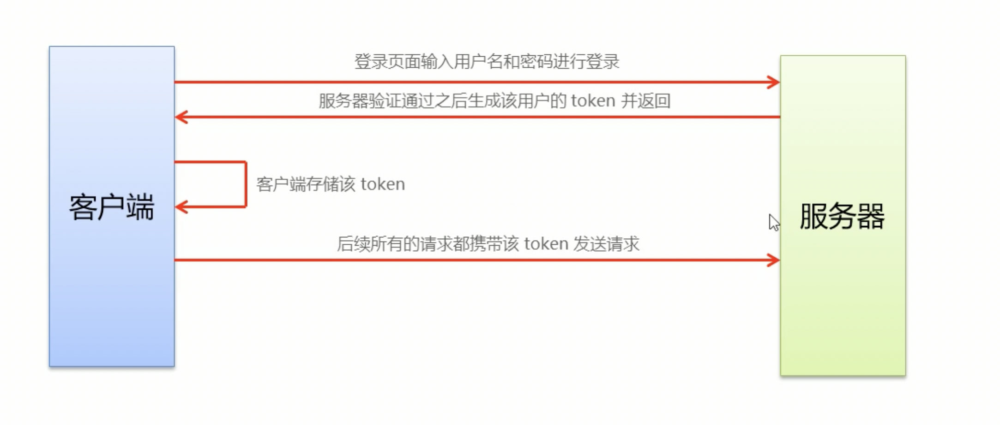
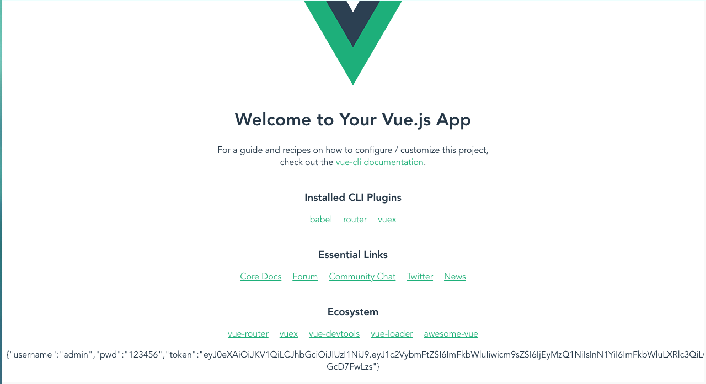

# SpringBoot整合jwt

## 登录功能的实现

- 登陆页面输入**用户名**和**密码**进行登录

- `服务器`验证用户生成该**用户Token**返回`客户端`

- `客户端`存储该Token

- 后续`客户端`的所有请求携带该**Token**

- `服务器`验证**Token**是否通过

  ---

  

## 实现原理



---

## Session、Cookie、Token的使用状况

- http是无状态的
- 通过cookie在客户端记录状态
- 通过session在服务器端记录状态
- 通过token方式维持状态

> 使用条件

在同一个服务器中常用Cookie，有跨域问题时使用Token

## 实践测试

### 生成Token给客户端

#### pojo

```java
@Data
public class User {
    private String username;
    private String pwd;
    private String token;
}
```

---

#### JwtUtil

```java
public class JwtUtil {
    private static long time=1000*60*60*24;
    private static String signature="admimn";
    public static String createToken(){
        JwtBuilder jwtBuilder= Jwts.builder();
        String jwtToken=jwtBuilder
                //header
                .setHeaderParam("typ","JWT")
                .setHeaderParam("alg","HS256")
                //payload
                .claim("username","admin")
                .claim("role","123456")
                .setSubject("admin-test")
                .setExpiration(new Date(System.currentTimeMillis()+time))
                .setId(UUID.randomUUID().toString())
                //signature
                .signWith(SignatureAlgorithm.HS256,signature)
                .compact();
        return jwtToken;
    }
}
```

---

#### Controller

```java
@RestController
public class UserController {
    private final String  USERNAME="admin";
    private final String PASSWORD="123456";

    @GetMapping("/login")
    public User login(User user){
        System.out.println(user);
        if(USERNAME.equals(user.getUsername()) && PASSWORD.equals(user.getPwd())){
            //添加token
            user.setToken(JwtUtil.createToken());
            return user;
        }
        return null;
    }
}
```

---

#### 解决跨域问题

```java
@Configuration
public class CrosConfiguration implements WebMvcConfigurer {

    @Override
    public void addCorsMappings(CorsRegistry registry){
        registry.addMapping("/**")
                .allowedOriginPatterns("*")
                .allowedMethods("GET","HEAD","POST","PUT","DELETE","OPTIONS")
                .allowCredentials(true)
                .maxAge(3600)
                .allowedHeaders("*");
    }
}
```

---

#### Vue

```vue
<template>
  <div class="about">
    <button @click="clickTo()">提交测试</button>
  </div>
</template>
<script>
	const axios = require('axios');
	export default{
		name:'about',
		data(){
			return{
				user:{
					username:'admin',
					pwd:'123456',
				}
			}
		},
		methods:{
			clickTo(){
				var _this=this;
				axios.get("http://localhost:8080/login",{params:_this.user})
				.then(res=>{
					console.log(res.data)
					//登陆成功
					if(res.data!=null){
            //存入localStorage
						localStorage.setItem('access-admin',JSON.stringify(res.data));
            //注意是router非route
						_this.$router.replace({path:'/'})
					}
				})
			}
		}
	}
</script>
```

---

#### 验证

> 查看存储到了localStorage对象中

```html
<template>
  <div class="home">
    
    <HelloWorld msg="Welcome to Your Vue.js App"/>
	<p>{{user}}</p>
  </div>
</template>

<script>
// @ is an alias to /src
import HelloWorld from '@/components/HelloWorld.vue'

export default {
  name: 'Home',
  components: {
    HelloWorld
  },
  data(){
	  return{
		  user:""
	  }
  },
  created(){
		  this.user=localStorage.getItem('access-admin');
  }
}
</script>
```



---

### 客户端存储Token

> 在route路由中实现`存储`代码复用,在每一次路由跳转前都需要进行一次用户验证

#### router.js

```js
//首先引入axios包
import axios from 'axios'

//然后在实例化的router后面跟执行路由的逻辑
//在进行任何一个跳转之前，都要进行验证是否登陆或者验证token是否合法
router.beforeEach((to,from,next)=>{
	if(to.path.startsWith('/login')){
		window.localStorage.removeItem('access-admin');
		next();
	}else{
		//判断是否登陆
		let admin = JSON.parse(window.localStorage.getItem('access-admin'));
		//没登陆的用户就去登陆
		if(!admin){
			next({path:'/login'});
		}else{
			//登陆的用户就去校验token的合法性
			axios({
				url:'http://localhost:8080/checkToken',
				method:'get',
				headers:{
					token: admin.token
				}
			}).then((response)=>{
				if(!response.data){
					console.log('校验失败')
					next({path:'/error'})
				}else{
          //如果说正确的话，直接路由跳转
					next();
        }
			})
		}
	}
})
```

---

#### Error.vue

```vue
<template>
	<div>
		1231
	</div>
</template>

<script>
	export default{
		name:"Error",
		created(){
			console.log("error")
				localStorage.removeItem('access-admin');
				this.$router.replace({path:'/about'});
		}
		
	}
</script>

<style>
</style>
```

---

#### JwtUtil.java

> 在工具类中加入解析方法，验证token的合法性

```java
public static boolean checkToken(String token){
    if(token == null){
        return false;
    }
    //正常就是正常解析，抛异常就是解析失败
    try{
        Jws<Claims> claimsJws = Jwts.parser().setSigningKey(signature).parseClaimsJws(token);
    }catch (Exception e){
        return false;
    }
    return true;
}
```

---

#### UserController.java

```java
@GetMapping("/checkToken")
public Boolean checkToken(HttpServletRequest request){
    String token=request.getHeader("token");
    return JwtUtil.checkToken(token);
}
```

---

#### 运行效果

> 所有的其他路径都被/login所替代拦截

## 专业解读

- 路由守卫只管有没有Token
- 验证Token一般放在请求拦截里
- 理论上所有的接口都有校验Token
