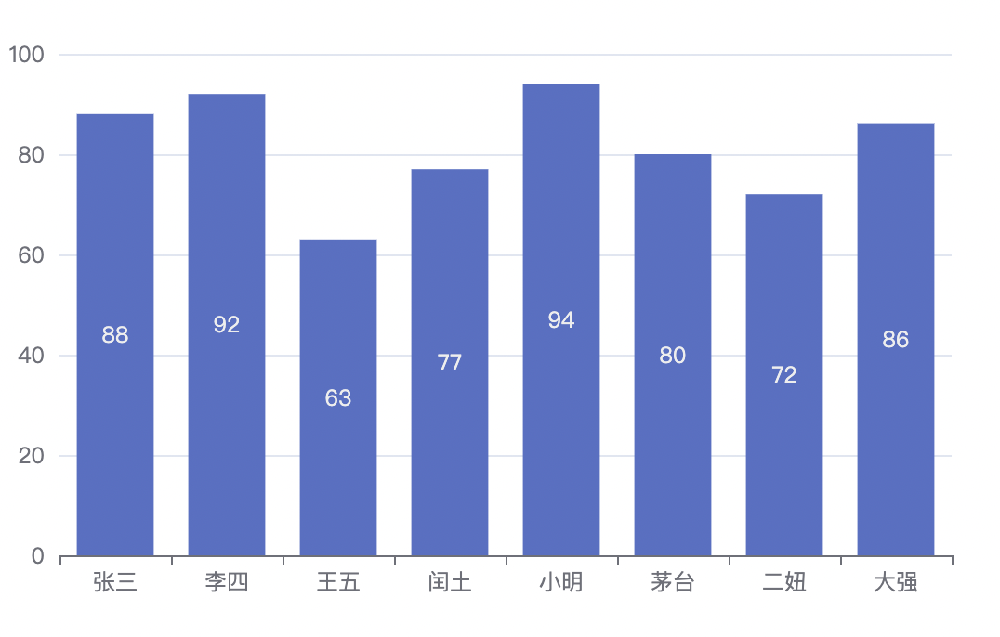
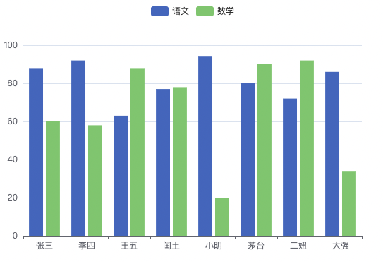

# echarts详解

## echarts基本使用

> 相关配置讲解

- xAxis: 直角坐标系中的x轴
- yAxis: 直角坐标系中的y轴
- series：系列列表。每个系列通过*type*决定自己的图表类型

---

> 案例配置项

```javascript
var option={
					xAxis:{
						type:'category',//类目轴
						data:['小明','小红','小王']
					},
					yAxis:{
						type:'value'//数值轴
					},
					series:[{
						name:'语文',
            //bar: 柱状图
            //line:折线图
            //pie: 饼图
						type:'bar',
						data:[70,92,87]
					}],
				}
```


---

## echarts常用图表

1. 柱状图
2. 折线图
3. 散点图
4. 饼图
5. 地图
6. 雷达图
7. 仪表盘图

## 柱状图

#### 实现步骤

- echarts最基本的代码结构：

  引入js文件，DOM容器，初始化对象，设置option

- x轴数据：['张三','李四','王五','闰土','小明','茅台','二妞','大强']

- y轴数据:  [88,92,63,77,94,80,72,86]

- 图表类型: 在**series**下设置**type:bar**

---

```javascript
 var myChart = echarts.init(document.getElementById('main'));
				var xDataArr=['张三','李四','王五','闰土','小明','茅台','二妞','大强']
				var yDataArr=[88,92,63,77,94,80,72,86]
				var option={
					xAxis:{
						type:'category',
						data:xDataArr
					},
					yAxis:{
						type:'value'
					},
					series:[{
						name:'语文',
						type:'bar',
						data:yDataArr
					}],
				}
				myChart.setOption(option)
```


> 常见效果

- 最大值、最小值、平均值（markPoint、markLine）

  ```javascript
  var option={
    xAxis:{
      type:'category',
      data:xDataArr
    },
    yAxis:{
      type:'value'
    },
    series:[{
      name:'语文',
      type:'bar',
      markPoint:{
        data:[
          {
            type:'max',
            name:'最大值'
          },{
            type:'min',
            name:'最小值'
          }
        ]
      },
      markLine:{
        data:[
          {
            type: 'average',
            name:'平均线'
          }
        ]
      },
      data:yDataArr
    }],
  }
  ```

  

- 显示：数值显示 柱宽度 横向柱状图（label、barWidth、对xAxis和yAxis变换）

  > label数值显示

  ```javascript
  var option={
  					xAxis:{
  						type:'category',
  						data:xDataArr
  					},
  					yAxis:{
  						type:'value'
  					},
  					series:[{
  						name:'语文',
  						type:'bar',
  						label:{
  							show:true
  						},
  						data:yDataArr
  					}],
  				}
  ```

  

  > barWidth柱宽度

  ```javascript
  var option={
  					xAxis:{
  						type:'category',
  						data:xDataArr
  					},
  					yAxis:{
  						type:'value'
  					},
  					series:[{
  						name:'语文',
  						type:'bar',
  						barWidth:'30%',
  						data:yDataArr
  					}],
  				}
  ```

  

  > 横向柱状图

  ```javascript
  var option={
  					xAxis:{
  						type:'value',
  					},
  					yAxis:{
  						type:'category',
  						data:xDataArr
  					},
  					series:[{
  						name:'语文',
  						type:'bar',
  						data:yDataArr
  					}],
  				}
  ```

  

---

## 通用配置

> 所有图表都能使用的配置

- 标题：title
- 提示：tooltip
- 工具按钮：toolbox
- 图例：legend

### title 标题

#### 文字样式

> testStyle

```javascript
var option={
					title:{
						text:"语文成绩",
						textStyle:{
							color:"red"
						}
					},
					xAxis:{
						type:'category',
						data:xDataArr
					},
					yAxis:{
						type:'value',
					},
					series:[{
						name:'语文',
						type:'bar',
						data:yDataArr
					}],
				}
```


#### 标题边框

> borderWidth、borderColor、borderRaduis

```javascript
var option={
					title:{
						text:"语文成绩",
						textStyle:{
							color:"red"
						},
						borderWidth:5,
						borderColor:"green",
						borderRadius:5
					},
					xAxis:{
						type:'category',
						data:xDataArr
					},
					yAxis:{
						type:'value',
					},
					series:[{
						name:'语文',
						type:'bar',
						data:yDataArr
					}],
				}
```


#### 标题位置

> left、top、right、bottom

```javascript
var option={
					title:{
						text:"语文成绩",
						textStyle:{
							color:"red"
						},
						left:"50%",
						top:10
					},
					xAxis:{
						type:'category',
						data:xDataArr
					},
					yAxis:{
						type:'value',
					},
					series:[{
						name:'语文',
						type:'bar',
						data:yDataArr
					}],
				}
```


### tooltip 提示框

> 鼠标滑过或者点击时的提示

#### 触发类型

> trigger(item、axis)

```javascript
var option={
					tooltip:{
						trigger:"item"
					},
					xAxis:{
						type:'category',
						data:xDataArr
					},
					yAxis:{
						type:'value',
					},
					series:[{
						name:'语文',
						type:'bar',
						data:yDataArr
					}],
				}
```


#### 触发时机

> t riggerOn(mouseover、click)

```javascript
var option={
					tooltip:{
						trigger:"item",
						triggerOn:"click"
					},
					xAxis:{
						type:'category',
						data:xDataArr
					},
					yAxis:{
						type:'value',
					},
					series:[{
						name:'语文',
						type:'bar',
						data:yDataArr
					}],
				}
```


#### 格式化

> formatter

```javascript
var option={
					tooltip:{
						trigger:"item",
						triggerOn:"click",
						formatter:"{b} : {c}"
            //formatter:function(arg){
							//console.log(arg);//是一个对象
							//return arg.name+'的分数'+arg.data
						}
					},
					xAxis:{
						type:'category',
						data:xDataArr
					},
					yAxis:{
						type:'value',
					},
					series:[{
						name:'语文',
						type:'bar',
						data:yDataArr
					}],
				}
```


### toolbox 工具栏

> Echarts提供的工具栏

内置有五个工具:

- 导出图片
- 数据视图
- 动态类型切换
- 数据区域缩放
- 重置

#### 显示工具栏按钮

> **feature**
>
> 只需要在`feature`对象下面添加属性即可

#### 导出图片

> saveAsImage

```javascript
var option={
					toolbox:{
						feature:{
							saveAsImage:{},//导出图片
						}
					},
					xAxis:{
						type:'category',
						data:xDataArr
					},
					yAxis:{
						type:'value',
					},
					series:[{
						name:'语文',
						type:'bar',
						data:yDataArr
					}],
				}
```


#### 数据视图

> dataView

```javascript
var option={
					toolbox:{
						feature:{
							saveAsImage:{},//导出图片
							dataView:{}//数据视图
						}
					},
					xAxis:{
						type:'category',
						data:xDataArr
					},
					yAxis:{
						type:'value',
					},
					series:[{
						name:'语文',
						type:'bar',
						data:yDataArr
					}],
				}
```


#### 重置

> restore

```javascript
var option={
					toolbox:{
						feature:{
							saveAsImage:{},//导出图片
							dataView:{},//数据视图
							restore:{}//重置
						}
					},
					xAxis:{
						type:'category',
						data:xDataArr
					},
					yAxis:{
						type:'value',
					},
					series:[{
						name:'语文',
						type:'bar',
						data:yDataArr
					}],
				}
```


#### 区域缩放

> dataZoom

```javascript
var option={
					toolbox:{
						feature:{
							saveAsImage:{},//导出图片
							dataView:{},//数据视图
							restore:{},//重置
							dataZoom:{}//区域缩放
						}
					},
					xAxis:{
						type:'category',
						data:xDataArr
					},
					yAxis:{
						type:'value',
					},
					series:[{
						name:'语文',
						type:'bar',
						data:yDataArr
					}],
				}
```


#### 动态类型切换

> magicType

```javascript
var option={
					toolbox:{
						feature:{
							saveAsImage:{},//导出图片
							dataView:{},//数据视图
							restore:{},//重置
							dataZoom:{},//区域缩放
							magicType:{
								type:['bar','line']
							}
						}
					},
					xAxis:{
						type:'category',
						data:xDataArr
					},
					yAxis:{
						type:'value',
					},
					series:[{
						name:'语文',
						type:'bar',
						data:yDataArr
					}],
				}
```


---

### legend 筛选系列

> 图例，用于筛选系列，需要和`series`配合使用

多数据使用情况

```javascript
series:[{
						name:'语文',
						type:'bar',
						data:yDataArr1
					},
					{
						name:'数学',
						type:'bar',
						data:yDataArr2
					}
					]
```


> legend的data的值需要和series数组中某组数据的name值一致

#### 对系列筛选




## 折线图

### 实现步骤

- 引入js文件
- DOM容器
- 初始化对象
- 设置option
  1. x轴数据：数组1:['1','2','3','4','5','6','7','8','9','10','11','12']
  2. y轴数据:数组2:[3000,2800,900,1000,800,700,1400,1300,900,1000,800,600]
  3. 图表类型:在series下设置type:line

```javascript
var option={
					xAxis:{
						type:'category',
						data:xDataArr
					},
					yAxis:{
						type:'value',
					},
					series:[{
						name:'康师傅的销量',
						type:'line',
						data:yDataArr1
					}
					],
				}
```


### 常见效果

- 标记：最大值、最小值、平均值、标注区间(markPoint、markLine、markArea)

  > 最大值、最小值(markPoint)

  ```javascript
  var option={
  					xAxis:{
  						type:'category',
  						data:xDataArr
  					},
  					yAxis:{
  						type:'value',
  					},
  					series:[{
  						name:'康师傅的销量',
  						type:'line',
  						data:yDataArr1,
  						markPoint:{
  							data:[{
  								type:"max"
  							},{
  								type:"min"
  							}]
  						}
  					}
  					],
  				}
  ```

  

  > 平均值(average)

  ```javascript
  var option={
  					xAxis:{
  						type:'category',
  						data:xDataArr
  					},
  					yAxis:{
  						type:'value',
  					},
  					series:[{
  						name:'康师傅的销量',
  						type:'line',
  						data:yDataArr1,
  						markLine:{
  							data:[{
  								type:"average"
  							}]
  						}
  					}
  					],
  				}
  ```

  

  > 标注区间(markArea)

  ```javascript
  var option={
  					xAxis:{
  						type:'category',
  						data:xDataArr
  					},
  					yAxis:{
  						type:'value',
  					},
  					series:[{
  						name:'康师傅的销量',
  						type:'line',
  						data:yDataArr1,
  						markArea:{
  							data:[
  								[{
  									xAxis:'1'
  								},{
  									xAxis:'2'
  								}],
  								[{
  									xAxis:'7'
  								},{
  									xAxis:'8'
  								}]
  								
  							]
  						}
  					}
  					],
  				}
  ```

  

- 线条控制：平滑 风格（smooth、lineStyle）

  > 平滑线条（smooth）

  ```javascript
  var option={
  					xAxis:{
  						type:'category',
  						data:xDataArr
  					},
  					yAxis:{
  						type:'value',
  					},
  					series:[{
  						name:'康师傅的销量',
  						type:'line',
  						data:yDataArr1,
  						smooth:true
  					}
  					],
  				}
  ```

  

  > 风格(lineStyle)

  ```javascript
  var option={
  					xAxis:{
  						type:'category',
  						data:xDataArr
  					},
  					yAxis:{
  						type:'value',
  					},
  					series:[{
  						name:'康师傅的销量',
  						type:'line',
  						data:yDataArr1,
  						lineStyle:{
  							type:"dashed",
  							color:"green"
  						}
  					}
  					],
  				}
  ```

  

- 填充风格(areaStyle)

  ```javascript
  var option={
  					xAxis:{
  						type:'category',
  						data:xDataArr
  					},
  					yAxis:{
  						type:'value',
  					},
  					series:[{
  						name:'康师傅的销量',
  						type:'line',
  						data:yDataArr1,
  						areaStyle:{}
  					}
  					],
  				}
  ```

  

- 紧挨边缘(boundaryGap)

  > 找x、y轴

  ```javascript
  var option={
  					xAxis:{
  						type:'category',
  						data:xDataArr,
  						boundaryGap: false
  					},
  					yAxis:{
  						type:'value',
  					},
  					series:[{
  						name:'康师傅的销量',
  						type:'line',
  						data:yDataArr1,
  					
  					}
  					],
  				}
  ```

  

- 脱离0值/支持缩放(scale)

  ```javascript
  var option={
  					xAxis:{
  						type:'category',
  						data:xDataArr,
  					},
  					yAxis:{
  						type:'value',
  						scale:true
  					},
  					series:[{
  						name:'康师傅的销量',
  						type:'line',
  						data:yDataArr1,
  					}
  					],
  				}
  ```

  

  

- 堆叠图(stack)

```javascript
var option={
					xAxis:{
						type:'category',
						data:xDataArr,
					},
					yAxis:{
						type:'value',
						scale:true
					},
					series:[{
						name:'康师傅的销量',
						type:'line',
						data:yDataArr1,
						stack:"all"
					},{
						name:'统一的销量',
						type:'line',
						data:yDataArr2,
						stack:"all"
					}
					],
				}
```


---

## 散点图

> 散点图可以帮助我们推断出变量之间的相关性
>
> **比如：**身高和体重

### 实现步骤

- x轴和y轴的数据---二维数组

  > 数组1:[[身高1，体重1],[身高2,体重2]...]

  ```javascript
  var myChart = echarts.init(document.getElementById('main'));
  				var data=[{"gender":"male","height":180.3,"weight":83.2},{"gender":"male","height":179,"weight":75.2},
  				{"gender":"male","height":181.3,"weight":73.2},{"gender":"male","height":166.5,"weight":93.2},
  				{"gender":"male","height":180.3,"weight":83.2},{"gender":"male","height":160.3,"weight":54.2}]
  				var axisData=[];
  				for (var i = 0; i <  data.length; i++) {
  					 var height=data[i].height;
  					 var weight=data[i].weight;
  					 var newArr=[height,weight];
  					 axisData.push(newArr);	 
  				}
  				console.log(axisData)
  				var option={
  					xAxis:{
  						type:"value"
  					},
  					yAxis:{
  						type:"value"
  					},
  					series:[
  						{
  							type:"scatter",
  							data:axisData
  						}
  					]
  				}
  ```

  

### 常见效果

- 气泡图效果
  - 散点的大小不同(symbolSize)
  - 散点的颜色不同(itemStyle.color)

```javascript
var option={
					xAxis:{
						type:"value"
					},
					yAxis:{
						type:"value"
					},
					series:[
						{
							type:"scatter",
							data:axisData,
							//symbolSize:20,//散点大小
							symbolSize:function(arg){
								var height=arg[0]/100;
								var weight=arg[1];
								//bmi=体重/（身高*身高）
								var bmi=weight/(height*height);
								if(bmi>28){
									return 20;
								}else{
									return 10;
								}
							},
							itemStyle:{
								color:function(arg){
									var height=arg.data[0]/100;
									var weight=arg.data[1];
									//bmi=体重/（身高*身高）
									var bmi=weight/(height*height);
									if(bmi>28){
										return "red";
									}else{
										return "green";
									}
								}
							}
							
						}
					]
				}
```


- 涟漪动画效果(type:'effectScatter')

  ```javascript
  var option={
  					xAxis:{
  						type:"value"
  					},
  					yAxis:{
  						type:"value"
  					},
  					series:[
  						{
  							type:"effectScatter",
                showEffectOn:"emphasis",//鼠标滑过才会有涟漪动画
  							data:axisData,
  						}
  					]
  				}
  ```

  

---

## 直角坐标系中的常用配置

### 属于直角坐标系的图表

柱状图 折线图 散点图

### 三个常用配置项

#### 网格 grid

> grid是用来控制直角坐标系的布局和大小的
>
> x轴和y轴就是在grid的基础上进行绘制的

- 显示grid （show）

  ```javascript
  var option={
  					grid:{
  						show:true
  					},
  					xAxis:{
  						type:"category",
  						data:["1","2","3","4"]
  					},
  					yAxis:{
  						type:"value"
  					},
  					series:[
  						{
  							type:"bar",
  							data:[12,15,17,18,19],
  						}
  					]
  				}
  ```

  

- grid边框宽度（borderWidth）

  ```javascript
  var option={
  					grid:{
  						show:true,
  						borderWidth:5
  					},
  					xAxis:{
  						type:"category",
  						data:["1","2","3","4"]
  					},
  					yAxis:{
  						type:"value"
  					},
  					series:[
  						{
  							type:"bar",
  							data:[12,15,17,18,19],
  						}
  					]
  				}
  ```

  

- grid的位置及大小(left、top、right、bottom/width、height)

#### 坐标轴 axis

> 坐标轴分为x轴和y轴

- 坐标类型type
  - value：数值轴，自动会从目标数据中读取数据
  - category：类目轴，该类型必须通过data设置类目数据
- 显示位置position（top、left、right、bottom）

#### 区域缩放 dataZoom

> dataZoom用于区域缩放，对数据范围过滤，x轴和y轴都可以拥有。
>
> dataZoom是一个数组，意味着可以配置多个区域缩放器

- 类型 type

  - slider：滑块

    ```js
    var option={
    					dataZoom:{
    						type:"slider"
    					},
    					xAxis:{
    						type:"category",
    						data:["1","2","3","4"]
    					},
    					yAxis:{
    						type:"value"
    					},
    					series:[
    						{
    							type:"bar",
    							data:[12,15,17,18,19],
    						}
    					]
    				}
    ```

    

  - inside：内置，依靠鼠标滚轮或者双指缩放

- 指明产生作用的轴

  - xAxisIndex:设置缩放组件控制的是x轴,一般写0即可
  - yAxisIndex:设置缩放组件控制的是y轴,一般写0即可

  ```js
  var option={
  					dataZoom:[{
  						type:"slider",
  						xAxisIndex:0
  					},{
  						type:"slider",
  						yAxisIndex:0
  					}],
  					xAxis:{
  						type:"category",
  						data:["1","2","3","4"]
  					},
  					yAxis:{
  						type:"value"
  					},
  					series:[
  						{
  							type:"bar",
  							data:[12,15,17,18,19],
  						}
  					]
  				}
  ```

  

- 指明初始状态的缩放情况

> start-end开始到结束的初始状态

```js
var option={
					dataZoom:[{
						type:"slider",
						xAxisIndex:0
					},{
						type:"slider",
						yAxisIndex:0,
						start:0,
						//指的是80%
						end:80
					}],
					xAxis:{
						type:"category",
						data:["1","2","3","4"]
					},
					yAxis:{
						type:"value"
					},
					series:[
						{
							type:"bar",
							data:[12,15,17,18,19],
						}
					]
				}
```


---

## 饼图

### 实现步骤

> 数据准备

```json
[
  {name:"淘宝",value:11231},
  {name:"京东",value:22673},
  {name:"唯品会",value:6123},
  {name:"1号店",value:8989},
  {name:"聚美优品",value:6700}
]
```

> 实现

```javascript
var option={
					series:[{
						type:'pie',
						data:pieData
					}]
				}
```


---

### 常见效果

- 显示数值

  > label.formatter

  ```javascript
  var option={
  					series:[{
  						type:'pie',
  						data:pieData,
  						label:{//饼图文字显示
  							show:true,//显示文字
  							formatter:function(args){
  								//决定显示文字内容
  								return args.name+"平台"+args.value+"元\n"+args.percent+"%";
  							}
  						}
  					}]
  				}
  ```

  

- 圆环

  > radius表示`半径`,数组表示`圆环`

  ```javascript
  var option={
  					series:[{
  						type:'pie',
  						data:pieData,
  						label:{//饼图文字显示
  							show:true,//显示文字
  							formatter:function(args){
  								//决定显示文字内容
  								return args.name+"平台"+args.value+"元\n"+args.percent+"%";
  							}
  						},
  						radius:["50%","75%"]
  					}]
  				}
  ```

  

- 南丁格尔图（半径是不一样的）

  > roseType:'radius'

  ```javascript
  var option={
  					series:[{
  						type:'pie',
  						data:pieData,
  						label:{//饼图文字显示
  							show:true,//显示文字
  							formatter:function(args){
  								//决定显示文字内容
  								return args.name+"平台"+args.value+"元\n"+args.percent+"%";
  							}
  						},
  						roseType:'radius'
  					}]
  				}
  ```

  

- 选中效果

  > selectedMode 点击设置（选中效果）

  ```javascript
  var option={
  					series:[{
  						type:'pie',
  						data:pieData,
  						label:{//饼图文字显示
  							show:true,//显示文字
  							formatter:function(args){
  								//决定显示文字内容
  								return args.name+"平台"+args.value+"元\n"+args.percent+"%";
  							}
  						},
              //选中单个效果偏离原点
  						//selectedMode:'single'
              //选中多个效果偏离原点
              selectedMode:'multiple',
            	//设置偏移距离
              selectedOffset:30
  					}]
  				}
  ```

  

  ---

## 地图

### 地图图表的使用方式

- 百度地图API

  > 需要申请百度地图ak

  

- 矢量地图

  > 需要准备矢量地图数据

### 实现步骤

- 准备中国的矢量地图json文件，放到json/map/的目录下

  china.json

- 使用ajax获取china.json

  $.get('json/map/china.json',function(chinaJson){})

- 在回调函数中往echarts全局对象注册地图的json数据

  Charts.registerMap(‘chinaMap’,chinaJson)

- 在geo下设置

  > type:'map'
  >
  > Map:'chinaMap'

```javascript
var data=[];//地图数据
echarts.registerMap('chinaMap', data);
			var option = {
				geo: {
					type: 'map',
					map: 'chinaMap',//ChinaMap需要和registerMap中的第一个参数保持一致
				}
			};
			myChart.setOption(option);
```


**教程**


---

### 常用配置

- 缩放|拖动

  > roam:true

  ```javascript
  var option = {
  				geo: {
  					type: 'map',
  					map: 'chinaMap',//ChinaMap需要和registerMap中的第一个参数保持一致
  					roam:true,//设置允许缩放和拖动效果
  				}
  			};
  ```

  

- 名称显示

  > label

  ```javascript
  var option = {
  				geo: {
  					type: 'map',
  					map: 'chinaMap',//ChinaMap需要和registerMap中的第一个参数保持一致
  					label:{
  						show:true
  					}
  				}
  			};
  ```

  

- 初始化缩放比例

  >zoom:数值

  ```javascript
  var option = {
  				geo: {
  					type: 'map',
  					map: 'chinaMap',//ChinaMap需要和registerMap中的第一个参数保持一致
  					zoom:2//设置初始化的缩放比例
  				}
  			};
  ```

  

- 地图中心点

  >center:[ x,y ]

  给一个具体坐标，实现中心点为那个坐标

  

### 显示空气质量

- 显示基本的中国地图

- 将城市的空气质量数据设置给series

- 将series下的数据和geo关联起来

  geoIndex:0,type:'map'

- 结合visualMap配合使用

```javascript
echarts.registerMap('chinaMap', data);
			var option = {
				geo: {
					type: 'map',
					map: 'chinaMap',//ChinaMap需要和registerMap中的第一个参数保持一致
					label:{
						show:true
					},
					zoom:2,
					series:[
						{
							data:dataWearther,//空气质量的data数据
							geoIndex:0,//将空气质量的数据和第0个geo配置关联在一起
							type:"map"
						}
					],
					visualMap:{//色彩可视化分布
						min:0,
						max:100,
            inRange:{//设置颜色
              color:['white','red']//颜色慢慢过渡到红色
            },
            calculable:true//出现滑块数据筛选
					}
				}
			};
```


---

### 地图和散点图结合

- 给series下增加新的对象

- 准备好散点的数据，设置给新对象的data

- 配置新对象的type

  type:effectScatter

- 让散点图使用地图坐标的系统

  coordinateSystem:'geo'

- 让涟漪动画的效果更加明显

  rippleEffect:{

  ​	scale:10

  }

