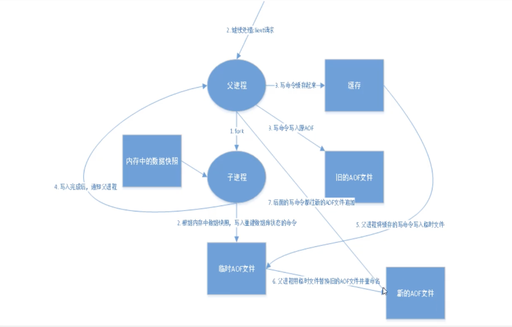
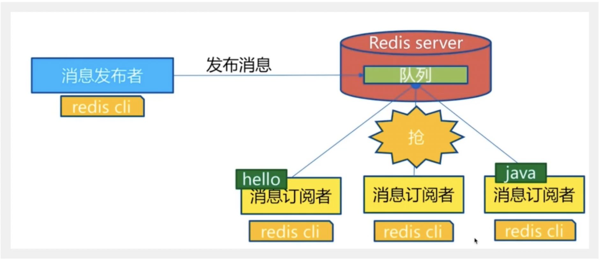
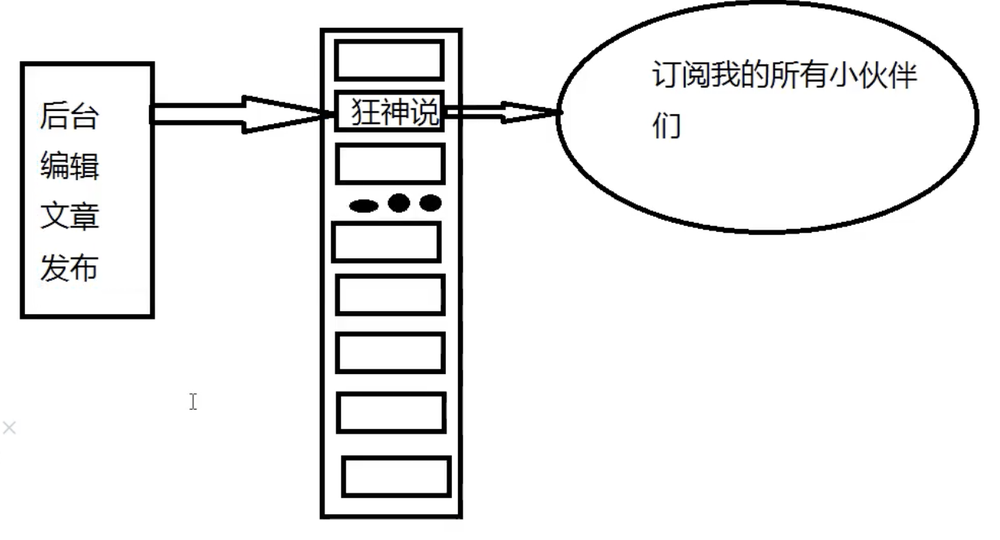
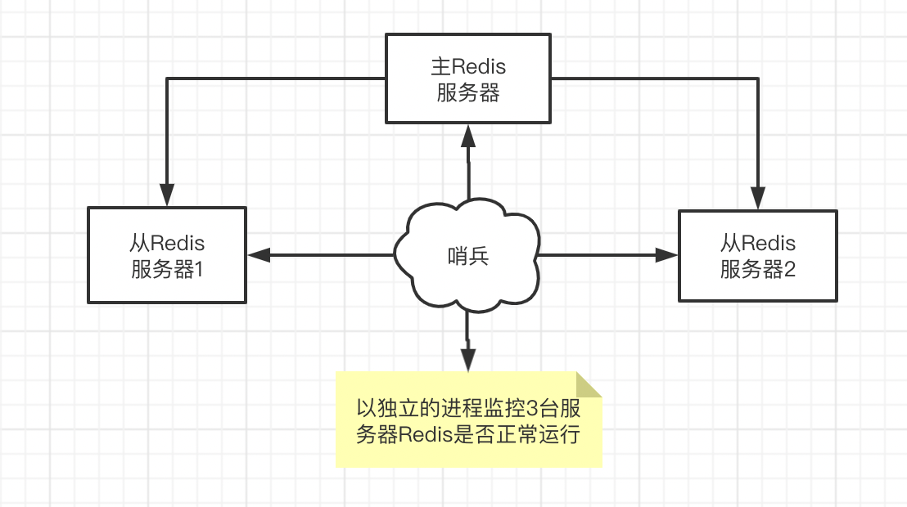
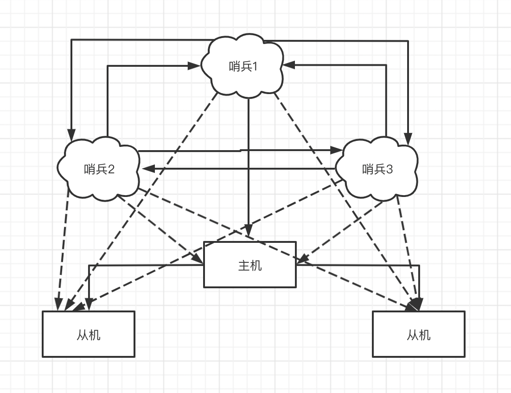
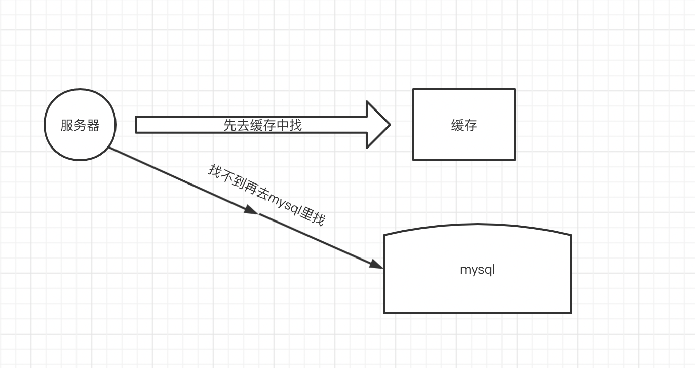
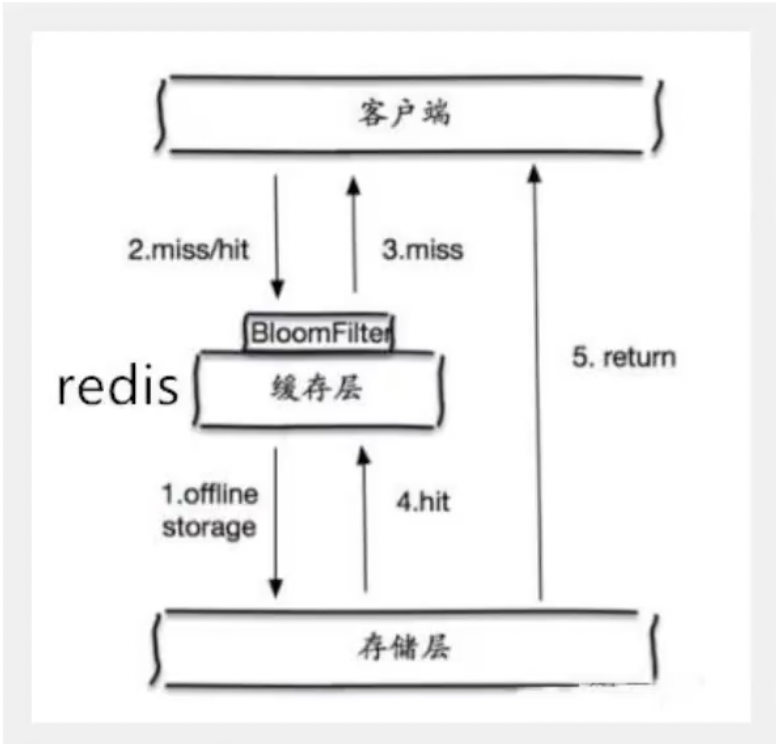
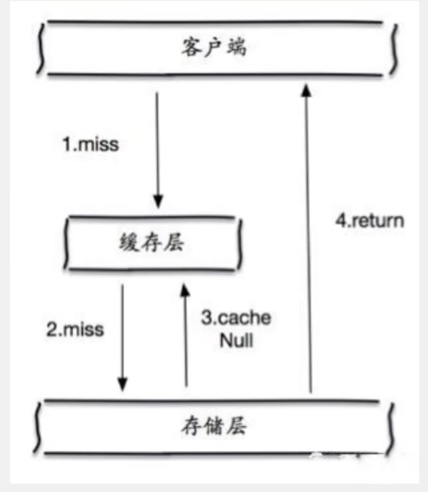
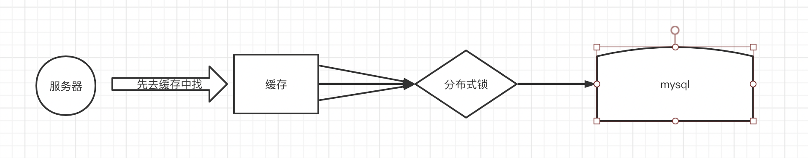
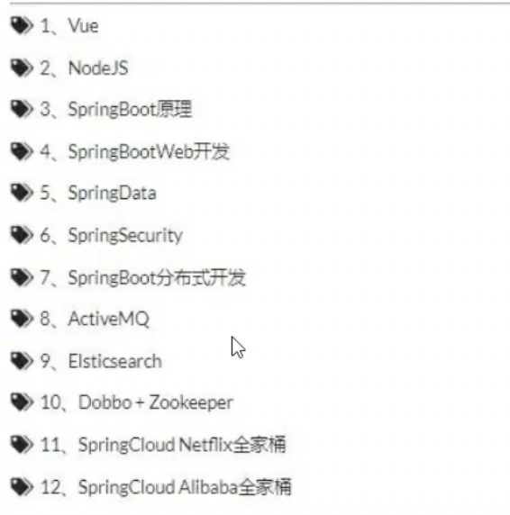

# Redis

## 1.nosql（非关系型数据库）讲解

### 为什么要用Nosql

大数据时代->SpringBoot+SpringCloud

----

> 单机Mysql的美好年代！

90年代，基本网站访问量不大，仅使用单个数据库就足够。

整个网站的瓶颈：

1.数据量如果太大了，一个机器放不下。

2.数据的索引（mysql的数据超过300w就一定要建立索引！），如果索引太大一个机器内存也放不下。

3.访问量（读写混合）一个服务器承受不了。

只要开始出现以上情况之一，就必须要晋级。

---

> Memcached+Mysql+垂直拆分（读写分离）

网站80%的情况都是在读，每次都要查询数据库的话就十分麻烦。

所以希望减轻服务器压力，可以用缓存来保证效率。

缓存主要是用于解决**读**的问题,张三从数据库里读过一次就存到缓存里，等李四去读的时候就从缓存里拿。

缓存发展过程：优化数据结构和索引----->文件缓存----->Memcached（缓存）

---

>分库分表+水平拆分+Mysql集群

本质：数据库（读+写）

慢慢地，使用分库分表来实现写的压力（把每个单独的业务单独一个数据库做成微服务）。

---

> 最近的年代

技术爆炸的30年，仅仅如mysql这样的关系型数据库就不够用了，如果用于存储博客或者文件，mysql的压力很大，数据库表大了，效率就降低了，如果有一个数据库专门来处理这种数据，就能降低mysql的压力。

---

> 为什么要使用NoSQL

用户的个人信息、社交网络、地理位置、自己产生的数据和日志等

关系型数据库就解决不掉，需要使用NoSQL数据库了，Nosql可以很好地解决以上情况。


### 什么是NoSql

> NoSql

NoSql=Not Only Sql(不仅仅是sql)

**关系型数据库**：表格，行，列组成（POI使用Java代码操作Excel）

泛指**非关系型数据库**，随着web2.0互联网的诞生，传统的关系型数据库很难对付web2.0时代。

尤其是超大规模的**高并发社区**。


> NoSql的特点

1.**方便扩展**(数据之间没有关系，很好扩展！)

2.**大数据量高性能**（Redis 一秒写8w次，读11w次，NoSql的缓存是一种细粒度的缓存）

3.**数据类型是多样型的**（不需要事先设计数据库！直接Set Get随取随用）


>传统的关系型数据库(RDBMS)和非关系型数据库(NoSql)的区别

传统的关系型数据库

> - 结构化组织
>
> - SQL
>
> - 数据和关系都存储在单独的表中（row和col）
>
> - 数据操作，数据定义语言
> - 严格的一致性（ACID原则）
> - 基础的事务


NoSql

> - 不仅仅是数据
> - 没有固定的查询语言
> - 键值对存储、列存储、文档存储、图形数据库（社交关系）
> - 最终一致性
> - CAP定理和BASE（异地多活）
> - 高性能、高可用、高可扩


##### 了解：大数据时代的3V+3高

>了解：3V+3高

大数据时代的3V：主要是用来描述问题的

1. 海量Volume：数据量大
2. 多样Variety：数据库多样
3. 实时Velocity：信息传递的实时性

大数据时代的3高：主要是用来解决问题的

1. 高并发
2. 高可扩（随时可以水平拆分）
3. 高性能（保证用户体验和性能）

真正公司上的实践：NoSql+RDBMS一起使用才是最强的


## 2.阿里巴巴架构演进

|           时间           |                            关键字                            |
| :----------------------: | :----------------------------------------------------------: |
|    1999第一代网络架构    |                      Perl、CGI、Oracle                       |
|     2000进入Java时代     |                         Java+Servlet                         |
|     2001-2004EJB时代     | EJB（SLSB、CMP、MDB），Pattern（ServiceLocator、Delegate、Facade、DAO、DTO） |
| 2005-2007Without EJB重构 | 去EJB重构：Spring+iBatis+Webx，Antx，底层架构：iSearch、MQ+ESB，数据挖掘、CMS |
|       2010安全镜像       |         安全，镜像，应用服务器升级，秒杀，NoSql，SSD         |

#### 第五代网站的使命

+ 敏捷

> 业务快速增长，每天都需要上线小需求

+ 开放

> 提升网站开放性，提供SDK，吸引第三方开发者加入网站共建

+ 体验

> 网站并发压力快速增长，用户对体验提出更高要求


#### 架构师使命

``` bash
# 1、商品的基本信息
	名称、价格、商家信息；
	关系型数据库就可以解决！
	- Mysql
# 2、商品的描述、评论（文字较多的时候）
	- 文档型数据库，MongoDB
# 3、图片
	分布式文件系统
	- Hadhoop  HDFS
	-阿里云     OSS
# 4、商品的关键字（搜索）
	- 搜索引擎 solr elasticsearch
# 5、商品的热门波段信息
	- 内存数据库 redis
# 6、商品交易、外部的支付接口
	-三方应用
```


#### 数据层所遇到的问题以及解决方案

##### 问题

大型互联网所遇到的问题：

> + 数据类型太多
> + 数据源繁多，经常重构
> + 数据要改造，大面积改造


##### 解决方案

> 数据解决方案：**统一数据服务层UDSL**
>
> （没有什么是加一层解决不了的）


具体实现方法：

``` bash
# 在应用集群和底层数据源之间，构建一层代理统一数据层
	- 统一数据层的特性：
		- 模型数据映射
			- 实现业务模型，各属性与底层不同类型数据源的模型数据映射
			-目前支持的关系型数据库：iSearch、redis、MongoDB
		- 统一的查询和更新API
			- 提供了基于业务模型的统一查询和更新的API，简化网站应用跨不同数据源的开发模式
		- 性能优化策略
			- 字段延迟加载，按需返回设置
			- 基于热点缓存平台的二级缓存
			- 异步并行查询数据：异步并行加载模型中来自不同数据源的字段
			- 并发保护：拒绝访问频率过高的主机或者IP
			- 过滤高危查询：例如会导致数据库崩溃的全表扫描
	
```

## 3.NoSql四大分类

#### **KV键值对**

	+ 新浪： Redis
	+ 美团：Redis+Tair
	+ 阿里/百度： Redis+memecache


#### **文档型数据库**

> 使用***bson***格式，长得和json一样,只是二进制的JSON

+ MongoDB(一般必须要掌握)
  + MongoDB是一个基于分布式文件存储的数据库，C++
  + 主要用来处理大量的**文档**
  + MongoDB是一个***介于***关系型数据库和非关系型数据中间的交集！
  + MongoDB是非关系型数据库中功能最丰富、最像关系型数据库的！
+ ConthDB（国外的）


#### **列存储数据库**

+ HBase
+ 分布式文件系统 Hadhoop


#### **图关系数据库**

> 放的是**关系**，而非图形

比如：

+ 朋友圈社交网络
+ 广告推荐

> Neo4j、InfoGrid


## 4.CAP

## 5.BASE

## 6.Redis入门

#### 概述

> Redis是什么？

Redis(Remote Dictionary Server)，即**远程字典服务**,也被人们称之为***结构化数据库***

**功能**：*把周期性数据持久化还能实现主从复制*

- 是一个开源的
- 用C语言编写的
- 支持网络、基于内存、可持久化的日志型Key-Value数据库
- 提供多种语言的API

> Redis能干嘛？

1. 内存存储、持久化。

   ``` bash
   -- 内存是断电即失的，持久化很重要
   # 关键：rdb、aof
   ```

   

2. 效率高、可以用于高速缓存

3. 发布订阅系统

4. 地图信息分析

5. 计时器、计数器（浏览量！incr decr）

6. .....

> 特性

1. 多样的数据类型
2. 持久化
3. 集群
4. 事务
5. .....

> 学习中需要用到的东西

``` bash
- 官网：https://redis.io/
- 中文网:https://www.redis.cn/
```

#### Redis是单线程的

官方表示Redis基于**内存操作**，*CPU* 不是Redis性能瓶颈，Redis的***瓶颈***是根据`机器内存`和`网络带宽`决定。

能使用单线程，就使用单线程。

> 为什么单线程还这么快？

1. 误区1:高性能的服务器一定是多线程的？


2. 误区2:多线程(CPU)一定比单线程效率高？

> 速度比较：CPU>内存>硬盘

**核心**：Redis是将所有的数据全部放到内存中，所以说使用单线程效率就是最高的。**（对于内存系统来说没有CPU上下文切换效率就是最高的）**

> 逻辑：多线程的==CPU上下文切换==是一个`耗时`的操作


## 7.Redis安装

#### 压力测试工具

> refis-benchmark是一个官方自带

redis-benchmark命令参数

``` bash
# 测试：100个并发 100000个请求
redis-benchmark -h localhost -p 6379 -c 100 -n 100000 
```


> 如何查看分析？

#### Redis基础知识

+ redis默认有**16**个数据库，默认使用第0个


##### select切换数据库

> 可以使用`select`切换数据库

``` bash
# 切换到第四个数据库 使用 select (index)
select 3
```


##### dbsize查看大小

> 可以使用`dbsize`查看数据库大小

``` bash
# 查看数据库大小
dbsize
```


##### keys查看key

> 可以使用`keys`查看key关键词

``` bash
#查看所有的key
keys *
```


##### flushdb清空当前库

> 可以使用`flushdb`清空当前的库

``` bash
# 清空当前库
flushdb
```


##### flushall清空所有库

> 可以使用`flushall`清空所有库

``` bash
# 清空所有库
flushall
```


##### exists判断存在

> 可以使用`exist`判断是否存在

``` bash
# 判断某个键是否存在 exists (key)
exists name
```


##### move移除键

> 可以使用`move`移除当前键

``` bash
# 移除当前键 move (key) (db)
move name 1
```


##### expire过期时间

> 可以使用`expire`设置过期时间

``` bash
# 设置某键的过期时间 expire (key) (seconds)
expire name 10
```


##### ttl查看过期时间

> 可以使用`ttl`查看过期时间

``` bash
# 查看某键的过期时间 ttl (key)
ttl name
```


##### set设置key

> 可以使用`set`写入key

``` bash
# 设置key set (key) (value)
set name zhangsan
```


##### get获得key值

> 可以使用`get`读取key值

``` bash
# 获得key值 get (key)
get name
```


##### type查看类型

> 可以使用`type` 查看key的类型

``` bash
# 查看key的类型 type (key)
type name
```


+ 端口号6379只是**讽刺效应**


## 8.五大基本数据类型

### Redis-Key

Redis是一个开源的，基于内存的数据结构存储系统，它可以用作==数据库==、==缓存==和==消息中间件MQ==。支持多种数据类型的数据结构，如字符串（strings）、散列（hashes）、列表（lists）、集合（sets）、有序集合（sorted sets）、与范围查询 bitmap，hyperloglogs和地理空间（geospatial）索引半径查询。内置了 复制（replication），LUA脚本（Lua scripting），LRU驱动事件（LRU eviction），事务（transactions）和不同级别的磁盘持久化（persistrnce），并通过Redis哨兵（Sentinel）和自动分区（Cluster）提供高可用性（high availability）。

### String(字符串)

> 90%的程序员使用Redis只会使用String类型。

> redis-cli -p 6379运行redis

#### 命令

##### append追加

> 可以使用`append`追加字符串

``` bash
# 可以使用append追加字符串,如果key不存在就相当于set key append (key) (value)
append name aaaa
```


##### strlen获取长度

> 可以使用`strlen`获取字符串长度

``` bash
# 可以使用strlen获取字符串长度 strlen (key)
strlen name
```


##### incr实现i++效果

> 可以使用`incr`实现i++效果 

``` bash
# 可以使用incr实现i++ incr (key)
incr view

# 可以用来实现浏览量++
127.0.0.1:6379> set view 0
OK
127.0.0.1:6379> get view
"0"
127.0.0.1:6379> incr view
(integer) 1
127.0.0.1:6379> get view
"1"
```


##### decr实现i--效果

> 可以使用`decr`实现i--效果

``` bash
# 可以使用decr实现i--效果 decr (key)
decr view

# 实现数据--
127.0.0.1:6379> decr view
(integer) 1
127.0.0.1:6379> get view
"1"
```


##### incrby设置加的步长

> 可以使用`incrby`设置加步长

``` bash
# 可以用incrby来设置步长 incrby (key) (increment)
incrby view 10
```


##### decrby设置减的步长

> 可以使用`decrby`设置减步长

``` bash
# 可以使用decrby来设置减步长 decrby (key) (increment)
decrby view 10
```


##### getrange获得某范围字符串

> 可以使用`getrange`获得某范围的字符串

``` bash
# 可以使用getrange来获得某范围的字符串 getrange (key) (start) (end)
getrange name 2 5
```


##### getrange获得全部字符串

> 可以使用`getrange`获得全部字符串

``` bash
# 可以使用getrange获得全部字符串 getrange (key) 0 -1
getrange name 0 -1
```


##### setrange替换

> 可以使用`setrange`把从某个位置开始改value位的值

``` bash
# 可以使用setrange把从第offest位置的值开始改成value setrange (key) (offset) (value)
setrange name 2 xx

# 例子
127.0.0.1:6379> get name
"abcaaasga"
127.0.0.1:6379> setrange name 2 xx
(integer) 9
127.0.0.1:6379> get name
"abxxaasga"
```


##### Setnx不存在设置

> 如果key不存在则使用`setnx`设置key｜set if not exit｜**分布式锁中常用**⬇️

``` bash
# 使用setnx如果key不存在的话 setnx (key) (value) (key2) (value2) ...[可以一/多key]
setnx name abc

# 例子
127.0.0.1:6379> setnx name abc
(integer) 0
127.0.0.1:6379> get name
"a"
```


##### setex设置过期时间

> 可以使用`setex`设置key的过期时间｜set with expire

``` bash
# 使用setex设置过期时间 setex (key) (second) (value)
setex name 30 abc
```


##### mset一次设置多个key

> 可以使用`mset`设置多个key

``` bash
# 使用mset一次设置多个key mset (key1) (value1) (key2) (value2) ... 
mset k1 v1 k2 v2
```


##### mget一次获取多个key

> 可以使用`mget`获取多个key值

``` bash
# 使用mget一次获取多个key值 mget (key1) (key2) ...
mget k1 k2 k3
```


##### 对象的设计

> 设计对象的存储

1. 使用`mset`设置对象属性

   ``` bash
   # mset user:{id}:{filed}
   mset user:1:name zhangsan user:1:age 21
   
   # 例子
   127.0.0.1:6379> mset user:1:name zhangsan user:1:age 21
   OK
   127.0.0.1:6379> keys *
   1) "user:1:age"
   2) "user:1:name"
   ```

2. 使用`set`设置对象

   ``` bash
   # set user:{id} {obj}
   set user:1 {name:zhangsan,age:3}
   
   # 例子
   127.0.0.1:6379> set user:1 {name:zhangsan,age:3}
   OK
   127.0.0.1:6379> keys *
   1) "user:1"
   127.0.0.1:6379> get user:1
   "{name:zhangsan,age:3}"
   ```

##### getset先获取再设置

> 使用`getset`先获取再设置key

``` bash
# 使用getset先获取再设置 getset (key) (value)
getset db 123

# 例子
127.0.0.1:6379> getset db redis
(nil)
127.0.0.1:6379> get db
"redis"
127.0.0.1:6379> getset db redis222
"redis"
127.0.0.1:6379> get db
"redis222"
```

**所有的数据结构是相同的，未来会使用Jedis.(方法)，命令即方法**


##### String使用场景举例

- 计数器
- 统计多单位数量：uid:952312:follow 0
- 粉丝数
- 对象存储缓存
- ...

### List(列表)

> 在Redis里面，我们可以把list完成栈、队列、阻塞队列

##### List规律

> 所有的命令都是用l开头的


##### lpush 设置list值/追加到头部

>使用`lpush`设置list/追加list|将某值追加到列表头部

``` bash
# 使用lpush设置list lpush (listkey) (element1) (element2) ...[elements]
lpush name zhangsan lisi

# 使用lpush追加list
lpush name wangwu 

# 例子
127.0.0.1:6379> lpush name zhangsan lisi
(integer) 2
127.0.0.1:6379> lrange name 0 -1
1) "lisi"
2) "zhangsan"
127.0.0.1:6379> lpush name wangwu
(integer) 3
127.0.0.1:6379> lrange name 0 -1
1) "wangwu"
2) "lisi"
3) "zhangsan"
```


##### rpush设置list值/追加到尾部

> 使用`rpush`设置list/追加list｜将某值追加到列表尾部

``` bash
# 使用rpush设置list rpush (listkey) (element1) (element2) ...[elements]
rpush name zhangsan lisi 

# 使用rpush追加list
rpush name wangwu 

# 例子
127.0.0.1:6379> rpush name zhangsan lisi
(integer) 2
127.0.0.1:6379> lrange name 0 -1
1) "zhangsan"
2) "lisi"
127.0.0.1:6379> rpush name wangwu
(integer) 3
127.0.0.1:6379> lrange name 0 -1
1) "zhangsan"
2) "lisi"
3) "wangwu"
```


##### lrange 查看list值

> 使用`lrange`查看list值(倒着取)

``` bash
# 使用lrange查看list范围
lrange name 1 3

# 使用lrange查看所有list
lrange name 0 -1
```


##### lpop从队列左边移除

> 使用`lpop`从队列左边移除元素

``` bash
# 移除队列左边第一个元素 lpop (listkey)[count]
lpop name

# 例子
127.0.0.1:6379> lpush k1 1 2 3 4 5
(integer) 5
127.0.0.1:6379> lpop k1
"5"
127.0.0.1:6379> lrange k1 0 -1
1) "4"
2) "3"
3) "2"
4) "1"

# 移除队列左边n个元素 lpop (key) (num)
lpop name 3

# 例子
127.0.0.1:6379> lpush name a b c d e f g h
(integer) 8
127.0.0.1:6379> lpop name 2
1) "h"
2) "g"
127.0.0.1:6379> lrange name 0 -1
1) "f"
2) "e"
3) "d"
4) "c"
5) "b"
6) "a"
```


##### rpop从队列右边移除

> 使用`rpop`从队列右边移除元素

``` bash
# 使用rpop从队列右边移除1个元素 rpop (listkey)
rpop name

# 例子
127.0.0.1:6379> lrange name 0 -1
1) "f"
2) "e"
3) "d"
4) "c"
5) "b"
6) "a"
127.0.0.1:6379> rpop name
"a"
127.0.0.1:6379> lrange name 0 -1
1) "f"
2) "e"
3) "d"
4) "c"
5) "b"

# 使用rpop从队列右边移除n个元素 rpop (listkey) (num)
rpop name 3

# 例子
127.0.0.1:6379> rpop name 3
1) "b"
2) "c"
3) "d"
127.0.0.1:6379> lrange name 0 -1
1) "f"
2) "e"
```


##### lindex获取list的某一个值

> 使用`lindex`获取key的某一下标的值

``` bash
# 使用lindex获取key的某一下标的值 lindex (listkey) (index)
lindex name 0
```


##### llen获取list长度

> 使用`llen`获取list长度

``` bash
# 使用llen获取list长度 llen (listkey)
llen name
```


##### lrem移除指定的值

> 使用`lrem`移除指定的key值｜**取关功能**

``` bash
# 使用lrem移除count个指定的值 lrem (listkey) (count) (value)
lrem name 1 a
# 例子
127.0.0.1:6379> lrem name 2 a
(integer) 2
```


##### ltrim修剪列表

> 使用`ltrim`修剪从n到m的元素截取出来

``` bash
# 使用ltrim修建从n到m的元素截取内容  ltrim (listkey) (start) (stop)
ltrim name 2 5
# 例子
127.0.0.1:6379> lpush name a b c d e f g h i j k
(integer) 11
127.0.0.1:6379> ltrim name 1 5
OK
127.0.0.1:6379> lrange name 0 -1
1) "j"
2) "i"
3) "h"
4) "g"
5) "f"
```


##### rpoplpush删除最后一个元素追加到另一个list

> 使用`rpoplpush`删除最后一个元素追加到另一个list中

``` bash
# 使用rpoplpush将sourse删除一个再将被删除放到另一个destionation中 rpoplpush (source) (destination)
rpoplush list mylist

# 例子
127.0.0.1:6379> lrange list 0 -1
1) "1"
2) "2"
3) "3"
4) "4"
127.0.0.1:6379> lrange mylist 0 -1
1) "5"
127.0.0.1:6379> rpoplpush list mylist
"4"
127.0.0.1:6379> lrange list 0 -1
1) "1"
2) "2"
3) "3"
127.0.0.1:6379> lrange mylist 0 -1
1) "4"
2) "5"
```


##### exists判断是否列表存在

> 使用`exists`判断列表是否存在

```bash
# 使用exists判断列表是否存在 exists (listkey)
exists list

# 例子
127.0.0.1:6379> exists list
(integer) 0
127.0.0.1:6379> lpush list a b c d 
(integer) 4
127.0.0.1:6379> exists list
(integer) 1
```


##### lset修改列表指定下标的值

> 使用`lset`修改指定下标的值

``` bash
# 使用lset修改指定下标的值 lset (listkey) (index) (element)
lset list 1 update

# 例子
127.0.0.1:6379> lrange list 0 -1
1) "d"
2) "c"
3) "b"
4) "a"
127.0.0.1:6379> lset list 1 update
OK
127.0.0.1:6379> lrange list 0 -1
1) "d"
2) "update"
3) "b"
4) "a"
```


##### linsert在指定关键词前后插入

> 使用`linsert`在指定关键词前后插入一个新值

```bash
# 使用linsert插入一个值 linsert (listkey) (before|after) (pivot关键词) (element)
linsert list before hello nihao

# 例子
127.0.0.1:6379> lrange list 0 -1
1) "world"
2) "hello"
127.0.0.1:6379> linsert list before hello nihao
(integer) 3
127.0.0.1:6379> lrange list 0 -1
1) "world"
2) "nihao"
3) "hello"
```


> 小结

- 它实际上是一个链表，before Node after，left和right都可以插入值
- 如果key不存在，可以创建新链表
- 如果key存在，新增内容
- 如果移除了所有的value，代表空链表，也表示不存在！
- 在两边插入/改动值效率最高！中间元素，相对来说效率低一点！

消息排队！消息队列Lpush Rpop ，栈Lpush Lpop！


### Set(集合)

> Set中的值不能重复


##### Set规律

> 所有命令都是s开头


##### sadd添加set集合

> 使用`sadd`添加元素到Set集合

``` bash
# 使用sadd添加元素到Set集合 sadd (setkey) (element1) (element2)..
sadd list hello world

# 例子
127.0.0.1:6379> sadd list hello world
(integer) 2
127.0.0.1:6379> smembers list
1) "world"
2) "hello"
```


##### Smenbers查看set集合

> 使用`smember`查看set集合

``` bash
# 使用smember查看set集合 smember (setkey)
smember list

# 例子
127.0.0.1:6379> smembers list
1) "world"
2) "hello"
```


##### sismember查看value是否是集合成员

> 使用`sismember`查看某元素是否是集合成员

``` bash
# 使用sismember查看是否是集合成员 sismember (setkey) (element)
sismember list hello

# 例子
127.0.0.1:6379> smembers list
1) "world"
2) "hello"
127.0.0.1:6379> sismember list hello
(integer) 1
```


##### scard查看集合大小

> 使用`scard`查看集合大小

``` bash
# 使用scard查看集合大小 scard (setkey)
scard list

# 例子
127.0.0.1:6379> scard list
(integer) 2
```


##### srem删除集合某一元素

> 使用`srem`删除集合的某一个元素

``` bash
# 使用srem移除集合的某一个元素 srem (setkey) (element)
srem list hello

# 例子
127.0.0.1:6379> srem list hello
(integer) 1
127.0.0.1:6379> smembers list
1) "world"
```


##### srandmember随机获取集合中的值

> 使用`srandmember`随机获取集合中的值

``` bash
# 使用srandmember随机获取集合中的值  srandmember (setkey) [count]
srandmember list

# 例子
127.0.0.1:6379> smembers list
1) "nihao"
2) "world"
3) "hello"
127.0.0.1:6379> srandmember list
"world"
127.0.0.1:6379> srandmember list
"nihao"
```


##### spop随机移除元素

> 使用`spop`随机移除元素

``` bash
# 使用spop随机移除元素 spop (setkey) [count]
spop list

# 例子
127.0.0.1:6379> spop list 
"world"
127.0.0.1:6379> smembers list
1) "hello"
2) "nihao"
```


##### smove将指定元素移动

> 使用`smove`将指定的元素从一个set移动到另一个set(如果没有会创建一个)

```bash
# 使用smove将指定element从set1移动到set2 smove (sourceList) (destinaionList) (member)
smove list1 list2 whz
```


##### 平台功能(并集)

数字集合类:

- 差集

> 差集：不同两个集合中不同的元素

``` bash
# 使用sdiff获得多个集合中不同的值 sdiff (list1) (list2) ...
sdiff list1 list2 ...
```


- 并集(共同关注，共同爱好，二度好友)

> 并集：不同两个集合共同的元素

```bash
# 使用sunion获得多个集合的并集 sunion (list1) (list2) ...
sunion list1 list2 ...
```


- 交集

> 交集：两个不同集合中相同的元素

```bash
# 使用sinter获得多个集合中相同的值 sinter (list1) (list2) ...
sinter list1 list2 ...
```


### Hash(散列｜哈希Map)

> Map集合，key-value形式，但是是Map集合对象,本质和String类型没有太大的区别
>
> ***更适合于对象的存储***


#### Hash规律

> 所有命令以h开头


##### hset插入hash字段和值

> 使用`hset`插入hashMap中的字段名和值

``` bash
# 使用hset插入key的字段名field和值value hset (key) (field) (value)
hset hashmap name zhangsan

# 例子
127.0.0.1:6379> hset hashmap name zhangsan age 9
(integer) 2
127.0.0.1:6379> hget hashmap name
"zhangsan"
127.0.0.1:6379> hget hashmap age
"9"
```


##### hget获取hash字段的值

> 使用`hget`获得hashMap中某个字段的值

``` bash
# 使用hget获得hashmap中某个字段的值
hget hashmap name

# 例子
127.0.0.1:6379> hget hashmap age
"9"
```


##### hmset插入多个hash字段和值

> 使用`hmset`插入hashMap中的字段名和值

``` bash
# 使用hmset插入key的字段名field和值value hmset (key) (field) (value)
hmset hash1 name zhangsan age 1
# 例子
127.0.0.1:6379> hmset hashmap name zhangsan age 9
(integer) 2
127.0.0.1:6379> hget hashmap name
"zhangsan"
127.0.0.1:6379> hget hashmap age
"9"
```


##### hmget获取多个hash字段的值

> 使用`hmget`获取多个hashMap的字段值

```bash
# 使用hmget获取多个hashMap的字段值 hmget (key) (field1) (field2) ...
hmget hashmap name age

# 例子
127.0.0.1:6379> hmget hashmap name age
1) "zhangsan"
2) "9"
```


##### hgetall获取一个key里面所有的hash值

> 使用`hgetall`获取一个key里面所有的hash值

``` bash
# 使用hgetall获取一个key里面所有的hashMap的值 hgetall (key)
hgetall hashmap

# 例子
127.0.0.1:6379> hgetall hashmap
1) "name"字段1
2) "zhangsan"字段值1
3) "age"字段2
4) "9"字段值2
```


##### hdel删除某一个hash中的一个字段

> 使用`hdel`删除具体某一个hashMap中的某一个具体字段

``` bash
# 使用hdel删除某一个hash中的一个具体的字段  hdel (key) (field1) (field2) ...
hdel hashmap age

# 例子
127.0.0.1:6379> hdel hashmap age
(integer) 1
```


##### hlen获取hash的长度

> 使用`hlen`获取hash集合的长度

``` bash
# 使用hlen获取hash集合的长度 hlen (key)
hlen hashmap

# 例子
127.0.0.1:6379> hlen hashmap
(integer) 1
```


##### hexists判断hash中的字段是否存在

>使用`hexists`判断hash中的字段是否存在

``` bash
# 使用hexists判断hash中的字段是否存在 hexists (key) (field)
hexists hashmap name

# 例子
127.0.0.1:6379> hexists hashmap name
(integer) 1
```


##### hkeys获取所有hash中所有的field

> 使用`hkeys`获取所有hash中的field字段名

```bash
# 使用hkeys获取所有hash中的field字段名 hkeys (key)
hkeys hashmap

# 例子
127.0.0.1:6379> hkeys hashmap
1) "name"
```


##### hvals获取所有value字段值

> 使用`hvals`获取所有的value字段值

```bash
# 使用hvals获取所有的value字段值 hvals (key)
hvals hashmap

# 例子
127.0.0.1:6379> hvals hashmap
1) "zhangsan"
```


##### hincrby自增/自减hash中实现

> 使用`hincrby`在hash中实现自增/自减

```bash
# 使用hincrby实现hashmap的字段自增 hincrby (key) (field) (increment)
hincrby hashmap age 3

# 例子
127.0.0.1:6379> hget hashmap age
"0"
127.0.0.1:6379> HINCRBY hashmap age 3
(integer) 3
127.0.0.1:6379> hget hashmap age
"3"

# 使用hincrby实现hashmap的字段自减 hincrby (key) (field) (increment)
hincrby hashmap age -1
```


##### hsetnx不存在设置

> 使用`hsetnx`如果不存在则设置，存在不做处理

``` bash
# 使用hsetnx如果不存在则设置 hsetnx (key) (field) (value)
hsetnx hashmap age 9

# 例子
127.0.0.1:6379> hsetnx hashmap age 9
(integer) 0
```


##### 对象的操作

> 模仿String类型

``` java
尤其可以用于/*用户信息等经常变动的信息*/的保存变更存储到数据库里
```


### Zset(有序集合)

> 在set的基础上增加了一个值
>
> 对比：
>
> ​	Set:  set   key1 value1
>
> ​	Zset:zset key1 source1 value1


##### zadd插入键值对

> 使用`zadd`插入有序集合，标志用于排序

``` bash
# 插入Zset有序集合 zadd (key) (score标志) (member)
zadd list 1 one

# 例子
127.0.0.1:6379> zadd list 1 one
(integer) 1
127.0.0.1:6379> zadd list 2 two
(integer) 1
127.0.0.1:6379> ZRange list 0 -1
1) "one"
2) "two"
```


##### zrange读取zset

> 使用`zrange`读取有序集合

``` bash
# 读取有序集合 zrange (key) (start) (stop)
zrange list 0 -1
```


##### zrangebyscore 按标识从小到大排序

> 使用`zrangebyscore` 按标识从小到大排序

``` bash
# 按标识从无限小排到无限大 (无限inf) zrangebyscore (key) (min) (max)
zrangebyscore list -inf +inf

# 例子
127.0.0.1:6379> ZRANGEBYSCORE list -inf +inf
1) "one"
2) "two"

# 按标识从无限小排到无限大 (无限inf)加参数 zrangebyscore (key) (min) (max) [withscores]
ZRANGEBYSCORE list -inf +inf withscores

# 例子
127.0.0.1:6379> ZRANGEBYSCORE list -inf +inf withscores
1) "one"
2) "1"
3) "two"
4) "2"
```


##### zrevrange按标识从大到小排序

>使用`zrevrange`按标识从大到小排序

``` bash
# 按标识从无限大到无限下 zrevrange (key) (max) (min)
zrevrange list 0 -1

# 例子
127.0.0.1:6379> ZREVRANGE list 0 -1
1) "four"
2) "three"
3) "two"
4) "one"
```


##### zrem移除标识中的元素

> 使用`zrem`移除标识中的元素

``` bash
# 移除有序集合中的元素 zrem (key) (member)
zrem list age

# 例子
127.0.0.1:6379> zrem list one
(integer) 1
```


##### zcard获取集合中的个数

> 使用`zcard`获取集合中的个数

``` bash
# 使用zcard获取集合的个数 zcard (key)
zcard list
```


##### zcount获取范围内的元素个数

> 使用`zcount`获取标识符范围内的元素个数

``` bash
# 使用zcount获取标识符范围内的元素个数 zcount (key) (min) (max)
zcount list 2 4

# 例子
127.0.0.1:6379> zcount list 2 4
(integer) 3
```


##### 案例思路

>- set排序
>
>存储班级成绩表、工资表排序
>
>- 权重排序
>
>普通消息-1 重要消息-2
>
>- 排行榜


## 9. 三种特殊数据类型

### geospatial地理位置

朋友定位｜附近的人｜打车距离计算

> 只有6个命令


##### geoadd 添加地理位置

> 参数（经度  纬度 城市）
>
> 规则：
>
> 	- 有效纬度从-85度到+85度
> 	- 有效经度从-180度到+180度

``` bash
# 两级无法直接添加，一般通过java程序导入
# geoadd (key) (经度) (纬度) （城市）
geoadd china:city 121.47 31.34  shanghai
```


##### geopos获取指定城市的经纬度

> 获得当前定位（坐标值）

```bash
# geopos (key) (城市)
geopos china:city shanghai
```


##### geodist测算距离

> 两人之间的距离
>
> 单位：
>
> - m表示米
> - km表示千米
> - mi表示英里
> - ft表示英尺

```bash
# geodist (key) (城市1) (城市2) [m|km|mi|ft]
geodist china:city chongqing xian km
```


##### georadius给定的经纬度为中心，找出某半径的元素

> 附近的人

```bash
# georadius (key) (经度) (纬度) (半径) [参数]
georadius china:city 114 38 1000 km
```


> 获得指定数量

``` bash
# georadius (key) (经度) (纬度) (半径) [参数] [count] [num]
# 查出三个
georadius china:city 114 38 1000 km count 3
```


##### georadiusbymember以给定的城市为中心，找出某半径的元素

> 附近的城市

``` bash
# georadiusbymember (key) (城市) (半径) [参数] [count] [num]
# 查出北京附近的10个城市
georadiusbymember china:city beijing 10 km count 10
```


##### geohash返回一个或多个字符串的hash表示

> 该命令会返回11个字符的Geohash字符串

``` bash
# 将二维的经纬度转换为一维的字符串，如果两个字符越接近，那么距离更近
127.0.0.1:6379> GEOHASH china:city nanjing shanghai
1) "ws14f5h28w0"
2) "wtw6k17b8p0"
```


##### 底层的实现原理

> 其实就是Zset有序集合,所以我们可以使用***Zset命令来操作geo***
>
> type china:city =>zset 
>
> 所以可以使用**zset命令**来实现其他操作


### hyperloglog(基数)

> 什么是基数？
>
> ​				----->不重复的元素

``` json
A {1,3,5,7,9,7}
B {1,3,5,7,9}
=>
基数=5,可以接受误差
```


> 简介

redis hyperloglog数据结构：

(允许容错的情况下，错误率0.81%)

主要用作于**基数统计的算法 **, 优点：***占用内存固定，2^64不同的元素技术，只需要废12kb的内存!***


##### 应用场景

页面访问量（一个人访问网站多次，但是还是算一个人）


##### pfadd新增基数key

> 统计不重复的key内容字段

``` bash
# 统计不重复的key字段 pfadd key (element1) (element2)...
PFADD mumber a b c d d d e f f g h i k

# 例子
127.0.0.1:6379> PFADD mumber a b c d d d e f f g h i k
(integer) 1
```


##### pfcount统计基数数量

> 统计一组内的基数value数量

``` bash
# 统计一组内基数value数量  pfcount (key)
pfcount mumber

# 例子
127.0.0.1:6379> PFCOUNT mumber
(integer) 10
```


##### pfmerge合并多组基数

> 将多组基数合并==并集

```bash
# 将多组基数合并 pfmerge (destkey) (sourcekey1) (sourcekey2) ...
pfmerge newKey key1 key2

# 例子
127.0.0.1:6379> PFADD mumber1 a b s r  g  h j i p f g h k k l
(integer) 1
127.0.0.1:6379> PFMERGE newKey mumber mumber1
OK
127.0.0.1:6379> pfcount newKey
(integer) 15
```


##### 本质

> String类型

``` bash
127.0.0.1:6379> type mumber
string
```


### bitmap(位图)

> 位存储 0｜1

统计用户信息，活跃｜不活跃

登陆｜未登陆

打卡｜未打卡

##### 只要是两个状态的都可以使用bitmap

> 数据结构，都是操作**二进制位**来进行记录，非0即1

365天=365bit=46字节 1字节=8位


> 使用bitmap来存储七天打卡情况

##### setbit加入位图数据

``` bash
# setbit (key) (记录) (二进制位)
127.0.0.1:6379> setbit daysign 0 1
(integer) 0
127.0.0.1:6379> setbit daysign 1 0
(integer) 0
127.0.0.1:6379> setbit daysign 2 1
(integer) 0
127.0.0.1:6379> setbit daysign 3 1
(integer) 0
127.0.0.1:6379> setbit daysign 4 1
(integer) 0
127.0.0.1:6379> setbit daysign 5 0 
(integer) 0
127.0.0.1:6379> setbit daysign 6 0 
(integer) 0
```


##### getbit获取位图数据

```bash
# getbit (key) (记录)
# 查看某天是否打卡
127.0.0.1:6379> getbit daysign 6 
(integer) 0
```


##### biycount统计位图次数

```bash
# bitcount (key) [start] [end]
# 有4天打卡了
127.0.0.1:6379> bitcount daysign 
(integer) 4
```

## 10.事务

> 本质（面试常问）

```java
-----队列=入队+执行
  set
  set
  set
-----
```

一组命令的集合：一组命令一块执行，一个事务中的所有命令都会被序列化，在事务执行过程中，会按照顺序执行。


> MySQL事务---**ACID**

具有4个特征,分别是*<u>原子性</u>*、*<u>一致性</u>*、*<u>隔离性</u>*和*<u>持久性</u>*,简称**事务的*ACID*特性**

> 原子性

一组事物，要么同时成功，要么同时失败。


> Redis事务

- Redis:不保证原子性，有着顺序性，一次性，排他性

- Redis的事务没有<u>隔离级别</u>的概念，在入队的时候都没有被执行，**只有在发出执行命令的时候才会执行！**

事务执行：

- 开启事务（multi）
- 命令入队
- 执行事务（exec）

> 正常执行事务

``` bash
# 开启事务
127.0.0.1:6379> multi
OK
# 命令入队
127.0.0.1:6379(TX)> set k1 v1
QUEUED
127.0.0.1:6379(TX)> set k2 v2
QUEUED
127.0.0.1:6379(TX)> get k2
QUEUED
127.0.0.1:6379(TX)> set k3 v3
QUEUED
# 执行事务
127.0.0.1:6379(TX)> exec
1) OK
2) OK
3) "v2"
4) OK
```

> 放弃事务

```bash
# 开启事务
127.0.0.1:6379> multi
OK
# 命令入队
127.0.0.1:6379(TX)> set k1 v1
QUEUED
127.0.0.1:6379(TX)> set k2 v2
QUEUED
# 放弃事务
127.0.0.1:6379(TX)> DISCARD
OK
# 事务队列中的命令都不会被执行
127.0.0.1:6379> get k2
(nil)
```

> 错误
>
> - 编译型异常（代码有问题！命令有错）
>
>   ​							--- 事务中的所有命令都不会被执行
>
> - 运行时异常（1/0）（事务队列中存在语法性）
>
>   ​							--- 执行命令的时候，其他命令可以执行

##### 监控 Watch监视器

###### 悲观锁

> 悲观，无论什么时候都先加锁再解锁


###### 乐观锁

> 乐观，不会上锁，更新数据的时候判断此期间是否有人修改过这个数据

MySQL的乐观锁操作:

+ 获取version
+ 更新的时候比较version

> Redis乐观锁监视测试

正常执行成功

```bash
127.0.0.1:6379(TX)> decrby money 20
QUEUED
127.0.0.1:6379(TX)> incrby money 20
QUEUED
127.0.0.1:6379(TX)> exec
1) (integer) 80
2) (integer) 100
```

被插队修改后，线程执行失败

返回nil值

解决方法：

```bash
# unwatch解锁,如果事务执行失败，就先解锁
# 再watch money加锁，获取新的watch，再次监视
# 解锁
127.0.0.1:6379> unwatch
OK
# 加乐观锁
127.0.0.1:6379> watch money
OK
127.0.0.1:6379> multi
OK
127.0.0.1:6379(TX)> decrby money 20
QUEUED
127.0.0.1:6379(TX)> incrby money 20
QUEUED
# 比对监视的值是否发生变化
127.0.0.1:6379(TX)> exec
1) (integer) 80
2) (integer) 100
```


> Redis的乐观锁操作就是使用的watch


## 11.Jedis

Jedis使用Java来操作redis

> 什么是Jedis？

Jedis是Redis官方推荐的java连接开发工具，是Java操作Redis中间件，如果你要使用Java操作Redis，那么一定要对Jedis十分熟悉。

> 知其然并知其所以然


**实战**

> 导入pom依赖

```java
<dependencies>
        <!--jedis相关依赖-->
        <dependency>
            <groupId>redis.clients</groupId>
            <artifactId>jedis</artifactId>
            <version>3.2.0</version>
        </dependency>
        <dependency>
            <groupId>com.alibaba</groupId>
            <artifactId>fastjson</artifactId>
            <version>1.2.47</version>
        </dependency>
</dependencies>
```


> 编码测试

1. 连接数据库
2. 操作命令
3. 断开连接

```java
public class test {
    public static void main(String[] args) {
        //1. new 一个Jedis对象
        Jedis jedis = new Jedis("127.0.0.1",6379);
        //2. Jedis命令就是我们之前学习的所有命令
        String ping = jedis.ping();
        System.out.println(ping);
      	//3.释放连接
        if(jedis!=null){
            jedis.close();
        }
    }
}
--------------------------------------------------------------------------------------------
=>PONG/*成功*/
```


>事务

```java
public class test {
    public static void main(String[] args) {
        //1. new 一个Jedis对象
        Jedis jedis = new Jedis("127.0.0.1",6379);
        //2. 开启事务
        Transaction multi = jedis.multi();
        try{
          multi.set("user","zhangsan");
          multi.get("user");
          multi.exec();
          System.out.println(jedis.get("user"));
        }catch(Exception e){
          multi.discard();
          e.printStackTrace();
        }finally{
          //3.释放连接
          jedis.close();
        }
        
    }
}
--------------------------------------------------------------------------------------------
=>zhangsan/*成功*/
```


## 12.SpringBoot整合redis

SpringBoot操作数据：**SpringData ** (jpa,jdbc,mongodb,redis)

> SpringData

和SpringBoot齐名的项目


### 导入依赖

``` xml
<!--操作redis-->
  <dependency>
    <groupId>org.springframework.boot</groupId>
    <artifactId>spring-boot-starter-data-redis</artifactId>
  </dependency>
```

> 深入底层

```xml
<dependency>
  <groupId>org.springframework.data</groupId>
  <artifactId>spring-data-redis</artifactId>
  <version>2.3.6.RELEASE</version>
  <scope>compile</scope>
</dependency>
<dependency>
  <groupId>io.lettuce</groupId>
  <artifactId>lettuce-core</artifactId>
  <version>5.3.5.RELEASE</version>
  <scope>compile</scope>
</dependency>
```

在SpringBoot2.0之后，原来使用的jedis被替换成了lettuce

> 区别：jedis｜letture

**jedis**:采用直连，多个线程操作的话，是不安全的，如果想要避免不安全，使用jedis pool连接池

**letture**:采用netty，实例可以在多个线程中共享，不存在线程不安全的情况，性能很高,可以减少线程数据


### 配置类

> SpringBoot所有配置类，都有一个<u>自动配置</u>类 RedisAutoConfiguration
>
> 自动配置类都会绑定一个<u>properties</u>配置文件 RedisProperties

源码分析：

```java
@Configuration(proxyBeanMethods = false)
@ConditionalOnClass(RedisOperations.class)
@EnableConfigurationProperties(RedisProperties.class)
@Import({ LettuceConnectionConfiguration.class, JedisConnectionConfiguration.class })
public class RedisAutoConfiguration {

	@Bean
  /*我们可以自己定义一个redisTemplate来替换这个默认的！*/
	@ConditionalOnMissingBean(name = "redisTemplate")
	public RedisTemplate<Object, Object> redisTemplate(RedisConnectionFactory redisConnectionFactory) throws UnknownHostException {
    //默认的RedisTemplate，没有过多的设置，redis对象都是需要序列化的
    //有netty这种nio异步的尤其需要序列化
    //两个泛型都是Object，Object的类型，我们后续使用需要强制转换<String,Object>
		RedisTemplate<Object, Object> template = new RedisTemplate<>();
		template.setConnectionFactory(redisConnectionFactory);
		return template;
	}

	@Bean
	@ConditionalOnMissingBean
  /*由于String类型常用所以单独提出来使用，直接使用默认的即可*/
	public StringRedisTemplate stringRedisTemplate(RedisConnectionFactory redisConnectionFactory) throws UnknownHostException {
		StringRedisTemplate template = new StringRedisTemplate();
		template.setConnectionFactory(redisConnectionFactory);
		return template;
	}
}
```

> 配置properties

``` properties
# redis配置
spring.redis.host=127.0.0.1
spring.redis.port=6379
```


### 测试

> **opsForValue()**:类似于字符串String
>
> **opsForList()**:类似于列表List
>
> ...

```java
// 获取redis连接对象
RedisConnection connection = redisTemplate.getConnectionFactory().getConnection();
connection.flushDb();
```

```java
@Autowired
private RedisTemplate redisTemplate;
@Test
void contextLoads() {
    redisTemplate.opsForValue().set("name","lisi");
    System.out.println(redisTemplate.opsForValue().get("name"));
}
--------------------------------------------------------------------------------------------
=>lisi(成功)
```

### 中文乱码问题

> 默认使用jdk序列化，需要自己定义一个JSON序列化

*解决方法在redis.conf中配置解决*


## 13.Redis配置redis.conf详解

> ！！！**所有的对象需要序列化**！！！
>
> 在企业中，我们所有的pojo类都会序列化！SpringBoot！


#### User.java

```java
@Data
@AllArgsConstructor
@NoArgsConstructor
@Component
public class User implements Serializable {
    private int uId;
    private String name;
}
```


#### RedisConfig.java

```java
@Configuration
public class RedisConfig {

    //编写自己的RedisTemplate
    @Bean
    //警告抑制器
    @SuppressWarnings("all")
    public RedisTemplate<String, Object> redisTemplate(RedisConnectionFactory redisConnectionFactory) {
        //为自己开发方便，一般使用<String,Object>
        RedisTemplate<String, Object> template = new RedisTemplate<>();
        template.setConnectionFactory(redisConnectionFactory);
        //配置具体的JSON序列化方式
        Jackson2JsonRedisSerializer<Object> objectJackson2JsonRedisSerializer = new Jackson2JsonRedisSerializer<Object>(Object.class);
        ObjectMapper objectMapper=new ObjectMapper();
        objectMapper.setVisibility(PropertyAccessor.ALL, JsonAutoDetect.Visibility.ANY);
        objectMapper.enableDefaultTyping(ObjectMapper.DefaultTyping.NON_FINAL);
        objectJackson2JsonRedisSerializer.setObjectMapper(objectMapper);
        //String的序列化
        StringRedisSerializer stringRedisSerializer=new StringRedisSerializer();
        //key采用String的序列化方式
        template.setKeySerializer(stringRedisSerializer);
        //hash采用String的序列化方式
        template.setHashKeySerializer(stringRedisSerializer);
        //value采用jackson序列化方式
        template.setValueSerializer(objectJackson2JsonRedisSerializer);
        //hash的value采用jackson序列化方式
        template.setHashValueSerializer(objectJackson2JsonRedisSerializer);
        template.afterPropertiesSet();
        return template;
    }

}
```


#### Test.java

```java
@Autowired
//@Qualifier标识自己自动注入的bean是哪一个
@Qualifier("redisTemplate")/*用于查看自己配置的redisTemplate*/
private RedisTemplate redisTemplate;

@Test
void contextLoads() {
   User user=new User();
   user.setName("张三");
   user.setUId(10);
   redisTemplate.opsForValue().set("user",user);
   System.out.println(redisTemplate.opsForValue().get("user"));
}
--------------------------------------------------------------------------------------------
=>User(uId=10, name=张三)
```


#### RedisUtils.java

> 在实际企业开发中一般使用封装过的RedisUtils

```java
@Component
public final class RedisUtils {
    @Autowired
    private RedisTemplate<String, Object> redisTemplate;

    // =============================common============================

    /**
     * 指定缓存失效时间
     *
     * @param key  键
     * @param time 时间(秒)
     */
    public boolean expire(String key, long time) {
        try {
            if (time > 0) {
                redisTemplate.expire(key, time, TimeUnit.SECONDS);
            }
            return true;
        } catch (Exception e) {
            e.printStackTrace();
            return false;
        }
    }

    /**
     * 根据key 获取过期时间
     *
     * @param key 键 不能为null
     * @return 时间(秒) 返回0代表为永久有效
     */
    public long getExpire(String key) {
        return redisTemplate.getExpire(key, TimeUnit.SECONDS);
    }


    /**
     * 判断key是否存在
     *
     * @param key 键
     * @return true 存在 false不存在
     */
    public boolean hasKey(String key) {
        try {
            return redisTemplate.hasKey(key);
        } catch (Exception e) {
            e.printStackTrace();
            return false;
        }
    }


    /**
     * 删除缓存
     *
     * @param key 可以传一个值 或多个
     */
    @SuppressWarnings("unchecked")
    public void del(String... key) {
        if (key != null && key.length > 0) {
            if (key.length == 1) {
                redisTemplate.delete(key[0]);
            } else {
                redisTemplate.delete(CollectionUtils.arrayToList(key));
            }
        }
    }


    // ============================String=============================

    /**
     * 普通缓存获取
     *
     * @param key 键
     * @return 值
     */
    public Object get(String key) {
        return key == null ? null : redisTemplate.opsForValue().get(key);
    }

    /**
     * 普通缓存放入
     *
     * @param key   键
     * @param value 值
     * @return true成功 false失败
     */

    public boolean set(String key, Object value) {
        try {
            redisTemplate.opsForValue().set(key, value);
            return true;
        } catch (Exception e) {
            e.printStackTrace();
            return false;
        }
    }


    /**
     * 普通缓存放入并设置时间
     *
     * @param key   键
     * @param value 值
     * @param time  时间(秒) time要大于0 如果time小于等于0 将设置无限期
     * @return true成功 false 失败
     */

    public boolean set(String key, Object value, long time) {
        try {
            if (time > 0) {
                redisTemplate.opsForValue().set(key, value, time, TimeUnit.SECONDS);
            } else {
                set(key, value);
            }
            return true;
        } catch (Exception e) {
            e.printStackTrace();
            return false;
        }
    }


    /**
     * 递增
     *
     * @param key   键
     * @param delta 要增加几(大于0)
     */
    public long incr(String key, long delta) {
        if (delta < 0) {
            throw new RuntimeException("递增因子必须大于0");
        }
        return redisTemplate.opsForValue().increment(key, delta);
    }


    /**
     * 递减
     *
     * @param key   键
     * @param delta 要减少几(小于0)
     */
    public long decr(String key, long delta) {
        if (delta < 0) {
            throw new RuntimeException("递减因子必须大于0");
        }
        return redisTemplate.opsForValue().increment(key, -delta);
    }


    // ================================Map=================================

    /**
     * HashGet
     *
     * @param key  键 不能为null
     * @param item 项 不能为null
     */
    public Object hget(String key, String item) {
        return redisTemplate.opsForHash().get(key, item);
    }

    /**
     * 获取hashKey对应的所有键值
     *
     * @param key 键
     * @return 对应的多个键值
     */
    public Map<Object, Object> hmget(String key) {
        return redisTemplate.opsForHash().entries(key);
    }

    /**
     * HashSet
     *
     * @param key 键
     * @param map 对应多个键值
     */
    public boolean hmset(String key, Map<String, Object> map) {
        try {
            redisTemplate.opsForHash().putAll(key, map);
            return true;
        } catch (Exception e) {
            e.printStackTrace();
            return false;
        }
    }


    /**
     * HashSet 并设置时间
     *
     * @param key  键
     * @param map  对应多个键值
     * @param time 时间(秒)
     * @return true成功 false失败
     */
    public boolean hmset(String key, Map<String, Object> map, long time) {
        try {
            redisTemplate.opsForHash().putAll(key, map);
            if (time > 0) {
                expire(key, time);
            }
            return true;
        } catch (Exception e) {
            e.printStackTrace();
            return false;
        }
    }


    /**
     * 向一张hash表中放入数据,如果不存在将创建
     *
     * @param key   键
     * @param item  项
     * @param value 值
     * @return true 成功 false失败
     */
    public boolean hset(String key, String item, Object value) {
        try {
            redisTemplate.opsForHash().put(key, item, value);
            return true;
        } catch (Exception e) {
            e.printStackTrace();
            return false;
        }
    }

    /**
     * 向一张hash表中放入数据,如果不存在将创建
     *
     * @param key   键
     * @param item  项
     * @param value 值
     * @param time  时间(秒) 注意:如果已存在的hash表有时间,这里将会替换原有的时间
     * @return true 成功 false失败
     */
    public boolean hset(String key, String item, Object value, long time) {
        try {
            redisTemplate.opsForHash().put(key, item, value);
            if (time > 0) {
                expire(key, time);
            }
            return true;
        } catch (Exception e) {
            e.printStackTrace();
            return false;
        }
    }


    /**
     * 删除hash表中的值
     *
     * @param key  键 不能为null
     * @param item 项 可以使多个 不能为null
     */
    public void hdel(String key, Object... item) {
        redisTemplate.opsForHash().delete(key, item);
    }


    /**
     * 判断hash表中是否有该项的值
     *
     * @param key  键 不能为null
     * @param item 项 不能为null
     * @return true 存在 false不存在
     */
    public boolean hHasKey(String key, String item) {
        return redisTemplate.opsForHash().hasKey(key, item);
    }


    /**
     * hash递增 如果不存在,就会创建一个 并把新增后的值返回
     *
     * @param key  键
     * @param item 项
     * @param by   要增加几(大于0)
     */
    public double hincr(String key, String item, double by) {
        return redisTemplate.opsForHash().increment(key, item, by);
    }


    /**
     * hash递减
     *
     * @param key  键
     * @param item 项
     * @param by   要减少记(小于0)
     */
    public double hdecr(String key, String item, double by) {
        return redisTemplate.opsForHash().increment(key, item, -by);
    }


    // ============================set=============================

    /**
     * 根据key获取Set中的所有值
     *
     * @param key 键
     */
    public Set<Object> sGet(String key) {
        try {
            return redisTemplate.opsForSet().members(key);
        } catch (Exception e) {
            e.printStackTrace();
            return null;
        }
    }


    /**
     * 根据value从一个set中查询,是否存在
     *
     * @param key   键
     * @param value 值
     * @return true 存在 false不存在
     */
    public boolean sHasKey(String key, Object value) {
        try {
            return redisTemplate.opsForSet().isMember(key, value);
        } catch (Exception e) {
            e.printStackTrace();
            return false;
        }
    }


    /**
     * 将数据放入set缓存
     *
     * @param key    键
     * @param values 值 可以是多个
     * @return 成功个数
     */
    public long sSet(String key, Object... values) {
        try {
            return redisTemplate.opsForSet().add(key, values);
        } catch (Exception e) {
            e.printStackTrace();
            return 0;
        }
    }


    /**
     * 将set数据放入缓存
     *
     * @param key    键
     * @param time   时间(秒)
     * @param values 值 可以是多个
     * @return 成功个数
     */
    public long sSetAndTime(String key, long time, Object... values) {
        try {
            Long count = redisTemplate.opsForSet().add(key, values);
            if (time > 0)
                expire(key, time);
            return count;
        } catch (Exception e) {
            e.printStackTrace();
            return 0;
        }
    }


    /**
     * 获取set缓存的长度
     *
     * @param key 键
     */
    public long sGetSetSize(String key) {
        try {
            return redisTemplate.opsForSet().size(key);
        } catch (Exception e) {
            e.printStackTrace();
            return 0;
        }
    }


    /**
     * 移除值为value的
     *
     * @param key    键
     * @param values 值 可以是多个
     * @return 移除的个数
     */

    public long setRemove(String key, Object... values) {
        try {
            Long count = redisTemplate.opsForSet().remove(key, values);
            return count;
        } catch (Exception e) {
            e.printStackTrace();
            return 0;
        }
    }

    // ===============================list=================================

    /**
     * 获取list缓存的内容
     *
     * @param key   键
     * @param start 开始
     * @param end   结束 0 到 -1代表所有值
     */
    public List<Object> lGet(String key, long start, long end) {
        try {
            return redisTemplate.opsForList().range(key, start, end);
        } catch (Exception e) {
            e.printStackTrace();
            return null;
        }
    }


    /**
     * 获取list缓存的长度
     *
     * @param key 键
     */
    public long lGetListSize(String key) {
        try {
            return redisTemplate.opsForList().size(key);
        } catch (Exception e) {
            e.printStackTrace();
            return 0;
        }
    }


    /**
     * 通过索引 获取list中的值
     *
     * @param key   键
     * @param index 索引 index>=0时， 0 表头，1 第二个元素，依次类推；index<0时，-1，表尾，-2倒数第二个元素，依次类推
     */
    public Object lGetIndex(String key, long index) {
        try {
            return redisTemplate.opsForList().index(key, index);
        } catch (Exception e) {
            e.printStackTrace();
            return null;
        }
    }


    /**
     * 将list放入缓存
     *
     * @param key   键
     * @param value 值
     */
    public boolean lSet(String key, Object value) {
        try {
            redisTemplate.opsForList().rightPush(key, value);
            return true;
        } catch (Exception e) {
            e.printStackTrace();
            return false;
        }
    }


    /**
     * 将list放入缓存
     *
     * @param key   键
     * @param value 值
     * @param time  时间(秒)
     */
    public boolean lSet(String key, Object value, long time) {
        try {
            redisTemplate.opsForList().rightPush(key, value);
            if (time > 0)
                expire(key, time);
            return true;
        } catch (Exception e) {
            e.printStackTrace();
            return false;
        }

    }


    /**
     * 将list放入缓存
     *
     * @param key   键
     * @param value 值
     * @return
     */
    public boolean lSet(String key, List<Object> value) {
        try {
            redisTemplate.opsForList().rightPushAll(key, value);
            return true;
        } catch (Exception e) {
            e.printStackTrace();
            return false;
        }

    }


    /**
     * 将list放入缓存
     *
     * @param key   键
     * @param value 值
     * @param time  时间(秒)
     * @return
     */
    public boolean lSet(String key, List<Object> value, long time) {
        try {
            redisTemplate.opsForList().rightPushAll(key, value);
            if (time > 0)
                expire(key, time);
            return true;
        } catch (Exception e) {
            e.printStackTrace();
            return false;
        }
    }


    /**
     * 根据索引修改list中的某条数据
     *
     * @param key   键
     * @param index 索引
     * @param value 值
     * @return
     */

    public boolean lUpdateIndex(String key, long index, Object value) {
        try {
            redisTemplate.opsForList().set(key, index, value);
            return true;
        } catch (Exception e) {
            e.printStackTrace();
            return false;
        }
    }


    /**
     * 移除N个值为value
     *
     * @param key   键
     * @param count 移除多少个
     * @param value 值
     * @return 移除的个数
     */

    public long lRemove(String key, long count, Object value) {
        try {
            Long remove = redisTemplate.opsForList().remove(key, count, value);
            return remove;
        } catch (Exception e) {
            e.printStackTrace();
            return 0;
        }

    }

}
```


#### 外部conf配置

> 启动时通过配置文件来启动


##### 单位


配置文件对unit单位 对**大小写不敏感**


##### 包含INCLUDE


**组合多个配置文件**，好比import


##### 网络NETWORK

```bash
bind 127.0.0.1         # 绑定的ip
protected-mode yes     # 保护模式
port 6379              # 默认端口｜集群的时候必须要修改端口
```


##### 通用GENERAL

```bash
daemonize yes          # 守护进程，后台开启，默认为no
pidfile /var/run/redis_6379.pid      # 如果以后台的方式运行，就需要指定一个pid

# 日志
# debug 一般用于测试和开发阶段
# verbose 很像debug，一般不用
# notice 仅用于生产环境
# warning 非常重要或关键的信息
loglevel notice

logfile ""            # 生成的文件日志名，如果为空就是标准输出
database 16           # 默认的数据库数量，默认有16个数据库
always-show-logo yes  #是否总是显示logo

```


##### 快照SNAPSHOTTING

持久化，在规定的时间内，执行了多少次操作，则会持久化到文件.rdb .aof

Redis是内存数据库，如果没有持久化，数据就会**断电即失**

```bash
# 持久化规则,学习持久化后会自己定义持久化
save 900 1                         # 如果15分钟内，至少有一个key修改，我们就进行持久化操作
save 300 10                        # 如果5分钟内，至少有10个key修改，我们就进行持久化操作
save 60 10000                      # 如果1分钟内(高并发)，有10000个key修改，我们就进行持久化操作
stop-writes-on-bgsave-error yes    # 持久化出错，是否继续工作，默认开启
rdbcompression yes                 # 是否压缩rdb文件，默认开启，需要消耗cpu资源
rdbchecksum yes                    # 保持rdb文件的时候，是否进行错误的检查校验
dir ./ 	                           # rdb文件的生成目录，默认当前目录
```


##### REPLICATION 主从复制，后面多个redis才能实现


##### 安全SECURITY

```bash
requirepass 123456                 # 默认为空，设置redis密码
# 或者通过命令行设置
config set requirepass "123456"    # 在redis中设置
# 之后执行指令需要登陆，就要使用auth
auth 123456
```


##### 限制CLIENTS

```bash
maxclients 10000                   # 设置能连接上redis的最大客户端数
maxmemory <bytes>                  # redis配置内存，最大内存容量设置
maxmemory-policy noeviction        # 内存达到上限的处理策略
```


##### AOF配置 APPEND ONLY

```bash
appendonly no                      # 默认不开启aof，大部分情况下rdb完全够用
appendfilename "appendonly.aof"    # 持久化的aof名字
appendfsync everysec               # 每秒执行一次sync同步，可能会丢失1s的数据
```


## 14.Redis持久化

> 面试和工作，持久化都是重点

### RDB(Redis DataBase)

> 指定时间间隔内将内存的数据存一个快照写入磁盘，读取的时候就直接从快照读到内存里
>
> 在主从复制中，rdb是从机当作备用的


*关于持久化*

Redis会单独创建(fork)一个子进程来进行持久化，会先将**数据**写入到一个临时文件，待持久化过程结束，再用这个临时文件代替上次持久化好的文件。整个过程，主进程不进行任何I/O操作，确保了极高的性能。如果对于恢复的数据完整性不是很敏感。RDB比AOF更为高效。RDB的缺点：**最后一次持久化的数据可能丢失**。


> rdb保存的文件是dump.rdb => ***生产环境***的时候需要对dump.rdb进行备份


=>除了conf文件中配置多少时长生成rdb文件，还可以通过`flushall`强行生成一个rdb文件。


> 触发机制

1. save的规则满足情况下，会触发rdb规则
2. 执行flushall命令，也会触发rdb规则
3. exit退出redis时，也会触发rdb规则

备份就会自动生成一个**dump.rdb**


> 如何恢复rdb文件

1. 只需要将rdb文件放到redis的启动目录下即可，redis启动时会自动检查dump.rdb恢复数据
2. 查看需要存放的位置`config get dir`


> 所有程序员使用rdb的时候自动(默认)配置几乎够用

优点：

- 适合大规模的数据恢复！dump.rdb
- 对数据完整性要求不高

缺点:

- 需要一定的时间间隔进程操作
- 如果redis意外宕机，最后一次修改数据就没有了
- fork一个进程的时候，会占用内存空间


### AOF(Append Only File)

把所有的命令都记录下来=history，恢复的时候把这个文件全都执行一遍。

> 是什么



*关于持久化*

以**日志**的形式记录操作，将Redis执行过的所有指令记录下来（不记录读操作），只许追加文件但是不可改文件，redis移动之初会读取该文件重新构建数据，即重新执行一遍。


> aof保存的文件是appendonly.aof=>**生产环境**的时候需要对aof进行备份

如果aof文件有错误，这时候redis是启动不起来的，我们需要修复这个aof文件，redis提供给我们的工具`redis-check-aof --fix appendonly.aof`

如果文件修复，重启即正常


> 重写规则说明

```bash
auto-aof-rewrite-percentage 100
auto-aof-rewrite-min-size 64mb
```

如果aof文件大于64M，就会fork一个新进程来将文件重写。


优点：

- 每次修改都同步，文件管理性会更好
- 每秒同步数据，可能会丢失一秒的数据
- 从不同步，效率最高

缺点：

- 相对于数据文件rdb来说，rdb更小，aof远远大于rdb，修复速度也比rdb慢
- aof运行效率也比rdb慢，使用I/O操作


## 15.Redis实现订阅发布

Redis发布订阅(pub/sub)是一种**消息通信模式**：发布者(pub)发送消息，订阅者(sub)接收消息

Redis客户端可以订阅**任意数量**的频道。

> 订阅/发布消息图




下图展示了频道 channel1 ， 以及订阅这个频道的三个客户端 —— client2 、 client5 和 client1 之间的关系：


当有新消息通过 PUBLISH 命令发送给频道 channel1 时， 这个消息就会被发送给订阅它的三个客户端：


#### 订阅常用命令

| 序号 | **命令及描述**                                               |
| ---- | ------------------------------------------------------------ |
| 1    | [PSUBSCRIBE pattern [pattern ...\]](https://www.runoob.com/redis/pub-sub-psubscribe.html)<br/>订阅一个或多个符合给定模式的频道。 |
| 2    | [PUBSUB subcommand [argument [argument ...\]]](https://www.runoob.com/redis/pub-sub-pubsub.html)<br/>查看订阅与发布系统状态。 |
| 3    | [ PUBLISH channel message](https://www.runoob.com/redis/pub-sub-publish.html) <br/>将信息发送到指定的频道。 |
| 4    | [ PUNSUBSCRIBE [pattern [pattern ...\]]](https://www.runoob.com/redis/pub-sub-punsubscribe.html) <br>退订所有给定模式的频道。 |
| 5    | [SUBSCRIBE channel [channel ...\]](https://www.runoob.com/redis/pub-sub-subscribe.html)<br/>订阅给定的一个或多个频道的信息。 |
| 6    | [UNSUBSCRIBE [channel [channel ...\]]](https://www.runoob.com/redis/pub-sub-unsubscribe.html)<br/>指退订给定的频道。 |


#### SUBSCRIBE 订阅

>订阅给定的一个或多个频道的信息

```bash
PC1
127.0.0.1:6379> SUBSCRIBE gushi     # 订阅一个频道
Reading messages... (press Ctrl-C to quit)
1) "subscribe"
2) "gushi"
3) (integer) 1
```


#### PUBLISH 发送信息

>将信息发送到指定的频道。

```bash
PC2
127.0.0.1:6379> PUBLISH gushi nihao  #向频道内发送信息
(integer) 1
PC1
127.0.0.1:6379> SUBSCRIBE gushi
Reading messages... (press Ctrl-C to quit)
1) "subscribe"
2) "gushi"
3) (integer) 1
# 接受的信息
1) "message"
2) "gushi"
3) "nihao"
```


#### 原理

Redis通过PUBLISH、SUBSCRIBE和PSUBSCRIBE等命令实现发布和订阅功能。

通过SUBSCRIBE命令订阅频道后，redis-server里维护了一个字典，字典的键就是一个个频道，而字典的值就是一个链表，链表中保存了所有订阅这个channel的客户端。SUBSCRIBE命令的关键，就是将客户端添加到给定channel的订阅链表中。



#### 使用场景

1. 实时消息系统！
2. 实时聊天！(频道当作聊天室,将信息会显)
3. 订阅，关注

稍微复杂的场景会使用**消息中间件MQ**来做。


## 16.Redis主从复制

### 概念

>***！！读写分离！！***

主从复制，是指将一台Redis服务器的数据，复制到其他Redis服务器。前者为**主节点**，后者为**从节点**。

数据的复制是***单向***的，只能从主节点到从节点。Master以写为主，Slave以读为主。


默认情况下，每台Redis服务器都是主节点；且一个主节点可以有多个从节点，但是一个从节点只能有一个主节点。


主从复制的作用主要包括：

1. 数据冗余：主从复制实现了数据的热备份，是持久化之外的一种数据冗余方式。
2. 故障恢复：当主节点出现问题时，可以由从节点提供服务，实现快速的故障恢复；实际上是一种服务冗余。
3. 负载均衡：在主从复制的基础上，配合读写分离，可以由主节点提供写服务，由从节点提供读服务（读的时候连接Redis从节点，写的时候连接Redis主节点），分担服务器负载，尤其是在写少读多的场景下，通过多个从节点分担读负载，可以大大提高Redis服务器的并发量。
4. 高可用(集群)基础：除上述作用以外，主从复制还是哨兵和集群能实现的基础，因此说主从复制是**高可用的基础**。


一般来说，使用Redis的工程项目中，只使用一台redis是万万不能的，原因如下：

1. 从结构上，单个Redis会发生单点故障，并且一台服务器需要处理的请求负载，压力较大。
2. 从容量上，单个Redis服务器内存容量有限，一般来说，单服务器Redis最大使用内存不超过20G。


> 公司中，真实项目不可能是单机，必然是主从复制集群


### 环境配置

> 只配置从库，不配置主库-----redis默认本身为主库

主库

```bash
info replication                            # 复制，查看当前库的信息

# Replication
role:master                                 # 属性角色 master
connected_slaves:0											    # 连接的从机 0个
master_failover_state:no-failover
master_replid:61cc3cc55461b71dc40d3b10b8dcf5ff6a12ef42
master_replid2:0000000000000000000000000000000000000000
master_repl_offset:0
second_repl_offset:-1
repl_backlog_active:0
repl_backlog_size:1048576
repl_backlog_first_byte_offset:0
repl_backlog_histlen:0
```

从库

```bash
cp redis.conf redis79.conf
cp redis.conf redis80.conf
cp redis.conf redis81.conf

vim redis79.conf
--------------------------------------------------------------------------------------------
port 6379                                     # 默认主机不用改
pidfile /var/run/redis_6379.pid
logfile "6379.log"                                # 日志文件
# dump.rdb的文件也必须相同
dbfilename dump6379.rdb
--------------------------------------------------------------------------------------------


vim redis80.conf
--------------------------------------------------------------------------------------------
port 6380                                    # 从机1端口改为6380
pidfile /var/run/redis_6380.pid              # 修改pid
logfile "6380.log"                           # 日志文件
dbfilename dump6380.rdb
--------------------------------------------------------------------------------------------


vim redis81.conf
--------------------------------------------------------------------------------------------
port 6381                                    # 从机1端口改为6380
pidfile /var/run/redis_6381.pid              # 修改pid
logfile "6381.log"                           # 日志文件
dbfilename dump6381.rdb
--------------------------------------------------------------------------------------------
```

复制3个配置文件，然后修改对应信息：

1、端口port

2、pid名字

3、log日志文件名字

4、rdb备份文件名字

### 开启服务

>redis-server kconfig/redis79.conf
>
>redis-server kconfig/redis80.conf
>
>redis-server kconfig/redis81.conf
>
>查看进程信息
>
>ps -ef|grep redis


### 一主二从

==默认情况下，每一台redis服务器都是主节点==

#### 配置从机

> 集群配置：slaveof指令

```bash
# slaveof host port
127.0.0.1:6380>slaveof 127.0.0.1 6379        # 认谁当老大
# 查看主机
info replacation
=>可以看到从机有几个小弟
```


> 真实主从配置应该在**配置文件的REPLICATION**中配置，这样的话是***永久***的。

***<u>进入redis80.conf进行配置</u>***

```bash
# replicaof <masterip> <marsterport>
replicaof 127.0.0.1 6379

# 如果主机有密码 masterauth <master-password>配置完毕即可
```


> 细节

- 主机可以写，从机只能读
- 主机中的所有信息和数据都会被从机自动保存
- 如果使用命令行配置的主从，如果重启就会变回主机，只要变回从机，数据立马写回


> 复制原理

Slave启动成功连接到master后会发送一个sync同步命令（<u>第一次连接的时候就会有一次全部同步</u>）

master接到命令，启动后台的存盘程序，同步手机所有接收到的用于修改数据集命令，在后台进程执行完毕之后，<u>master将传送整个数据文件到slave，并完成一次完全同步。</u>

**全量复制**：slave服务在接收到数据库文件数据后，将其存盘并加载到内存中

**增量复制**：master继续将新的所有收集到的修改命令依次传给slave，完成同步

但是，只要重新连接master，一次完全同步（**全量复制**）将被执行。


> 层层链路
>
> ---------每一层都是主节点和从节点关系

上一个M链接下一个S！


#### 主机宕机

```bash
# 模拟主机宕机
shutdown
```

> 解决宕机导致的主从问题

手动！<u>在无*哨兵模式*的前提下</u>，哨兵模式可以自动选老大。 

只能 "谋朝篡位"

所以执行一个slaveof命令

```bash
# 我自己当老大
sloveof no one
```


## 17.Redis哨兵模式

（现在所有公司的集群都用哨兵模式）

> 概念

（自动选老大）

**主从切换技术的方式**：当主服务器宕机后，需要手动把一台从服务器切换为主服务器，这就需要人工干预，费事费力，还会造成一段时间内服务不可用。这不是一种推荐的方式，更多时候优先考虑哨兵模式。Redis从2.8开始正式提供***Sentinel***（哨兵）架构来解决这个问题。


### 原理

后台监控主机是否故障，如果故障了就会根据票数==自动将从库变为主库==。


### 运行模式

哨兵模式是一种特殊的模式，首先Redis提供了哨兵的命令，哨兵是一个***独立的进程***，作为进程，它会独立运行。其原理是**哨兵通过发送命令，等待Redis服务器响应，从而监控运行多个Redis实例。**



单哨兵，如果哨兵宕机就会引发新问题，所以一般使用**多哨兵模式**



假设主服务器宕机，哨兵1先检测到这个结果，系统不会立即进行`failover`过程，仅仅是哨兵1主观认为主服务器不可用，就被称为<u>“主观下线”</u>，当后面的哨兵也检测到主服务器不可用，并且数量达到一定值时，那么哨兵就会进行一次投票，投票由随机一个哨兵发起，进行`failover`（故障转移）。切换成功后，就会通过发布订阅模式，让各个哨兵把自己的监控的从服务器实现切换主机，就被称为<u>“客观下线”</u>


> 测试

1、配置哨兵配置文件

```bash
vim sentinel.conf                                  # 哨兵模式配置
->
# 配置哨兵，监视，主redis名字,监控对象IP，监控对象端口，主机宕机后投票
sentinel monitor myredis 127.0.0.1 6379 1
```

2、启动哨兵服务

``` bash
redis-sentinel kcongig/sentinel.conf
```


### 哨兵模式

优点：

1. 哨兵集群，基于主从复制，所有主从复制的优点全部都有
2. 主从可以切换，故障可以转移，系统的可用性更好
3. 哨兵模式就是主从模式的升级，从手动到自动更加健壮

缺点：

1. redis不好扩容，如果集群容量满了在线扩容十分麻烦
2. 实现哨兵模式的配置其实很麻烦，里面有很多选择


### 哨兵模式的全部配置

```bash
# 端口
port 26379

# 是否后台启动
daemonize yes

# pid文件路径
pidfile /var/run/redis-sentinel.pid

# 日志文件路径
logfile "/var/log/sentinel.log"

# 定义工作目录
dir /tmp

# 定义Redis主的别名, IP, 端口，这里的2指的是需要至少2个Sentinel认为主Redis挂了才最终会采取下一步行为
sentinel monitor mymaster 127.0.0.1 6379 2

# 如果mymaster 30秒内没有响应，则认为其主观失效
sentinel down-after-milliseconds mymaster 30000

# 如果master重新选出来后，其它slave节点能同时并行从新master同步数据的台数有多少个，显然该值越大，所有slave节点完成同步切换的整体速度越快，但如果此时正好有人在访问这些slave，可能造成读取失败，影响面会更广。最保守的设置为1，同一时间，只能有一台干这件事，这样其它slave还能继续服务，但是所有slave全部完成缓存更新同步的进程将变慢。
sentinel parallel-syncs mymaster 1

# 该参数指定一个时间段，在该时间段内没有实现故障转移成功，则会再一次发起故障转移的操作，单位毫秒
sentinel failover-timeout mymaster 180000

# 不允许使用SENTINEL SET设置notification-script和client-reconfig-script。
sentinel deny-scripts-reconfig yes
```


## 18.缓存穿透及解决方案

> 面试高频



### 什么是缓存穿透

> 概念（查不到导致）

缓存穿透就是当缓存中查不到数据(秒杀)的时候，会向持久层数据库发送请求，如果有大量请求向持久层数据库发起，就会对数据库造成很大的压力，甚至崩溃。

---


> 解决方案

##### 布隆过滤器

> \*面试问题

布隆过滤器是一种数据结构，对所有可能查询的参数以hash形式存储，在控制层先进行校验，不符合则丢弃，从而避免对底层存储系统的压力。



---


> 使用

导包即可

##### 缓存空对象

当存储层不命中后，即返回的空对象也将其缓存起来，同时设置一个过期时间，之后再访问这个数据将会从缓存中获取，保护后端数据源。



> 存在的问题

- 如果空对象能够被存储起来，这就意味着缓存需要更多的空间存储更多的键，因为这里面可能会有很多空值的键。
- 即使对空值设置了过期时间，还是会存在缓存层和存储层的数据会有一段时间窗口的不一致，这对于需要保持一致性的业务会有影响。（就是持久层有了，在过期时间内缓存的还有空值）

---


## 19.缓存击穿及解决方案

> 概念（量太大，缓存过期）

缓存击穿，指一个key非常热点，在不停的扛着大并发，集中对一个点进行访问，当这个key失效瞬间，持续大并发就穿透缓存，直接请求数据库，像在屏障上开了个洞。

当某个key在过期的瞬间，有大量的请求并发访问，一般是热点数据，会同时访问数据库来查询最新数据，并且回写缓存，会导致数据库压力瞬间变大。


---

> 解决方案

##### **设置热点永不过期**

从缓存层面来讲，没有设置过期时间，所以不会产生热点key过期后的问题。

##### **加互斥锁**（setnx）

分布式锁：确保每一个key同一时间只有一个线程去查询后端服务，其他线程没有获得分布式锁的权限，因此需要等待即可。这种方式将高并发的压力转移到了分布式锁中，对分布式锁考验很大。



---


## 20.缓存雪崩及解决方案

> 面试高频

#### 概念

缓存雪崩，指的是某一个时间段，缓存集中过期。比如，Redis宕机（停电）。

当一个热点数据过期，会被集中访问到数据持久层，容易导致持久层数据库崩溃。

> 双十一：停掉一些服务，保证主要服务可用。

#### 解决方案

**Redis高可用**

即Redis服务可能会挂，我多设几台Redis，一台挂了另一台继续工作，其实就是搭建集群。

**限流降级**

在缓存失效后，通过加锁或者队列来控制读数据库写缓存的线程数量。比如对某个key只允许一个线程查询数据和写缓存，其他线程等待。

**数据预热**

数据加热的含义就是在正式部署前，我先把可能的数据先预设访问一遍，这样部分可能大量访问的数据就会加载到缓存中，在即将大并发前手动触发加载缓存不同的key，设置不同过期时间，让缓存失效的时间尽量均匀。


## 21.小结及拓展

> 开发路线

### 


