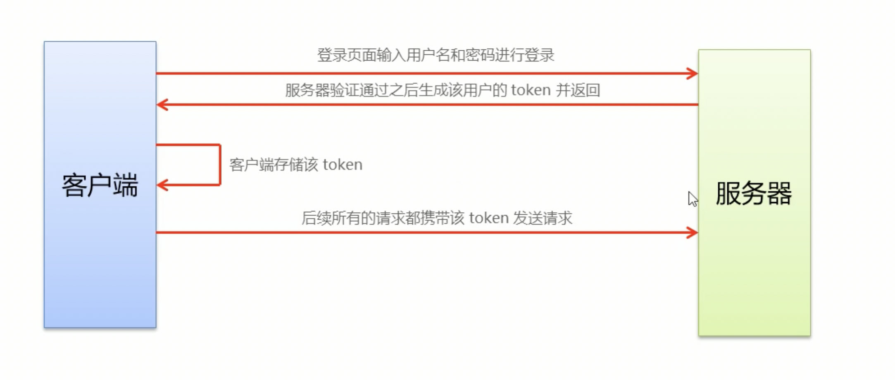

# 前后端分离的Token原理

## 登录功能的实现

- 登陆页面输入**用户名**和**密码**进行登录

- `服务器`验证用户生成该**用户Token**返回`客户端`

- `客户端`存储该Token

- 后续`客户端`的所有请求携带该**Token**

- `服务器`验证**Token**是否通过

  ---

  

## 实现原理

---

## Session、Cookie、Token的使用状况

- http是无状态的
- 通过cookie在客户端记录状态
- 通过session在服务器端记录状态
- 通过token方式维持状态

> 使用条件

在同一个服务器中常用Cookie，有跨域问题时使用Token

