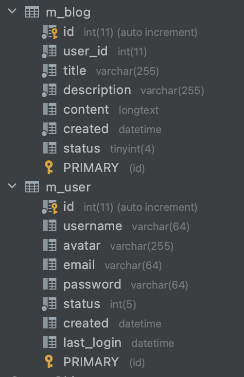
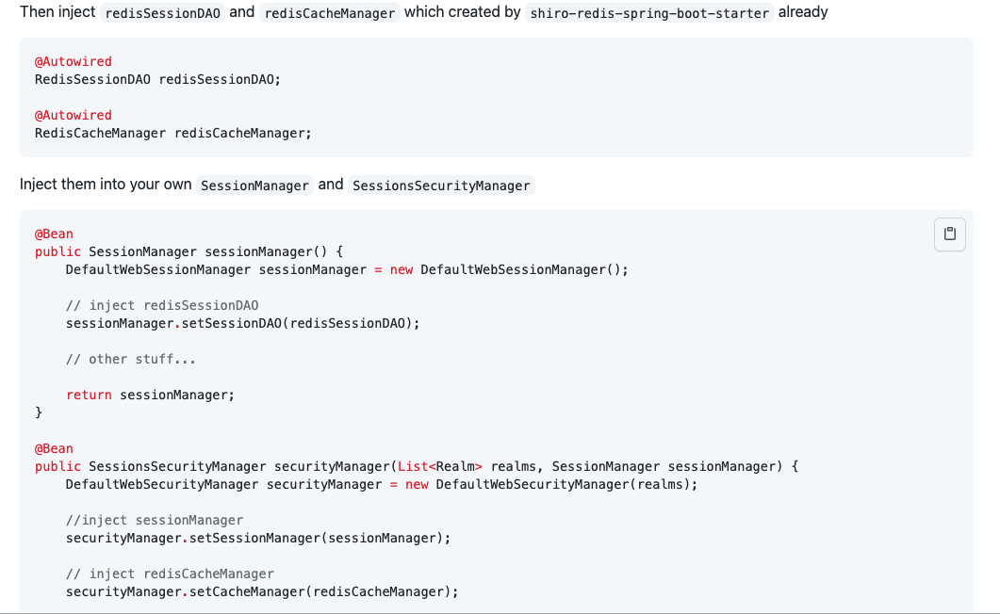
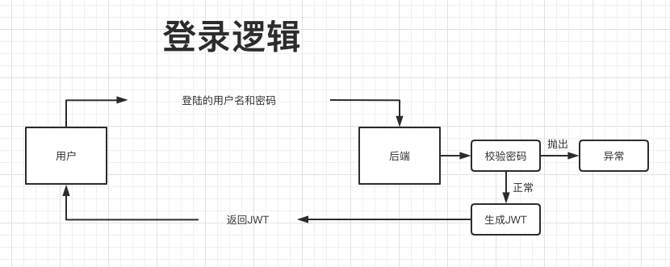
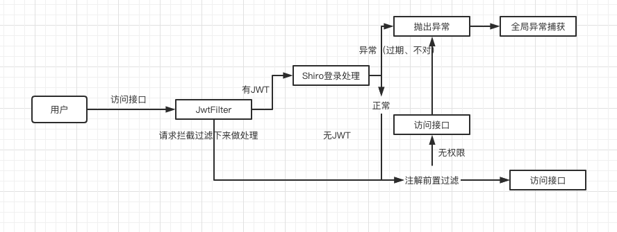
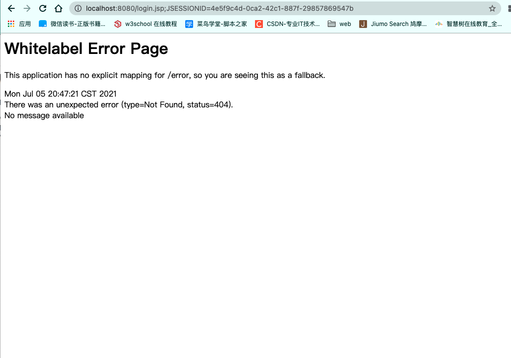
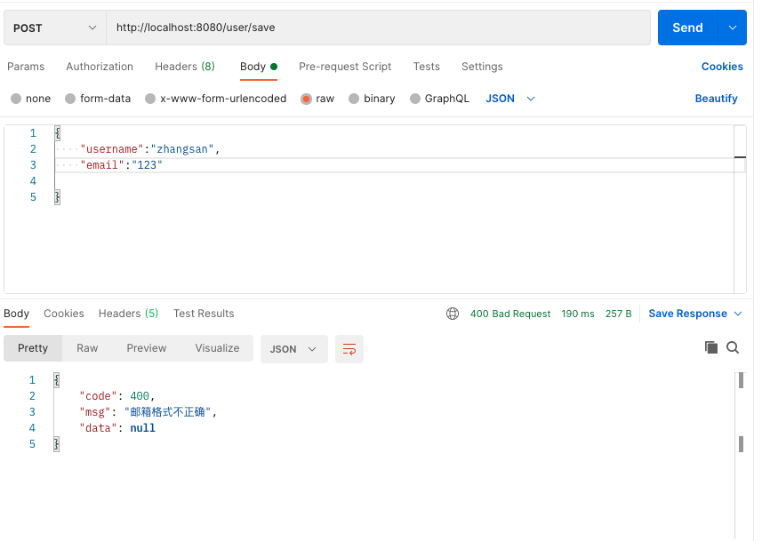

# Vue博客系统前后端分离

> Java后端接口开发

## 前言

从零开始搭建一个**项目骨架**，适合微服务化体系等，以***SpringBoot***作为框架基础，这是离不开的。

**数据层**，我们常用***Mybatis***，易上手，方便维护。但是单表操作比较困难，添加字段或者减少字段的时候比较繁琐，所以此处使用***Mybatis Plus***，为简化开发而生，只需简单配置，即可快速进行CRUD操作，节省大量时间。

**权限管理**，***Shiro***配置简单，使用方便，所以使用Shiro为我们的权限。

考虑到项目可能需要部署多台，这时候需要**会话等信息共享**，***Redis***是现在*<u>主流中间件</u>*，也适合我们的项目。

**前后端分离**，所以使用***jwt***作为*<u>用户身份凭证</u>*。

---

## 技术栈

- SpringBoot
- Mybatis Plus
- Shiro
- Lombok
- Redis
- Hibernate validatior
- jwt

---

## 环境配置

> 开发工具与环境

Idea、Mysql、JDK1.8、Maven

---

## 开发

### 新建SpringBoot项目

#### 导入依赖

> 导入的基础jar包

```xml
<!--Spring Boot DevTools热加载-->
<dependency>
  <groupId>org.springframework.boot</groupId>
  <artifactId>spring-boot-devtools</artifactId>
  <scope>runtime</scope>
	<optional>true</optional>
</dependency>

<!--Lombok-->
<dependency>
  <groupId>org.projectlombok</groupId>
  <artifactId>lombok</artifactId>
  <optional>true</optional>
</dependency>

<!--Spring Web-->
<dependency>
  <groupId>org.springframework.boot</groupId>
  <artifactId>spring-boot-starter-web</artifactId>
</dependency>

<!--mysql-->
<dependency>
  <groupId>mysql</groupId>
  <artifactId>mysql-connector-java</artifactId>
  <scope>runtime</scope>
</dependency>
```

---

### 整合Mybatis Plus

#### 导入依赖

> 导入jar依赖

```xml
<!--mybatis plus-->
<dependency>
  <groupId>com.baomidou</groupId>
  <artifactId>mybatis-plus-boot-starter</artifactId>
  <version>3.2.0</version>
</dependency>
<!--freemarker页面模版引擎｜用于代码生成-->
<dependency>
  <groupId>org.springframework.boot</groupId>
  <artifactId>spring-boot-starter-freemarker</artifactId>
</dependency>
<!--mybatis plus代码生成器-->
<dependency>
  <groupId>com.baomidou</groupId>
  <artifactId>mybatis-plus-generator</artifactId>
  <version>3.2.0</version>
</dependency>
```

---

#### 编写配置文件

> application.yml

```yml
# DataSource Config
spring:
  datasource:
    driver-class-name: com.mysql.cj.jdbc.Driver
    url: jdbc:mysql://localhost:3306/vueblog?useUnicode=true&useSSL=false&characterEncoding=utf8&serverTimezone=Asia/Shanghai
    username: root
    password: 123456
# 要注意配置mybatis plus的mapper的xml文件扫描路径
mybatis-plus:
  mapper-locations: classpath*:/mapper/**Mapper.xml

```

---

#### 开启mapper扫描，添加分页插件

> 通过``@mapperScan`注解指定要变成实现类的接口所在的包，然后包下的所有接口都会生成相应的实现类。
>
> **PaginationInterceptor**是一个分页插件

- com.cxy.vueblogbg.config.MybatisPlusConfig

```java
@Configuration
@EnableTransactionManagement
@MapperScan("com.cxy.vueblogbg.mapper")
public class MybatisPlusConfig {
    @Bean
    public PaginationInterceptor paginationInterceptor() {
        PaginationInterceptor paginationInterceptor = new PaginationInterceptor();
        return paginationInterceptor;
    }
}
```

---

#### 代码生成

>官方给我们提供了一个代码生成器，然后我写上自己的参数之后，就可以直接根据数据库表信息生成entity、service、mapper等接口和实现类。

- com.cxy.vueblogbg.CodeGenerator

```java
public class CodeGenerator {

    /**
     * <p>
     * 读取控制台内容
     * </p>
     */
    public static String scanner(String tip) {
        Scanner scanner = new Scanner(System.in);
        StringBuilder help = new StringBuilder();
        help.append("请输入" + tip + "：");
        System.out.println(help.toString());
        if (scanner.hasNext()) {
            String ipt = scanner.next();
            if (StringUtils.isNotEmpty(ipt)) {
                return ipt;
            }
        }
        throw new MybatisPlusException("请输入正确的" + tip + "！");
    }

    public static void main(String[] args) {
        // 代码生成器
        AutoGenerator mpg = new AutoGenerator();

        // 全局配置
        GlobalConfig gc = new GlobalConfig();
        String projectPath = System.getProperty("user.dir");
        gc.setOutputDir(projectPath + "/src/main/java");
        gc.setAuthor("xing-yu-chen");
        gc.setOpen(false);
        // gc.setSwagger2(true); 实体属性 Swagger2 注解
        gc.setServiceName("%sService");
        mpg.setGlobalConfig(gc);

        // 数据源配置
        DataSourceConfig dsc = new DataSourceConfig();
        dsc.setUrl("jdbc:mysql://localhost:3306/vueblog?useUnicode=true&useSSL=false&characterEncoding=utf8&serverTimezone=UTC");
        // dsc.setSchemaName("public");
        dsc.setDriverName("com.mysql.cj.jdbc.Driver");
        dsc.setUsername("root");
        dsc.setPassword("123456");
        mpg.setDataSource(dsc);

        // 包配置
        PackageConfig pc = new PackageConfig();
        pc.setModuleName(null);
      	//常用用于生成位置的包名
        pc.setParent("com.cxy.vueblogbg");
        mpg.setPackageInfo(pc);

        // 自定义配置
        InjectionConfig cfg = new InjectionConfig() {
            @Override
            public void initMap() {
                // to do nothing
            }
        };

        // 如果模板引擎是 freemarker
        String templatePath = "/templates/mapper.xml.ftl";
        // 如果模板引擎是 velocity
        // String templatePath = "/templates/mapper.xml.vm";

        // 自定义输出配置
        List<FileOutConfig> focList = new ArrayList<>();
        // 自定义配置会被优先输出
        focList.add(new FileOutConfig(templatePath) {
            @Override
            public String outputFile(TableInfo tableInfo) {
                // 自定义输出文件名 ， 如果你 Entity 设置了前后缀、此处注意 xml 的名称会跟着发生变化！！
                return projectPath + "/src/main/resources/mapper/"
                        + "/" + tableInfo.getEntityName() + "Mapper" + StringPool.DOT_XML;
            }
        });

        cfg.setFileOutConfigList(focList);
        mpg.setCfg(cfg);

        // 配置模板
        TemplateConfig templateConfig = new TemplateConfig();

        templateConfig.setXml(null);
        mpg.setTemplate(templateConfig);

        // 策略配置
        StrategyConfig strategy = new StrategyConfig();
        strategy.setNaming(NamingStrategy.underline_to_camel);
        strategy.setColumnNaming(NamingStrategy.underline_to_camel);
        strategy.setEntityLombokModel(true);
        strategy.setRestControllerStyle(true);
        strategy.setInclude(scanner("表名，多个英文逗号分割").split(","));
        strategy.setControllerMappingHyphenStyle(true);
        strategy.setTablePrefix("m_");
        mpg.setStrategy(strategy);
        mpg.setTemplateEngine(new FreemarkerTemplateEngine());
        mpg.execute();
    }
}
```

---

#### 数据库建表

> 本项目中生成两个表**m_user**和**m_blog**



生成之后，运行**代码生成器**。

> 测试代码

```java
@SpringBootTest
class VueBlogBgApplicationTests {

    @Autowired
    private UserService userService;
    @Test
    void contextLoads() {
        System.out.println(userService.getById(1L));
    }
}
//得到
User(id=1, username=zhangsan, avatar=null, email=null, password=null, status=1, created=null, lastLogin=null)
```

运行成功。

---

### 封装统一结果

> 用到了一个**Result**的类，这个用于我们的异步统一返回的结果封装。
>
> 一般来说，结果里面有几个要素是必要的。

- 是否成功，可用code表示(如200表示成功，400表示异常)
- 结果消息
- 结果数据

> 封装如下

- com.cxy.vueblogbg .common.lang.Result

```java
@Data
public class Result implements Serializable {
    //200是正常，非200表示异常
    private int code;
    private String msg;
    private Object data;

    //成功的结果
    public static Result succ(Object data){
        return succ(200,"操作成功",data);
    }

    public static Result succ(int code,String msg,Object data){
        Result result=new Result();
        result.setCode(code);
        result.setMsg(msg);
        result.setData(data);
        return result;
    }

    //异常数据的调用方法
    //数据异常｜密码错误等
    public static Result succ(String msg){
       return fail(400,msg,null);
    }

    //返回错误方法
    public static Result fail(String msg,Object data){
        return fail(400,msg,data);
    }

    public static Result fail(int code,String msg,Object data){
        Result result=new Result();
        result.setCode(code);
        result.setMsg(msg);
        result.setData(data);
        return result;
    }
}
```

> 测试

```java
@RestController
@RequestMapping("/user")
public class UserController {
    @Autowired
    private UserService userService;
    @GetMapping("/id")
    public Result getUserId(){
        User byId = userService.getById(1L);
        return Result.succ(byId);
    }
}
```

```json
{
  "code": 200,
  "msg": "操作成功",
  "data": {
    "id": 1,
    "username": "zhangsan",
    "avatar": null,
    "email": null,
    "password": null,
    "status": 1,
    "created": null,
    "lastLogin": null
  }
}
```

---

### 整合shiro+jwt与会话共享

>考虑到后面可能需要做集群、负载均衡等，所以就需要会话共享，而shiro的缓存和会话信息，我们一般考虑使用redis来存储这些数据，所以，我们不仅仅需要整合shiro，同时也需要整合redis。在开源的项目中，我们找到了一个starter可以快速整合shiro-redis，配置简单，这里也推荐大家使用。
>
>**我们会采用token或者jwt作为跨域身份验证解决方案。所以整合shiro的过程中，我们需要引入jwt的身份验证过程。**

#### 官方文档

https://github.com/alexxiyang/shiro-redis/blob/master/docs/README.md#spring-boot-starter



此处重写自定义。

#### 导入依赖包

> 导入shiro-redis的starter包，还有jwt工具包，以及简化开发的hutool工具包

```xml
<!--shiro-redis-->
<dependency>
  <groupId>org.crazycake</groupId>
  <artifactId>shiro-redis-spring-boot-starter</artifactId>
  <version>3.2.1</version>
</dependency>

<!-- hutool工具类-->
<dependency>
  <groupId>cn.hutool</groupId>
  <artifactId>hutool-all</artifactId>
  <version>5.3.3</version>
</dependency>

<!-- jwt -->
<dependency>
  <groupId>io.jsonwebtoken</groupId>
  <artifactId>jjwt</artifactId>
  <version>0.9.1</version>
</dependency>
```

#### 登录逻辑





#### 代码逻辑流程

##### ShiroConfig

```java
@Configuration
public class ShiroConfig {
    @Bean
    public SessionManager sessionManager(RedisSessionDAO redisSessionDAO) {
        DefaultWebSessionManager sessionManager = new DefaultWebSessionManager();
        sessionManager.setSessionDAO(redisSessionDAO);
        return sessionManager;
    }

    @Bean
    public SessionsSecurityManager securityManager(AccountRealm accountRealm,
                                                   SessionManager sessionManager,
                                                   RedisCacheManager redisCacheManager) {
        DefaultWebSecurityManager securityManager = new DefaultWebSecurityManager(accountRealm);
        securityManager.setSessionManager(sessionManager);
        securityManager.setCacheManager(redisCacheManager);
        return securityManager;
    }
    //shiro过滤器链的定义，定义哪些链接需要经过哪些过滤器
    @Bean
    public ShiroFilterChainDefinition shiroFilterChainDefinition() {
        DefaultShiroFilterChainDefinition chainDefinition = new DefaultShiroFilterChainDefinition();
        Map<String, String> filterMap = new LinkedHashMap<>();
        filterMap.put("/**", "authc"); // 主要通过注解方式校验权限
        chainDefinition.addPathDefinitions(filterMap);
        return chainDefinition;
    }
    @Bean("shiroFilterFactoryBean")
    public ShiroFilterFactoryBean shiroFilterFactoryBean(SecurityManager securityManager,
                                                         ShiroFilterChainDefinition shiroFilterChainDefinition) {
        ShiroFilterFactoryBean shiroFilter = new ShiroFilterFactoryBean();
        shiroFilter.setSecurityManager(securityManager);
//        Map<String, Filter> filters = new HashMap<>();
//        filters.put("jwt", jwtFilter);
//        shiroFilter.setFilters(filters);
        Map<String, String> filterMap = shiroFilterChainDefinition.getFilterChainMap();
        shiroFilter.setFilterChainDefinitionMap(filterMap);
        return shiroFilter;
    }

}
```

##### 导包问题

```java
import com.cxy.vueblogbg.shiro.AccountRealm;
import org.apache.shiro.mgt.SessionsSecurityManager;
import org.apache.shiro.session.mgt.SessionManager;
import org.apache.shiro.mgt.SecurityManager;
import org.apache.shiro.spring.web.ShiroFilterFactoryBean;
import org.apache.shiro.spring.web.config.DefaultShiroFilterChainDefinition;
import org.apache.shiro.spring.web.config.ShiroFilterChainDefinition;
import org.apache.shiro.web.mgt.DefaultWebSecurityManager;
import org.apache.shiro.web.session.mgt.DefaultWebSessionManager;
import org.crazycake.shiro.RedisCacheManager;
import org.crazycake.shiro.RedisSessionDAO;
import org.springframework.context.annotation.Bean;
import org.springframework.context.annotation.Configuration;

import java.util.LinkedHashMap;
import java.util.Map;
```

##### AccountRealm

```java
@Component
public class AccountRealm extends AuthorizingRealm {
    //获取权限
    @Override
    protected AuthorizationInfo doGetAuthorizationInfo(PrincipalCollection principalCollection) {
        return null;
    }

    //身份验证
    @Override
    protected AuthenticationInfo doGetAuthenticationInfo(AuthenticationToken authenticationToken) throws AuthenticationException {
        return null;
    }
}
```

##### 测试

> localhost:8080/user/id
>
> 成功拦截



#### 完整版Shiro代码流程

##### ShiroConfig

> com.cxy.vueblogbg.config.ShiroConfig

```java
import com.cxy.vueblogbg.shiro.AccountRealm;
import com.cxy.vueblogbg.shiro.JwtFilter;
import org.apache.shiro.mgt.SessionsSecurityManager;
import org.apache.shiro.session.mgt.SessionManager;
import org.apache.shiro.mgt.SecurityManager;
import org.apache.shiro.spring.web.ShiroFilterFactoryBean;
import org.apache.shiro.spring.web.config.DefaultShiroFilterChainDefinition;
import org.apache.shiro.spring.web.config.ShiroFilterChainDefinition;
import org.apache.shiro.web.mgt.DefaultWebSecurityManager;
import org.apache.shiro.web.session.mgt.DefaultWebSessionManager;
import org.crazycake.shiro.RedisCacheManager;
import org.crazycake.shiro.RedisSessionDAO;
import org.springframework.beans.factory.annotation.Autowired;
import org.springframework.context.annotation.Bean;
import org.springframework.context.annotation.Configuration;

import javax.servlet.Filter;
import java.util.HashMap;
import java.util.LinkedHashMap;
import java.util.Map;

@Configuration
public class ShiroConfig {

    @Autowired
    private JwtFilter jwtFilter;

    @Bean
    public SessionManager sessionManager(RedisSessionDAO redisSessionDAO) {
        DefaultWebSessionManager sessionManager = new DefaultWebSessionManager();
        sessionManager.setSessionDAO(redisSessionDAO);
        return sessionManager;
    }

    @Bean
    public SessionsSecurityManager securityManager(AccountRealm accountRealm,
                                                   SessionManager sessionManager,
                                                   RedisCacheManager redisCacheManager) {
        DefaultWebSecurityManager securityManager = new DefaultWebSecurityManager(accountRealm);
        securityManager.setSessionManager(sessionManager);
        securityManager.setCacheManager(redisCacheManager);
        return securityManager;
    }
    //shiro过滤器链的定义，定义哪些链接需要经过哪些过滤器
    @Bean
    public ShiroFilterChainDefinition shiroFilterChainDefinition() {
        DefaultShiroFilterChainDefinition chainDefinition = new DefaultShiroFilterChainDefinition();
        Map<String, String> filterMap = new LinkedHashMap<>();
        filterMap.put("/**", "jwt"); // 主要通过注解方式校验权限
        chainDefinition.addPathDefinitions(filterMap);
        return chainDefinition;
    }
    @Bean("shiroFilterFactoryBean")
    public ShiroFilterFactoryBean shiroFilterFactoryBean(SecurityManager securityManager,
                                                         ShiroFilterChainDefinition shiroFilterChainDefinition) {
        ShiroFilterFactoryBean shiroFilter = new ShiroFilterFactoryBean();
        shiroFilter.setSecurityManager(securityManager);
        Map<String, Filter> filters = new HashMap<>();
        filters.put("jwt", jwtFilter);
        shiroFilter.setFilters(filters);
        Map<String, String> filterMap = shiroFilterChainDefinition.getFilterChainMap();
        shiroFilter.setFilterChainDefinitionMap(filterMap);
        return shiroFilter;
    }
}
```

上面ShiroConfig，我们主要做了几件事情：

1. 引入**RedisSessionDAO**和**RedisCacheManager**，为了<u>解决shiro的权限数据和会话信息能保存到redis中</u>，实现会话共享。
2. 重写了**SessionManager**和**DefaultWebSecurityManager**，同时在**DefaultWebSecurityManager**中为了<u>关闭shiro自带的session方式</u>，我们需要设置为false，这样用户就不再能通过session方式登录shiro。后面将<u>采用jwt凭证登录</u>。
3. 在**ShiroFilterChainDefinition**中，我们不再通过编码形式拦截Controller访问路径，而是所有的路由都需要经过<u>JwtFilter过滤器</u>，然后判断请求头中是否含有jwt的信息，有就登录，没有就跳过。跳过之后，有Controller中的shiro注解进行再次拦截，比如**@RequiresAuthentication**，这样控制权限访问。

那么，接下来，我们聊聊ShiroConfig中出现的**AccountRealm**，还有**JwtFilter**。

##### AccountRealm

> AccountRealm是shiro进行登录或者权限校验的逻辑所在,我们需要重写3个方法:
>
> - supports：为了让realm支持jwt的凭证校验
> - doGetAuthorizationInfo：权限校验
> - doGetAuthenticationInfo：登录认证校验

- com.cxy.vueblogbg.shiro.AccountRealm

```java
import cn.hutool.core.bean.BeanUtil;
import com.cxy.vueblogbg.entity.User;
import com.cxy.vueblogbg.service.UserService;
import com.cxy.vueblogbg.util.JwtUtils;
import org.apache.shiro.authc.*;
import org.apache.shiro.authz.AuthorizationInfo;
import org.apache.shiro.realm.AuthorizingRealm;
import org.apache.shiro.subject.PrincipalCollection;
import org.springframework.beans.factory.annotation.Autowired;
import org.springframework.stereotype.Component;

@Component
public class AccountRealm extends AuthorizingRealm {

    @Autowired
    private JwtUtils jwtUtils;

    @Autowired
    private UserService userService;

    //告诉它支持的token类型是jwttoken,而非其他的token
    @Override
    public boolean supports(AuthenticationToken token) {
        return token instanceof JwtToken;
    }

    //获取权限
    @Override
    protected AuthorizationInfo doGetAuthorizationInfo(PrincipalCollection principalCollection) {
        return null;
    }

    //身份验证
    @Override
    protected AuthenticationInfo doGetAuthenticationInfo(AuthenticationToken authenticationToken) throws AuthenticationException {
        //登陆逻辑开发
        JwtToken jwtToken=(JwtToken)authenticationToken;
        String userId = jwtUtils.getClaimByToken((String) jwtToken.getPrincipal()).getSubject();
        User user = userService.getById(Long.valueOf(userId));
        if(user == null){
            throw new UnknownAccountException("账户不存在");
        }
        if(user.getStatus()==-1){
            //如果账户被锁定
            throw new LockedAccountException("账户已被锁定");
        }
        AccountProfile profile=new AccountProfile();
        //把公开的用户信息copy到profile里
        BeanUtil.copyProperties(user,profile);

        System.out.println("------");
        return new SimpleAuthenticationInfo(profile,jwtToken.getCredentials(),getName());
    }
}
```

其实主要就是**doGetAuthenticationInfo**<u>登录认证</u>这个方法，可以看到我们通过<u>jwt获取到用户信息，判断用户的状态，最后异常就抛出对应的异常信息，否者封装成SimpleAuthenticationInfo返回给shiro</u>。 接下来我们逐步分析里面出现的新类：

shiro默认supports的是UsernamePasswordToken，而我们现在采用了jwt的方式，所以这里我们<u>自定义一个JwtToken</u>，来完成shiro的supports方法。

##### JwtToken

> com.cxy.vueblogbg.shiro.JwtToken

```java
public class JwtToken implements AuthenticationToken {

    private String token;

    public JwtToken(String jwt){
        this.token=jwt;
    }

    //获取授权用户信息
    @Override
    public Object getPrincipal() {
        return token;
    }

    //返回密钥信息
    @Override
    public Object getCredentials() {
        return token;
    }
}
```

##### JwtUtils

> JwtUtils是个生成和校验jwt的工具类，其中有些jwt相关的密钥信息是从项目配置文件中配置的
>
> com.cxy.vueblogbg.util.JwtUtils

```java
@Slf4j
@Data
@Component
@ConfigurationProperties(prefix = "markerhub.jwt")
public class JwtUtils {
    //需要配置配置文件
    //yml里markhub的hwt说明
    //密钥
    private String secret;

    //过期时间
    private long expire;

    //信息
    private String header;

    /**
     * 生成jwt token
     */
    public String generateToken(long userId) {
        Date nowDate = new Date();
        //过期时间
        Date expireDate = new Date(nowDate.getTime() + expire * 1000);

        return Jwts.builder()
                .setHeaderParam("typ", "JWT")
                .setSubject(userId+"")
                .setIssuedAt(nowDate)
                .setExpiration(expireDate)
                .signWith(SignatureAlgorithm.HS512, secret)
                .compact();
    }

    public Claims getClaimByToken(String token) {
        try {
            return Jwts.parser()
                    .setSigningKey(secret)
                    .parseClaimsJws(token)
                    .getBody();
        }catch (Exception e){
            log.debug("validate is token error ", e);
            return null;
        }
    }

    /**
     * token是否过期
     * @return  true：过期
     */
    public boolean isTokenExpired(Date expiration) {
        return expiration.before(new Date());
    }
```

> application.yml

```yml
shiro-redis:
  enabled:true
  redis-manager:
    host:127.0.0.1:6379
markerhub:
  jwt:
    secret: f4e2e52034348f86b67cde581c0f9eb5
    expire: 604800
    header: Authorization
```

在AccountRealm我们还用到了AccountProfile，这是为了登录成功之后返回的一个用户信息的载体。

##### AccountProfile

> com.cxy.vueblogbg.shiro.AccountProfile

```java
//非私密信息封装用于给Shiro公开
@Data
public class AccountProfile implements Serializable {
    private Long id;
    private String username;
    private String avatar;
    private String email;
}
```

##### JwtFilter

> 定义jwt的过滤器JwtFilter
>
> 个过滤器是我们的重点，这里我们继承的是Shiro内置的AuthenticatingFilter，一个可以内置了可以自动登录方法的的过滤器，有些同学继承BasicHttpAuthenticationFilter也是可以的。
>
> 我们需要重写几个方法：
>
> 1. createToken：实现登录，我们需要生成我们自定义支持的JwtToken
>
> 2. onAccessDenied：拦截校验，当头部没有Authorization时候，我们直接通过，不需要自动登录；当带有的时候，首先我们校验jwt的有效性，没问题我们就直接执行executeLogin方法实现自动登录
>
> 3. onLoginFailure：登录异常时候进入的方法，我们直接把异常信息封装然后抛出
>
> 4. preHandle：拦截器的前置拦截，因为我们是前后端分析项目，项目中除了需要跨域全局配置之外，我们再拦截器中也需要提供跨域支持。这样，拦截器才不会在进入Controller之前就被限制了。

- com.cxy.vueblogbg.shiro.JwtFilter

```java
import cn.hutool.json.JSONUtil;
import com.baomidou.mybatisplus.core.toolkit.StringUtils;
import com.cxy.vueblogbg.common.lang.Result;
import com.cxy.vueblogbg.util.JwtUtils;
import io.jsonwebtoken.Claims;
import org.apache.shiro.authc.AuthenticationException;
import org.apache.shiro.authc.AuthenticationToken;
import org.apache.shiro.authc.ExpiredCredentialsException;
import org.apache.shiro.web.filter.authc.AuthenticatingFilter;
import org.springframework.beans.factory.annotation.Autowired;
import org.springframework.stereotype.Component;

import javax.servlet.ServletRequest;
import javax.servlet.ServletResponse;
import javax.servlet.http.HttpServletRequest;
import javax.servlet.http.HttpServletResponse;
import java.io.IOException;

@Component
public class JwtFilter extends AuthenticatingFilter {

    @Autowired
    private JwtUtils jwtUtils;
    @Override
    protected AuthenticationToken createToken(ServletRequest servletRequest, ServletResponse servletResponse) throws Exception {
        HttpServletRequest request = (HttpServletRequest) servletRequest;
        String jwt = request.getHeader("Authorization");
        //如果没有就返回空，如果有才进行封装成token的形式
        if(StringUtils.isEmpty(jwt)){
            //如果jwt是空的，登录是没必要登陆的直接跳过即可
            return null;
        }
        return new JwtToken(jwt);
    }

    //拦截
    @Override
    protected boolean onAccessDenied(ServletRequest servletRequest, ServletResponse servletResponse) throws Exception {
        HttpServletRequest request = (HttpServletRequest) servletRequest;
        String jwt = request.getHeader("Authorization");
        //如果没有就返回空，如果有才进行封装成token的形式
        if(StringUtils.isEmpty(jwt)){
            //如果jwt是空的，不需要拦截，直接可以访问controller
            return true;
        }else{
            //校验jwt
            //获取头部信息
            Claims claimByToken = jwtUtils.getClaimByToken(jwt);
            //如果token等于空或者过期的话都抛出异常
            if(claimByToken==null&&jwtUtils.isTokenExpired(claimByToken.getExpiration())){
                throw new ExpiredCredentialsException("token已失效，请重新登陆");
            }
            //登录处理
            return executeLogin(servletRequest,servletResponse);
        }
    }

    //重写loginfailture的方法，显示有格式的错误信息,登陆异常的情况
    @Override
    protected boolean onLoginFailure(AuthenticationToken token, AuthenticationException e, ServletRequest request, ServletResponse response) {
        HttpServletResponse httpServletResponse = (HttpServletResponse) response;
        //e.getCause()获取错误原因
        Throwable throwable = e.getCause() == null ? e : e.getCause();
        Result fail = Result.fail(throwable.getMessage());
        String json= JSONUtil.toJsonStr(fail);
        try {
            httpServletResponse.getWriter().print(json);
        } catch (IOException ioException) {
            ioException.printStackTrace();
        }
        return false;
    }
  
   /**
     * 对跨域提供支持
     */
    @Override
    protected boolean preHandle(ServletRequest request, ServletResponse response) throws Exception {
        HttpServletRequest httpServletRequest = WebUtils.toHttp(request);
        HttpServletResponse httpServletResponse = WebUtils.toHttp(response);
        httpServletResponse.setHeader("Access-control-Allow-Origin", httpServletRequest.getHeader("Origin"));
        httpServletResponse.setHeader("Access-Control-Allow-Methods", "GET,POST,OPTIONS,PUT,DELETE");
        httpServletResponse.setHeader("Access-Control-Allow-Headers", httpServletRequest.getHeader("Access-Control-Request-Headers"));
        // 跨域时会首先发送一个OPTIONS请求，这里我们给OPTIONS请求直接返回正常状态
        if (httpServletRequest.getMethod().equals(RequestMethod.OPTIONS.name())) {
            httpServletResponse.setStatus(org.springframework.http.HttpStatus.OK.value());
            return false;
        }
        return super.preHandle(request, response);
    }
}
```

##### 使用spring-boot-devtools

果你项目有使用spring-boot-devtools，需要添加一个配置文件，在resources目录下新建文件夹META-INF，然后新建文件spring-devtools.properties，这样热重启时候才不会报错。

- resources/spring-devtools.properties

```properties
restart.include.shiro-redis=/shiro-[\\w-\\.]+jar
```

#### 异常处理

有时候不可避免服务器报错的情况，如果不配置异常处理机制，就会默认返回tomcat或者nginx的5XX页面，对普通用户来说，不太友好，用户也不懂什么情况。这时候需要我们程序员设计返回一个友好简单的格式给前端。

处理办法如下：通过使用@ControllerAdvice来进行统一异常处理，@ExceptionHandler(value = RuntimeException.class)来指定捕获的Exception各个类型异常 ，这个异常的处理，是全局的，所有类似的异常，都会跑到这个地方处理。

定义全局异常处理，**@ControllerAdvice**表示定义全局控制器异常处理，**@ExceptionHandler**表示针对性异常处理，可对每种异常针对性处理。

- com.cxy.vueblogbg.common.exception.GlobalExceptionHandler

```java
//全局异常捕获
@Slf4j
@RestControllerAdvice
public class GlobalExceptionHandler {
    // 捕捉shiro的异常
    @ResponseStatus(HttpStatus.UNAUTHORIZED)
    @ExceptionHandler(ShiroException.class)
    public Result handle401(ShiroException e) {
        return Result.fail(401, e.getMessage(), null);
    }
    /**
     * 处理Assert的异常
     */
    @ResponseStatus(HttpStatus.BAD_REQUEST)
    @ExceptionHandler(value = IllegalArgumentException.class)
    public Result handler(IllegalArgumentException e) throws IOException {
        log.error("Assert异常:-------------->{}",e.getMessage());
        return Result.fail(e.getMessage());
    }
    /**
     * @Validated 校验错误异常处理
     */
    @ResponseStatus(HttpStatus.BAD_REQUEST)
    @ExceptionHandler(value = MethodArgumentNotValidException.class)
    public Result handler(MethodArgumentNotValidException e) throws IOException {
        log.error("运行时异常:-------------->",e);
        BindingResult bindingResult = e.getBindingResult();
        ObjectError objectError = bindingResult.getAllErrors().stream().findFirst().get();
        return Result.fail(objectError.getDefaultMessage());
    }

    @ResponseStatus(HttpStatus.BAD_REQUEST)
    @ExceptionHandler(value = RuntimeException.class)
    public Result handler(RuntimeException e) throws IOException {
        log.error("运行时异常:-------------->",e);
        return Result.fail(e.getMessage());
    }
}
```

上面我们捕捉了几个异常：

- ShiroException：shiro抛出的异常，比如没有权限，用户登录异常
- IllegalArgumentException：处理Assert的异常
- MethodArgumentNotValidException：处理实体校验的异常
- RuntimeException：捕捉其他异常

调整Controller登陆认证

```java
@RequiresAuthentication
@GetMapping("/id")
public Result getUserId(){
    User byId = userService.getById(1L);
    return Result.succ(byId);
}
```

运行结果：

```json
{
"code": 401,
"msg": "The current Subject is not authenticated.  Access denied.",
"data": null
}
```

#### 实体校验

当我们表单数据提交的时候，前端的校验我们可以使用一些类似于jQuery Validate等js插件实现，而后端我们可以使用Hibernate validatior来做校验。

我们使用springboot框架作为基础，那么就已经自动集成了Hibernate validatior。

##### 添加校验规则

```java
@TableName("m_user")
public class User implements Serializable {
    private static final long serialVersionUID = 1L;
    @TableId(value = "id", type = IdType.AUTO)
    private Long id;
    @NotBlank(message = "昵称不能为空")
    private String username;
    @NotBlank(message = "邮箱不能为空")
    @Email(message = "邮箱格式不正确")
    private String email;
    
    ...
}
```

##### 抛出异常

这里我们使用**@Validated**注解方式，如果实体不符合要求，系统会抛出异常，那么我们的异常处理中就捕获到**MethodArgumentNotValidException**。

- com.cxy.vueblogbg.controller.UserController

```java
**
 * 测试实体校验
 * @param user
 * @return
 */
@PostMapping("/save")
public Object testUser(@Validated @RequestBody User user) {
    return user.toString();
}
```

##### 运行结果



#### 跨域问题

> 跨域问题是避免不了的，我们直接在后台进行全局跨域处理

- com.cxy.vueblogbg.config.CorsConfig

```java
/**
 * 解决跨域问题
 */
@Configuration
public class CorsConfig implements WebMvcConfigurer {
    @Override
    public void addCorsMappings(CorsRegistry registry) {
        registry.addMapping("/**")
                .allowedOrigins("*")
                .allowedMethods("GET", "HEAD", "POST", "PUT", "DELETE", "OPTIONS")
                .allowCredentials(true)
                .maxAge(3600)
                .allowedHeaders("*");
    }
}
```

