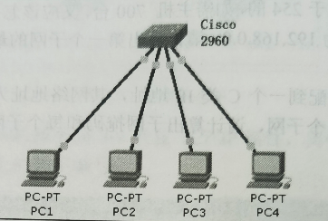
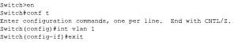
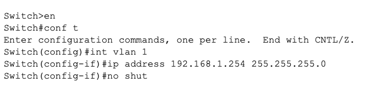
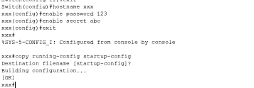
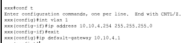
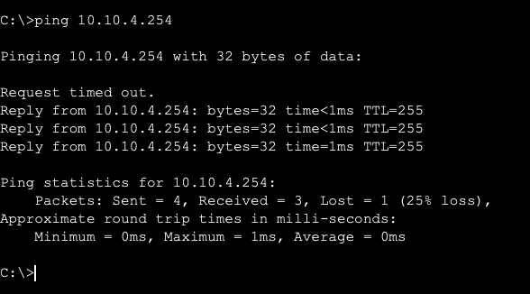
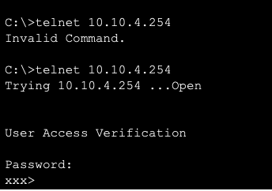
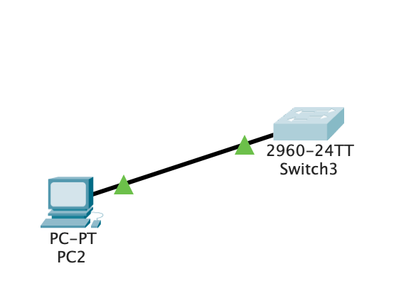
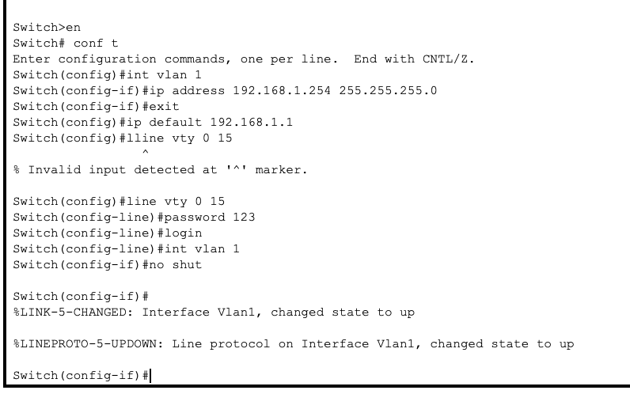
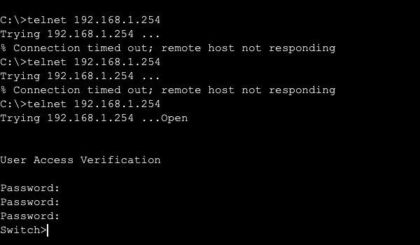

# 交换机基本配置实验

## 实验拓扑



## 实验目的

- 了解吧交换机的作用
- 掌握交换机的基本配置
- 熟悉Packet Tracer 7.0

## 实验步骤

1.在任何模式下，用户在输入命令时，不用全部将其输入，只要几个字母能够唯一标识该命令便可，在此时按Tab键将显示全称。（如：**interface serical 0/1**可以写成:**int s0/1**）

2.在任何模式下，输入一个"?"即可显示所有在该模式下的命令。

3.如果不会拼写某个命令，可以键入开始的几个字母，在其后紧跟一个"?"，交换机即显示有什么样的命令与其匹配。

4.要删除某条配置命令，可以在原配置命令前加一个**no**和**空格**

5.了解交换机的各种模式的功能



```bash
switch> en(用户模式)
switch# conf t(特权模式)
switch(config)# interface vlan 1(全局配置模式)
switch(config-if)# (端口配置模式)
switch(config-line)# (访问配置模式)
```

7.IP地址配置



```bash
switch> en(用户模式)
switch# conf t(特权模式)
switch(config)# int vlan 1(全局配置模式)
switch(config-if)# ip address 192.168.1.254 255.255.255.0(设置交换机的管理IP地址)
switch(config-if)# no shut(默认关闭)
```

8.修改交换机用户名和密码



```bash
Switch(config)#hostname xxx(设置用户名)
xxx(config)#enable password 123(设置交换机明文密码)
xxx(config)#enable secret abc(设置交换机密文密码)
xxx(config)#exit
xxx#copy running-config startup-config(保存配置，没保存重启配置丢失)
Destination filename [startup-config]? 
Building configuration...
[OK]
```

9.telent配置


```bash
xxx#conf t(特权模式)
xxx(config)#line vty 0 15(vty指的是虚拟终端，指定开启line模式的的是0-15线路供用户使用)
xxx(config-line)#password cisco
xxx(config-line)#login
```

10.连接登录到真正Cisco设备的过程

- 通过Console（控制台）终端的方式
- 通过Talnet远程访问
- 通过Web管理界面
- 通过网管软件

**步骤1**：要连接一台还没配置的新交换机或者没有管理IP地址的交换机，只能用终端方式访问，利用console线连接设备的console口与PC机的串口。

**步骤2**:设置好交换机的管理IP地址后，就可以通过telnet登陆到交换机进行管理了



```bash
xxx#conf t(特权模式)
xxx(config)#int vlan 1（全局配置vlan1）
xxx(config-if)#ip address 10.10.4.254 255.255.255.0（配置vlan1的管理IP地址）
xxx(config-if)#exit（回退）
xxx(config)#ip default-gateway 10.10.4.1（设置ip地址的默认网关地址）
```

**步骤3**：PC机telnet到10.10.4.254上访问（所有密码为cisco）

> 先ping通



> 使用telnet远程访问




## 思考题

- 交换机有多少种配置模式？

1. 普通用户模式
2. 特权用户模式
3. 全局配置模式
4. 接口配置模式
5. vlan配置模式
6. 恢复交换机的缺省模式

- 为了方便管理，交换机需开通telnet功能，请问如何配置交换机？







- 查看交换机所有配置信息用哪条指令？

```bash
switch# show run
```

