# 三层交换机的配置

## 实验拓扑

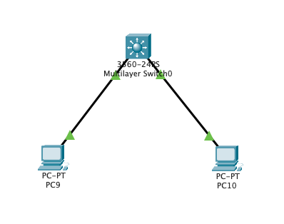

## 实验目的

(1)深入了解三层机哦啊还击的功能、特点及工作原理

(2)掌握三层交换机实现路由功能的方法

---

## 实验步骤

三层机交换机实际上是**具有路由功能**的交换机。

1. 通过vlan ip做网关，实现不同vlan的路由

   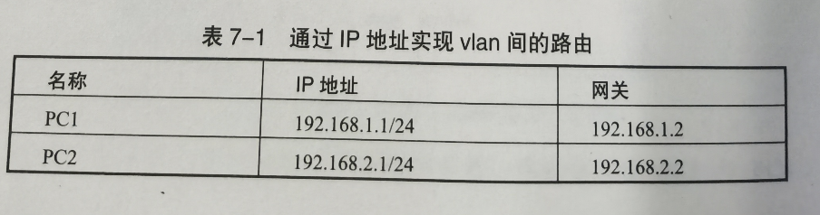

   在交换机上先建两个vlan，分别为vlan2和vlan3，将F0/1放入vlan2，将F0/2放入vlan3，再设置vlan2和vlan3的IP地址

   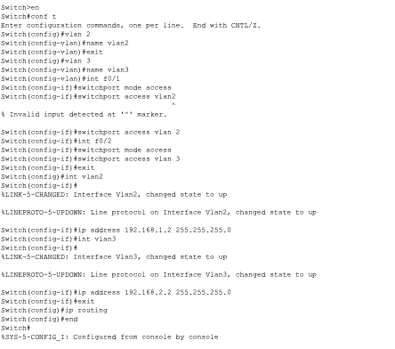

   ```bash
   Switch>en
   Switch#conf t
   Enter configuration commands, one per line.  End with CNTL/Z.
   Switch(config)#vlan 2
   Switch(config-vlan)#name vlan2
   Switch(config-vlan)#exit
   Switch(config)#vlan 3 
   Switch(config-vlan)#name vlan3
   Switch(config-vlan)#int f0/1
   Switch(config-if)#switchport mode access
   Switch(config-if)#switchport access vlan 2
   Switch(config-if)#int f0/2
   Switch(config-if)#switchport mode access
   Switch(config-if)#switchport access vlan 3
   Switch(config-if)#exit
   Switch(config)#int vlan2
   Switch(config-if)#ip address 192.168.1.2 255.255.255.0
   Switch(config-if)#int vlan3
   Switch(config-if)#ip address 192.168.2.2 255.255.255.0
   Switch(config-if)#exit
   Switch(config)#ip routing(开启三层路由模式)
   Switch(config)#end
   ```

   PC1 Ping 通PC2，三层交换配置正确

2. 通设置端口的三层工作模式实现不同网络的路由

   端口为三层模式，实际上是通过no switchport关闭交换机端口的二层功能，再设端口的IP地址，但是**这一功能只有三层交换机才有。**

   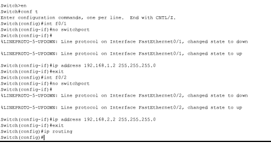

   ```bash
   Switch>en
   Switch#conf t
   Switch(config)#int f0/1
   Switch(config-if)#no switchport
   Switch(config-if)#
   Switch(config-if)#ip address 192.168.1.2 255.255.255.0
   Switch(config-if)#exit
   Switch(config)#int f0/2
   Switch(config-if)#no switchport
   Switch(config-if)#
   Switch(config-if)#ip address 192.168.2.2 255.255.255.0
   Switch(config-if)#exit
   Switch(config)#ip routing
   ```

   

   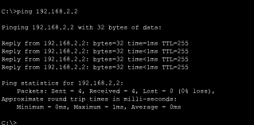

3. 三层、二层交换机联合配置

   > 用3560做路由，2960做二层交换机，通过**虚拟网干协议**（VTP）功能将三层机交换机VLAN传到下层

   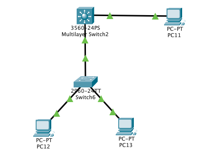

   （1）交换机2960配置为vtp clinent（VTP客户机），vtp domain（VTP域）为abc

   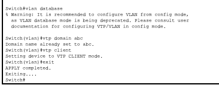

   ```bash
   Switch>en
   Switch#conf t
   Enter configuration commands, one per line.  End with CNTL/Z.
   Switch#vlan database
   % Warning: It is recommended to configure VLAN from config mode,
     as VLAN database mode is being deprecated. Please consult user
     documentation for configuring VTP/VLAN in config mode.
   
   Switch(vlan)#vtp domain abc
   Domain name already set to abc.
   Switch(vlan)#vtp client
   Setting device to VTP CLIENT mode.
   Switch(vlan)#exit
   APPLY completed.
   Exiting....
   Switch#
   ```
   
   (2)交换机2960的F0/4接口配置为trunk
   
   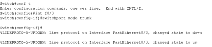

   ```bash
Switch#conf t
   Enter configuration commands, one per line.  End with CNTL/Z.
Switch(config)#int f0/3
   Switch(config-if)#switchport mode trunk
   Switch(config-if)#
   %LINEPROTO-5-UPDOWN: Line protocol on Interface FastEthernet0/3, changed state to down
   %LINEPROTO-5-UPDOWN: Line protocol on Interface FastEthernet0/3, changed state to up
   ```
   
   (3)交换机2960的端口划分
   
   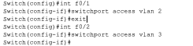

   ```bash
Switch(config)#int f0/1
   Switch(config-if)#switchport access vlan 2
Switch(config-if)#exit
   Switch(config)#int f0/2
   Switch(config-if)#switchport access vlan 3
   Switch(config-if)#
   ```
   
   (4)交换机3560配置为vtp Server（VTP服务器），vtp domain（VTP域）为abc
   
   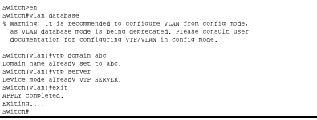

   ```bash
Switch>en
   Switch#vlan database
% Warning: It is recommended to configure VLAN from config mode,
     as VLAN database mode is being deprecated. Please consult user
     documentation for configuring VTP/VLAN in config mode.
   Switch(vlan)#vtp domain abc
   Domain name already set to abc.
   Switch(vlan)#vtp server
   Device mode already VTP SERVER.
   Switch(vlan)#exit
   APPLY completed.
   Exiting....
   Switch#
   ```
   
   (5)交换机3560的接口配置为trunk
   
   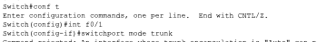

   ```bash
Switch#conf t
   Enter configuration commands, one per line.  End with CNTL/Z.
Switch(config)#int f0/1
   Switch(config-if)#switchport mode trunk
   ```
   
   (6)交换机3560创建vlan和设置vlan的IP地址
   
   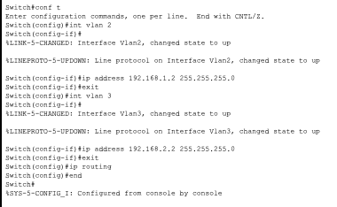

   ```bash
Switch#conf t
   Enter configuration commands, one per line.  End with CNTL/Z.
Switch(config)#int vlan 2
   Switch(config-if)#
   %LINK-5-CHANGED: Interface Vlan2, changed state to up
   
   %LINEPROTO-5-UPDOWN: Line protocol on Interface Vlan2, changed state to up
   
   Switch(config-if)#ip address 192.168.1.2 255.255.255.0
   Switch(config-if)#exit
   Switch(config)#int vlan 3
   Switch(config-if)#
   %LINK-5-CHANGED: Interface Vlan3, changed state to up
   
   %LINEPROTO-5-UPDOWN: Line protocol on Interface Vlan3, changed state to up
   
   Switch(config-if)#ip address 192.168.2.2 255.255.255.0
   Switch(config-if)#exit
   Switch(config)#ip routing
   Switch(config)#end
   Switch#
   %SYS-5-CONFIG_I: Configured from console by console
   ```
   
   (7)PC14的IP设为192.168.1.1,网关为192.168.1.2,PC15的IP设为192.168.2.1,网关设为192.168.2.2，如果PC14能Ping通PC15，说明三层交换配置成功。
   
   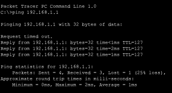

   ## 思考题

   (1)三层交换机和普通交换机有什么区别？

   三层交换机有部分路由功能，（概念）算在网络层，普通交换机在数据链路层

   (2)三层交换机和路由器有什么区别？

   1. 路由器要用在跨网段数据转发，三层交换主要用来做本地的高速数据转发
2. 交换机发生在OSI参考模型第二层（数据链路层），而路由发生在第三层，即网络层