# 虚拟局域网

## 实验拓扑

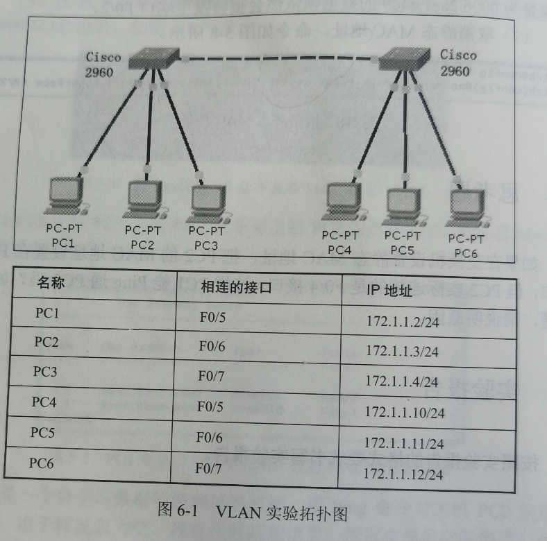

## 实验内容

1. 分别把交换机命名为SWA，SWB
2. 划分虚拟局域网vlan，并静态把端口划分到vlan中

---

第一，使用两种方法划分vlan

- 在**全局模式**下划分vlan：使用这种方法在SWA交换机上创建三个vlan，分别为vlan2，vlan3和vlan4，vlan名称可任意定义。
- 进入**vlan database**划分vlan：使用这种方式在SWB机哦啊还击上创建三个vlan，分别为：vlan 2，vlan 3和vlan 4，vlan名称可任意定义。

第二，按下面的要求把**端口静态划分**到vlan中

把SWA交换机的F0/5端口划分到vlan 2，F0/6端口划分到vlan 3，F0/7端口划分到vlan 4里面。

第三，删除vlan信息

- 在SWA交换机上删除vlan 2，vlan 3信息
- 在SWB交换机上删除vlan2，vlan 3信息

## 实验步骤

交换机的基本配置：分别把交换机命名为SWA，SWB

### SWA的基本配置

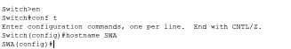

```bash
Switch>en 
Switch#conf t
Enter configuration commands, one per line.  End with CNTL/Z.
Switch(config)#hostname SWA
```

### SWB的基本配置

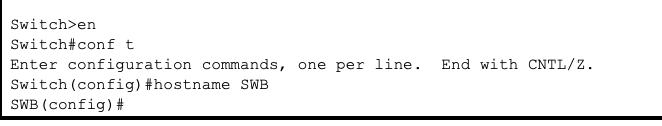

```bash
Switch>en
Switch#conf t
Enter configuration commands, one per line.  End with CNTL/Z.
Switch(config)#hostname SWB
```

### 连通性测试:(PC1 Ping PC4)

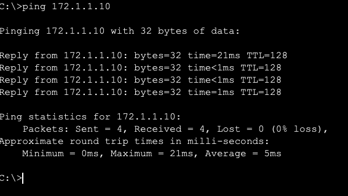

### 划分vlan和静态端口划分到vlan中

(1) 划分vlan

SWA的划分配置

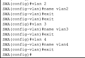

```bash
SWA(config)#vlan 2(全局配置模式)
SWA(config-vlan)#name vlan2
SWA(config-vlan)#exit
SWA(config)#vlan 3
SWA(config-vlan)#name vlan3
SWA(config-vlan)#exit
SWA(config)#vlan 4
SWA(config-vlan)#name vlan4
SWA(config-vlan)#exit
```

SWB的划分配置

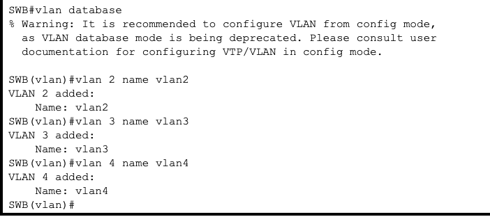

```bash
SWB#vlan database (进入vlan配置模式)
% Warning: It is recommended to configure VLAN from config mode,
  as VLAN database mode is being deprecated. Please consult user
  documentation for configuring VTP/VLAN in config mode.

SWB(vlan)#vlan 2 name vlan2
VLAN 2 added:
    Name: vlan2
SWB(vlan)#vlan 3 name vlan3
VLAN 3 added:
    Name: vlan3
SWB(vlan)#vlan 4 name vlan4
VLAN 4 added:
    Name: vlan4
```

(2)把端口静态划分到vlan中

SWA的配置

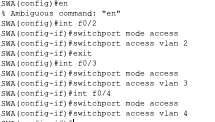

```bash
SWA(config)#int f0/2
SWA(config-if)#switchport mode access(把交换机接口模式改为access)
SWA(config-if)#switchport access vlan 2（在access工作模式下允许vlan 2通过）
SWA(config-if)#exit
SWA(config)#int f0/3
SWA(config-if)#switchport mode access(把交换机接口模式改为access)
SWA(config-if)#switchport access vlan 3（在access工作模式下允许vlan 3通过）
SWA(config-if)#exit
SWA(config)#int f0/4
SWA(config-if)#switchport mode access(把交换机接口模式改为access)
SWA(config-if)#switchport access vlan 4（在access工作模式下允许vlan 3通过）
```

SWB的配置

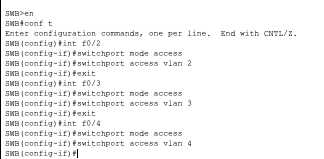

```bash
SWB>en
SWB#conf t
Enter configuration commands, one per line.  End with CNTL/Z.
SWB(config)#int f0/2
SWB(config-if)#switchport mode access
SWB(config-if)#switchport access vlan 2
SWB(config-if)#exit
SWB(config)#int f0/3
SWB(config-if)#switchport mode access
SWB(config-if)#switchport access vlan 3
SWB(config-if)#exit
SWB(config)#int f0/4
SWB(config-if)#switchport mode access
SWB(config-if)#switchport access vlan 4
```

### 查看配置

使用`show vlan`或者`show vlan brief`显示vlan配置信息

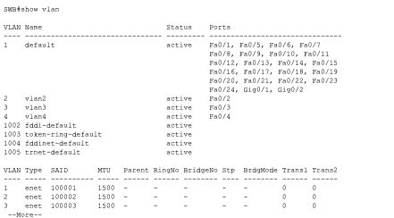

### 连通性测试

发现全部都**ping**不通了

### 实测VLAN

#### 解决方案

##### 方法一

交换机之间连三条线路，分别用来连通不同的vlan。两个交换机接口情况为F0/8-F0/8,F0/9-F0/9，F0/10-F0/10

将三个接口静态划分到同一个vlan中。

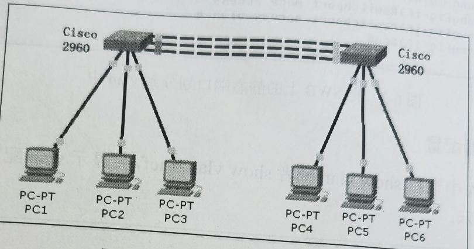

##### 方法二

建立一个**trunk中继线路**代替方法一的三条连线。

SWA的trunk配置

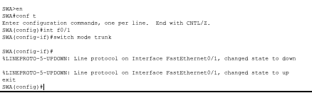

```bash
SWA>en
SWA#conf t
Enter configuration commands, one per line.  End with CNTL/Z.
SWA(config)#int f0/1
SWA(config-if)#switch mode trunk
```

SWB的trunk配置

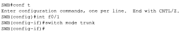

```bash
SWB#conf t
Enter configuration commands, one per line.  End with CNTL/Z.
SWB(config)#int f0/1
SWB(config-if)#switch mode trunk
```

### 连通性测试

> 非同一vlan网段连不同，同一vlan即可

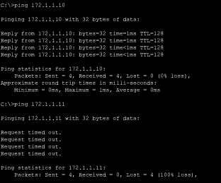

### 删除vlan信息

(1)在SWA交换机上删除vlan2，vlan3信息


(2)在SWB交换机上删除vlan2，vlan3信息

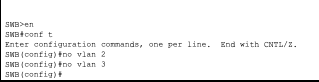

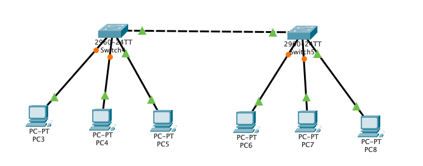

## 思考题

> 如果把vlan2，vlan3，vlan4都删除了，两个交换机只连一条线，六台PC机能互相访问吗？如果不能如何设置才能互相访问？

答：不能，各个vlan间没有访问列表，将所有接口静态划分在同一个vlan里，再用trunk中继线将连接接口设为trunk中继线模式。

