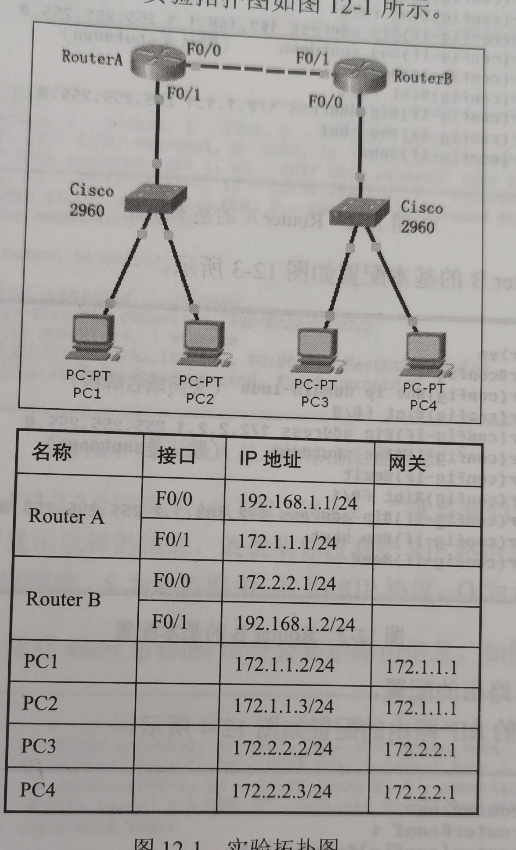
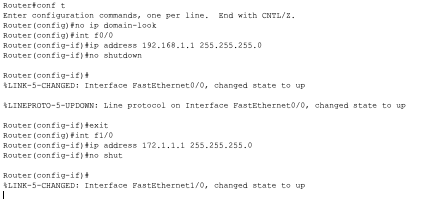
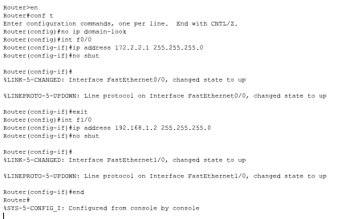
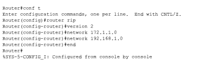
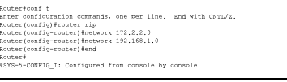
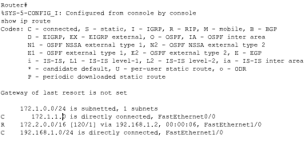
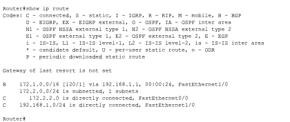

# RIP配置实验

## 实验拓扑




## 实验要求

（1）路由器的基本配置：设置路由接口IP地址

（2）根据以上拓扑划分出的三个网段，要求配置RIP路由使所有客户机都能通信，该如何实现？

---

## 实验步骤

### 路由器的基本配置

> 设置路由器接口IP地址

1. RouterA的基本配置

   

   ```bash
   Router#conf t
   Enter configuration commands, one per line.  End with CNTL/Z.
   Router(config)#no ip domain-look
   Router(config)#int f0/0
   Router(config-if)#ip address 192.168.1.1 255.255.255.0
   Router(config-if)#no shutdown
   Router(config-if)#
   %LINK-5-CHANGED: Interface FastEthernet0/0, changed state to up
   %LINEPROTO-5-UPDOWN: Line protocol on Interface FastEthernet0/0, changed state to up
   Router(config-if)#exit
   Router(config)#int f1/0
   Router(config-if)#ip address 172.1.1.1 255.255.255.0
   Router(config-if)#no shut
   ```

2. RouterB的基本配置

   

   ```bash
   Router>en
   Router#conf t
   Enter configuration commands, one per line.  End with CNTL/Z.
   Router(config)#no ip domain-look
   Router(config)#int f0/0
   Router(config-if)#ip address 172.2.2.1 255.255.255.0
   Router(config-if)#no shut
   Router(config-if)#
   %LINK-5-CHANGED: Interface FastEthernet0/0, changed state to up
   %LINEPROTO-5-UPDOWN: Line protocol on Interface FastEthernet0/0, changed state to up
   Router(config-if)#exit
   Router(config)#int f1/0
   Router(config-if)#ip address 192.168.1.2 255.255.255.0
   Router(config-if)#no shut
   Router(config-if)#
   %LINK-5-CHANGED: Interface FastEthernet1/0, changed state to up
   %LINEPROTO-5-UPDOWN: Line protocol on Interface FastEthernet1/0, changed state to up
   ```

3. RIP路由配置

   RouterA的RIP路由配置

   

   ```bash
   Router#conf t
   Enter configuration commands, one per line.  End with CNTL/Z.
   Router(config)#router rip
   Router(config-router)#version 2
   Router(config-router)#network 172.1.1.0
   Router(config-router)#network 192.168.1.0
   Router(config-router)#end
   ```

   RouterB的RIP路由配置

   

   ```bash
   Router#conf t
   Enter configuration commands, one per line.  End with CNTL/Z.
   Router(config)#router rip（进入路由配置模式）
   Router(config-router)#network 172.2.2.0
   Router(config-router)#network 192.168.1.0
   Router(config-router)#end
   Router#
   %SYS-5-CONFIG_I: Configured from console by console
   ```

4. 查看配置

   在RouterA运行show ip route会显示路由配置信息

   

   在RouterB运行show ip route会显示路由配置信息

   

5. 测试连通，如果互通就说明配置成功

   ```bash
   ip route 0.0.0.0 0.0.0.0 192.168.1.2
   ```

6. 删除路由协议

```bash
no router rip
```

