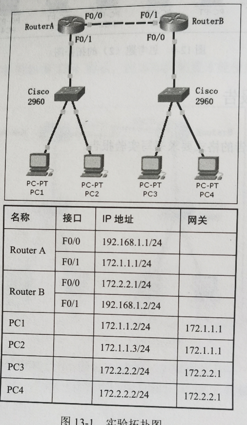
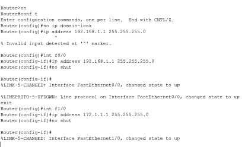
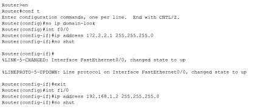
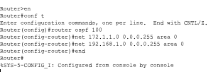

# 最短路径优先OSPF实验

## 实验拓扑



## 实验要求

（1）路由器的基本配置：设置路由器接口IP地址

（2）根据以上拓扑划分出的3个网段，要求配置OSPF路由使所有客户机都能相互通信

---

## 实验步骤

路由器的基本配置：设置路由器接口IP地址

（1）RouterA的基本配置



```bash
Router>en
Router#conf t
Enter configuration commands, one per line.  End with CNTL/Z.
Router(config)#no ip domain-look
Router(config)#int f0/0
Router(config-if)#ip address 192.168.1.1 255.255.255.0
Router(config-if)#no shut
Router(config-if)#
%LINK-5-CHANGED: Interface FastEthernet0/0, changed state to up
%LINEPROTO-5-UPDOWN: Line protocol on Interface FastEthernet0/0, changed state to up
exit
Router(config)#int f1/0
Router(config-if)#ip address 172.1.1.1 255.255.255.0
Router(config-if)#no shut
Router(config-if)#
```

(2)RouterB的基本配置



```bash
Router>en
Router#conf t
Enter configuration commands, one per line.  End with CNTL/Z.
Router(config)#no ip domain-look
Router(config)#int f0/0
Router(config-if)#ip address 172.2.2.1 255.255.255.0
Router(config-if)#no shut
Router(config-if)#
%LINK-5-CHANGED: Interface FastEthernet0/0, changed state to up
%LINEPROTO-5-UPDOWN: Line protocol on Interface FastEthernet0/0, changed state to up
Router(config-if)#exit
Router(config)#int f1/0
Router(config-if)#ip address 192.168.1.2 255.255.255.0
Router(config-if)#no shut
Router(config-if)#
%LINK-5-CHANGED: Interface FastEthernet1/0, changed state to up
```

(3)配置OSPF路由

RouterA的OSPF配置



```bash
Router>en
Router#conf t
Enter configuration commands, one per line.  End with CNTL/Z.
Router(config)#router ospf 100
Router(config-router)#net 172.1.1.0 0.0.0.255 area 0
Router(config-router)#net 192.168.1.0 0.0.0.255 area 0
Router(config-router)#end
Router#
%SYS-5-CONFIG_I: Configured from console by console
```

