# Windows/Mac安装mysql

## 压缩版安装配置教程

### 在官网下载安装包

#### Mac版

> 下载地址:[8.0.25](https://dev.mysql.com/downloads/mysql/)
>
> [8.0.11-8.0.25都有DMG文件可选]

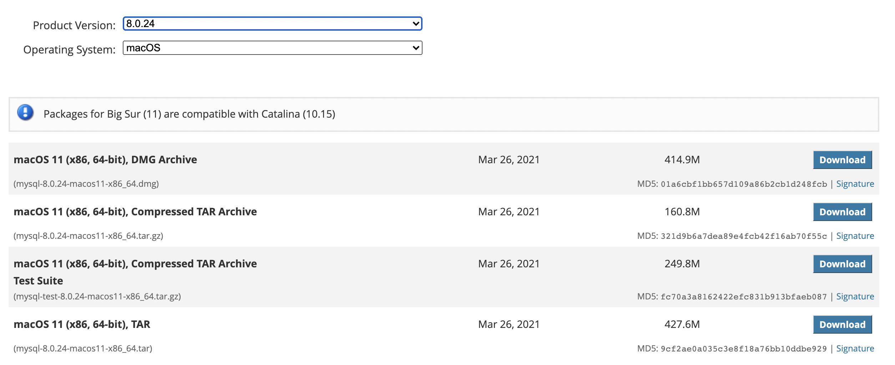

---


> 下载地址:[5.7.23](https://downloads.mysql.com/archives/community/)
>
> [建议先选择macOS的5.7.22这些有系统显示的，然后再去选择别的版本，这样跳起来比较方便]

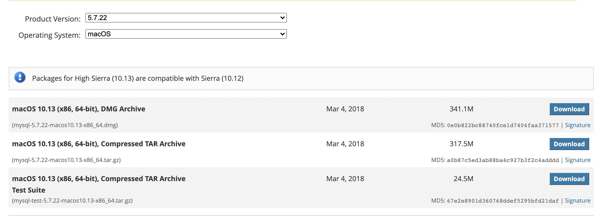

下载DMG文件快速傻瓜安装即可，下一步、下一步二话不说直接冲！

---


#### Windows版

> 下载地址:[8.0.25](https://dev.mysql.com/downloads/mysql/)
>
> 选择`mysql-8.0.25.zip`这样的压缩包解压安装

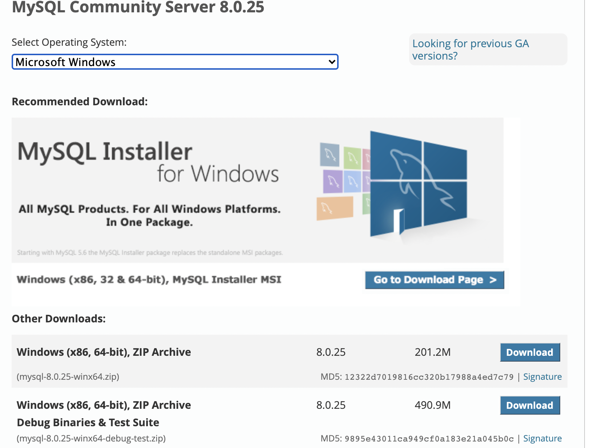

---


> 下载地址:[5.7.23](https://downloads.mysql.com/archives/community/)
>
> 个人推荐使用5.7版本的mysql，使用面广，8.0的sql转5.7的教程在此[教程](https://blog.csdn.net/yw99999/article/details/117353156)

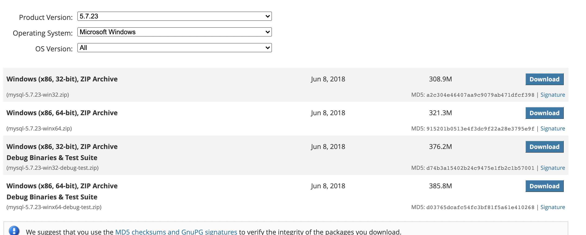

---


### 安装与配置

#### 将压缩包解压到任意目录

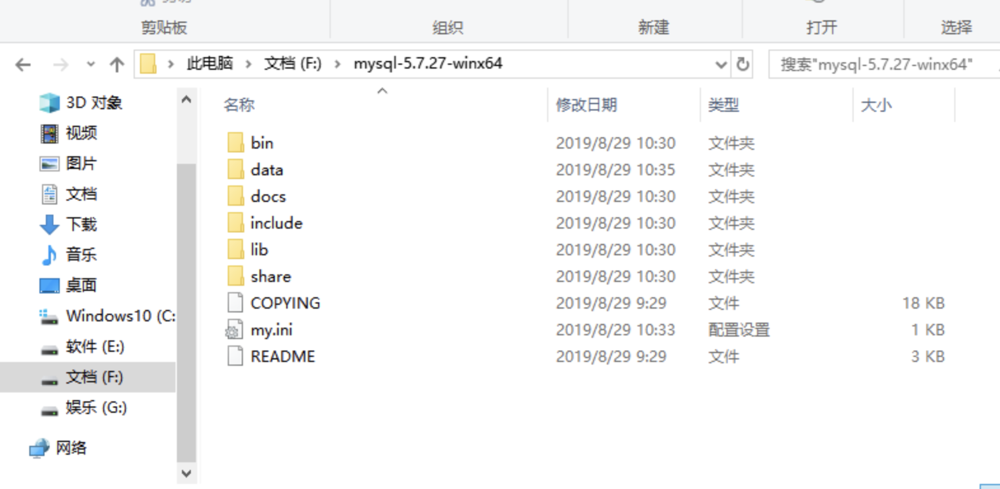

---

#### 在该目录下建一个my.ini的配置文件

> my.ini的配置文件内容如下

```bash
[mysqld]
# 设置服务端使⽤用的字符集为utf-8
character-set-server=utf8
# 绑定IPv4地址
bind-address = 0.0.0.0
# 设置mysql的端⼝口号
port = 3306
# 设置mysql的安装⽬目录，此处改成自己的安装路径
basedir=F:/mysql-5.7.23
# 设置mysql数据库的数据的存放⽬目录，此处改成自己的安装路径
datadir=F:/mysql-5.7.23/data
# 允许最⼤大连接数
max_connections=2000
# 创建新表时将使⽤用的默认存储引擎
default-storage-engine=INNODB
# 设置mysql以及数据库的默认编码
[mysql]
default-character-set=utf8
[mysql.server]
default-character-set=utf8
# 设置客户端默认字符集
[client]
default-character-set=utf8
```

**注意:**以下代码的注释是必须<u>删除</u>的，也就是***#***号及其后面的*中文*必须都删掉,还有就是**basedir**和**datadir**要改成自己相应的目录

---


#### 安装mysql服务

> 用管理员身份打开cmd窗口,win -> windows系统 -> 右击命令提示符 -> 更多 -> 以管理员身份运行

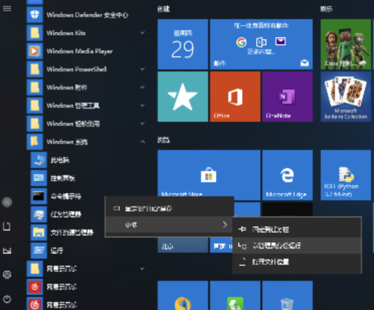

---


> 进入到bin目录下

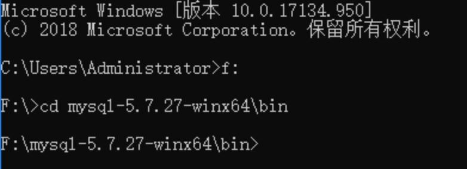

```bash
# 进入F盘
f:
# cd道具体目录
cd mysql-5.7.27-win64\bin
```

---

>执行**mysqld --install**命令安装（执行**mysqld --remove**卸载安装）

```bash
mysqld --install
```


---

> 执行**mysqld --initialize --user=root --console**命令

```bash
mysqld --initialize --user=root --console
```

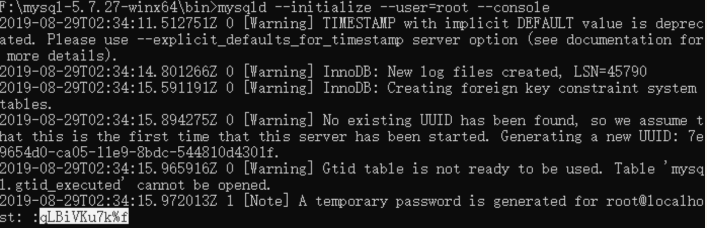

**注意:**初始化完成后MySQL会给root用户创建一个默认随机密码，***白色部分就是密码***，同时在data目录下也添加了相关的配置文件，如果密码有字符辨识不了，则把date目录下的文件都删了，重新执行这一步。

---

> 执行net start mysql启动服务（执行net stop mysql关闭服务）

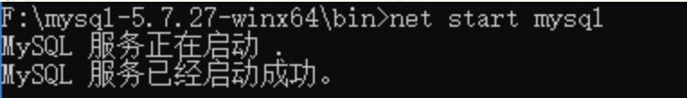

---

#### 登陆mysql

>执行mysql -uroot -p qLBiVku7k%f登录MySQL（-u后面是用户名，-p后面是密码，即上面的默认随机密码）,建议分开如下方代码执行

```bash
# 指令
mysql -uroot -p 
# 密码
qLBiVku7k%f
```

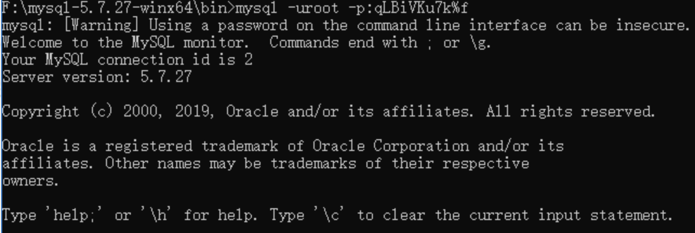

---

#### 修改密码

```bash
set password = password('123456');
```

**注意**：如果mysql版本是8或以上，则使用 **alter user 'root'@'localhost' identified by '新的密码';** 修改密码

---

#### 使用新密码登陆

> 退出登录

```bash
exit;
```

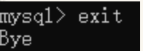

> 用修改后的密码登录MySQL

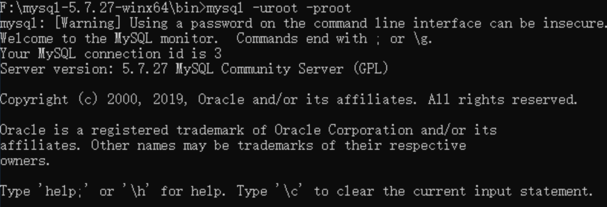


***至此Mysql安装完毕***

