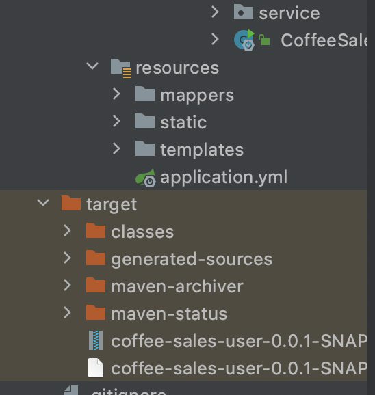

# 服务器运行springboot项目，快速入门

## 第一步 配置SpringBoot所需环境


### 常规项目环境

> 配置centOS等常规服务器对Springboot所需环境

- JDK
- Tomcat
- Mysql
- (Redis等所需环境)


---


> 方法一：自行配置
>
> 方法二：安装宝塔linux

如果选择自行安装，Tomcat、Oracle JDK都需要自行下载然后使用FTP或者指令传递，这里不做解读。这里我们只对宝塔Linux进行解读，比较适合新手小白入门。


---


### 自行配置不安装FTP时的文件传输

``` bash
# 传服务器文件 scp -p 2233(默认端口号) (本地文件路径) root@公网ip:(服务器存储地址)
scp -P 2233 /home/abc.tar.gz root@服务器公网ip:/root/abc.tar.gz
# 获取远程服务器上的文件 scp -p 2233(默认端口号) root@公网ip:(服务器存储地址) (本地文件路径)
scp -P 2223  root@服务器公网ip:/remote/test.tar.gz /local/test.tar.gz
```

其他建议自行摸索。


---


### 安装宝塔Linux

> **Linux面板7.5.2安装命令**
>
> 使用SSH 连接工具（[查看使用方法](https://www.bt.cn/bbs/thread-1971-1-1.html)），挂载磁盘后（[查看](https://www.bt.cn/bbs/forum.php?mod=viewthread&tid=3187&extra=page%3D1)），根据系统执行框内命令开始安装（大约2分钟完成面板安装）

安装命令：

``` bash
yum install -y wget && wget -O install.sh http://download.bt.cn/install/install_6.0.sh && sh install.sh
```


安装成功后的信息：

```bash
外网面板地址: http://183.126.212.168:8888/c135ea5b
内网面板地址: http://11.32.17.120:8888/c135ea5b
username: qvwcdjg2
password: 2d7a163a
```


选择外网面板地址：

```bash
http://183.126.212.168:8888/c135ea5b
```


输入密码后登陆:


---

### 使用宝塔Linux配置环境

1、点击软件商店


​	搜索自己需要的服务安装即可。

---


2、配置远程mysql


新建项目需要的数据库，这里我已经创建完毕。

---


数据库名和密码必须是项目配置完毕的，如果需要修改默认密码，可以点击`改密`按钮。

---

>  如何执行.sql数据还原？

点击`导入`


选择`从本地导入`再点击导入即把数据还原在数据库中了，如果有喜欢使用指令的小伙伴可以使用指令执行对数据库的操作。


----


## 第二步 打包SpringBoot项目

> 个人使用的是idea里的maven打包springboot项目

1、进入idea界面的`Maven`管理

---


2、点击`clean`再点击`package`


---


​	打包出来的jar包默认放在<u>target</u>文件目录下。



---


3、将jar包通过ftp/命令行/宝塔上传到服务器

> **此处使用的宝塔上传**
>
> 宝塔支持上传和下载


---

选中自己要放置文件的文件目录上传文件


---


## 第三步 运行项目

> 远程ssh连接服务器

```bash
ssh root@公网ip
# 第一次连接会需要输入一个yes
# 会跳出root@8.136.241.0's password:输入密码(密码不可见)
->
# 类似这样表示连接成功
Welcome to Alibaba Cloud Elastic Compute Service !

Activate the web console with: systemctl enable --now cockpit.socket

Last failed login: Sat May 29 11:09:18 CST 2021 from 127.0.0.1 on ssh:notty
There was 1 failed login attempt since the last successful login.
```

---


>找到文件路径 **cd **过去

```bash
[root@iZsc1j1t23458ykuo47ppwZ ~]# cd /var/ftp/pub
```

---


> 查看文件名**ls**

```bash
[root@iZsc1j1t23458ykuo47ppwZ pub]# ls
coffee-sales-user-0.0.1-SNAPSHOT.jar
```

---

> 按文件名运行jar包

```bash
[root@iZsc1j1t23458ykuo47ppwZ pub]#java -jar coffee-sales-user-0.0.1-SNAPSHOT.jar
```


---

> 运行效果

- 公网ip加端口号


- 域名加端口号，80端口为默认不用另外加


### 端口占用问题

> 解决方法一

```bash
# 查看端口pid
sudo lsof -i:80  # sudo lsof -i:<端口号>
```


---


> 解决方法二

```bash
# 查看进程pid
ss -lnp|grep 80  # ss -lnp|grep <端口号>
```


>最终将获取到进程的pid杀死

```bash
# 杀死进程
kill 9 9899
```


## 第四步 让程序在后端运行

```bash
# 将日志存为一个nohup.log文件
nohup java -jar  ***.jar  &     //***为你的jar包名
```


---

## 第五步 为网站绑定域名

### 申请阿里云域名

新人1元**首页**->**最新活动**->**新人1元享**

---


### 为域名备案

> 等待10-20天即可，80为默认端口，其他端口需要在域名后以:8080这样形式表示，3个月后备案不再需要带端口号


### 解析域名

> 到云服务器上使用官方解析
>
> 等于
>
> 服务器可以被用你的域名访问到，你的网站就是大盒子里的小物件，自然也可以


### 搜索自己的域名

> 例如80端口的baide.top，解析的时候是__.baide.top，填入www，即可拥有www.baide.top域名，三个月前只有80端口可以没有后面端口号，其他都要www.baide.top:81这样